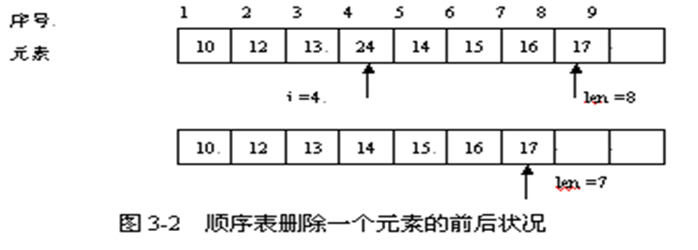
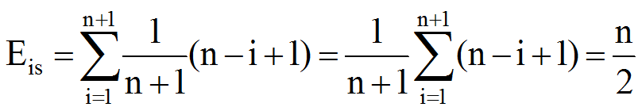
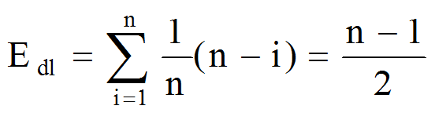

## 线性表的顺序表示

用顺序存储方式存储的线性表称为顺序表。顺序表的特点是：

- 顺序表是计算机中一种最基本和最主要的存储结构
- 一块地址连续的有限空间存放表中的数据元素
- 任意两个逻辑上相邻的数据元素在物理上也必然相邻
- 顺序表中的每个表项都是单个数据元素，所有表项的  数据类型相同
- 顺序表可以随机访问

顺序表通常用数组存储，在C++中，数组有静态数组和动态数组两种，对于顺序表，我们将采用静态数组方式存储。 

## 顺序表插入、删除算法的复杂度分析

通常顺序表的插入和删除操作都会保持各元素原来的顺序不变。举例来看顺序表上的插入和删除，如图所示

- 在原来已有7个元素的表的第4个元素前插入数据元素x=24的过程


- 在原来已有8个元素的顺序表中删除第4个元素的过程



在顺序表中插入一个数据元素时，算法中时间复杂度最高的部分是循环移动数据元素的操作。插入时，是从后向前循环右移数据元素，而循环移动数据元素的次数和插入数据元素的序号有关，最好的情形是在序号n+1处插入新元素(即追加)，移动元素个数为0，最坏情形是在序号1处插入新元素，移动元素个数为n；一般情形逐个移动n-i+1个元素。若在顺序表的任何位置上插入数据元素的概率相等，即为1/(n+1)，数据元素移动的平均次数为：



在顺序表中删除一个数据元素时，是从删除位置向后循环左移数据元素，一般情形逐个移动n－i个数据元素。若在顺序表的任何位置上删除数据元素的概率相等(1/n)，数据移动的次数平均为：



因此，顺序表中插入和删除一个数据元素的时间复杂度为O(n)。定位一个数据元素的时间复杂度为O(n)。其余操作的时间复杂度均为O(1)。

在顺序表的插入和删除操作中，若不需保持数据元素原来的顺序，此时可采用下图所示的方式移动数据元素。

在插入时，把新元素插入到表尾，如图所示。


在删除时，把表中的最后一个数据元素移来覆盖被删元素，如图所示。在这种情形下，插入时移动0个数据元素，删除时移动1个数据元素。


## 线性表的顺序存储（顺序表）

### SeqList.h

```c
#ifndef _SEQLIST_H_
#define  _SEQLIST_H_

typedef void SeqList;
typedef void SeqListNode;

SeqList* SeqList_Create(int capacity); //创建顺序表
void SeqList_Destory(SeqList* list);  //销毁顺序表
void SeqList_Clear(SeqList* list);  //清空线性表
int SeqList_Length(SeqList* list);  //获取顺序表长度
int SeqList_Capacity(SeqList* list); //获取顺序表容量
int SeqList_Insert(SeqList* list, SeqListNode* node, int pos); //在pos位置插入元素
SeqListNode* SeqList_Get(SeqList* list, int pos); //获取pos位置上的元素
SeqListNode* SeqList_Delete(SeqList* list, int pos);  //删除pos位置的元素

#endif
```

### SeqList.c

```c
#include <stdio.h>
#include <stdlib.h>
#include <string.h>

typedef void SeqList;
typedef void SeqListNode;

typedef struct _tag_SeqList  //头结点，记录表的信息
{
	int capacity;  //表容量
	int length;    //表长度
	int * node;    //node[capacity]，为指针数组
}TSeqList;

//创建顺序表
SeqList* SeqList_Create(int capacity) //返回值为SeqList*类型，即顺序表的地址
{
	int ret;
	TSeqList *temp = NULL;
	temp = (TSeqList*)malloc(sizeof(TSeqList));  //为头结点分配空间
	if (temp == NULL)
	{
		ret = 1;
		printf("func SeqList_Create() error:%d\n", ret);
		return NULL;
	}
	memset(temp, 0, sizeof(TSeqList));
	temp->capacity = capacity;
	temp->length = 0;
	temp->node = (int*)malloc(sizeof(void*)*capacity); //分配一个指针数组
	if (temp->node == NULL)
	{
		ret = 2;
		printf("func SeqList_Create() error:%d\n", ret);
		return NULL;
	}
	return temp;  //将分配好的顺序表的地址扔出去
}

//求顺序表容量
int SeqList_Capacity(SeqList* list) //参数为顺序表地址
{
	TSeqList *temp = NULL;
	if (list == NULL) //作健壮性判断
	{
		return;
	}
	temp = (TSeqList *)list;
	return temp->capacity;
}

//获取顺序表长度
int SeqList_Length(SeqList* list)
{
	TSeqList *temp = NULL;
	if (list == NULL)
	{
		return;
	}
	temp = (TSeqList *)list;
	return temp->length;
}

//插入元素
//参数为顺序表地址，要插入的元素地址，插入位置
int SeqList_Insert(SeqList* list, SeqListNode* node, int pos)
{                     
	int i;
	TSeqList *temp = NULL;
	//先作健壮性判断
	if (list == NULL || node == NULL) //如果顺序表为空，或者结点为空
	{
		return -1;
	}
	temp = (TSeqList *)list;
	//如果顺序表已满
	if (temp->length >= temp->capacity)
	{
		return -2;
	}

	//容错
	if (pos > temp->length) //如果给出的pos在长度后，即中间有空余，
		pos = temp->length; //就修正到最后一个元素后面

	for (i = temp->length; i > pos; i--)  //将插入位置的元素依次后移动
	{
		temp->node[i] = temp->node[i - 1];
	}
	temp->node[i] = (int)node; //然后在空出的位置插入新元素结点
	temp->length++; //插入成功后，长度加1
	return 0;
}

//删除元素
SeqListNode* SeqList_Delete(SeqList* list, int pos)
{
	int i;
	//先作健壮性判断
	TSeqList * tlist = NULL;
	SeqListNode * temp = NULL;
	tlist = (TSeqList *)list;
	if (list == NULL || pos < 0 || pos >= tlist->capacity)
	{
		printf("SeqList_Delete() error\n");
		return NULL;
	}
	temp = (SeqListNode *)tlist->node[pos]; //要删除的元素

	for (i = pos + 1; i < tlist->length; i++) //将删除元素位置后的所有元素向前移动
	{
		tlist->node[i - 1] = tlist->node[i];
	}

	tlist->length--; //删除元素后，长度要减
	return temp;
}

SeqListNode* SeqList_Get(SeqList* list, int pos)
{
	//先作健壮性判断
	TSeqList * tlist = NULL;
	SeqListNode * temp = NULL;
	tlist = (TSeqList *)list;
	if (list == NULL || pos < 0 || pos >= tlist->capacity)
	{
		printf("SeqList_Get() error\n");
		return NULL;
	}
	temp = (SeqListNode *)tlist->node[pos]; //将表中pos位置的结点指针赋给temp
	return temp;
}

//清空顺序表
void SeqList_Clear(SeqList* list)
{
	TSeqList *temp = NULL;
	if (list == NULL)
	{
		return;
	}
	temp = (TSeqList *)list;
	temp->length = 0;
	memset(temp->node, 0, (temp->capacity * sizeof(void*))); //将顺序表全部归0
	return;
}
//销毁顺序表
void SeqList_Destory(SeqList* list)
{
	TSeqList* temp = NULL;
	if (list == NULL)  //如果参数顺序表为空
	{
		return;
	}
	temp = (TSeqList *)list;
	if (temp->node != NULL)
	{
		free(temp->node); //先释放头结点中的指针数组
	}
	free(temp); //再释放头结点
	return;
}
```
### main.c

```c
#include "SeqList.h"
#include <stdio.h>
#include <stdlib.h>

typedef struct _Teacher
{
	char name[32];
	int age;
}Teacher;

int main()
{
	int ret = 0;
	SeqList * list = NULL;
	Teacher t1, t2, t3, t4, t5; //结点元素
	t1.age = 31;
	t2.age = 32;
	t3.age = 33;
	t4.age = 34;
	t5.age = 35;
	//创建结点
	list = SeqList_Create(10);  //创建顺序表
	
	//插入结点
	ret = SeqList_Insert(list, (SeqListNode*)&t1, 0); //位置0表示始终在头部插入
	ret = SeqList_Insert(list, (SeqListNode*)&t2, 0);
	ret = SeqList_Insert(list, (SeqListNode*)&t3, 0);
	ret = SeqList_Insert(list, (SeqListNode*)&t4, 0);
	ret = SeqList_Insert(list, (SeqListNode*)&t5, 0);

	printf("顺序表容量：%d\n", SeqList_Capacity(list));
	printf("顺序表长度：%d\n", SeqList_Length(list));
	
	//遍历顺序表
	printf("遍历顺序表：\n");
	for (int i = 0; i < SeqList_Length(list); i++)
	{
		Teacher* temp = (Teacher*)SeqList_Get(list, i); //获取链表结点
		if (temp == NULL)
		{
			printf("func SeqList_Get() error\n", ret);
			return;
		}
		
		printf("age: %d\n", temp->age);
	}


	//销毁链表
	printf("销毁顺序表时：\n");
	while (SeqList_Length(list) > 0)
	{
		Teacher* temp = (Teacher *)SeqList_Delete(list, 0); //删除头部元素
		if (temp == NULL)
		{
			printf("func SeqList_Get() error\n", ret);
			return;
		}
		
		printf("age: %d\n", temp->age);
	}
	SeqList_Destory(list);

	system("pause");
	return 0;
}
```