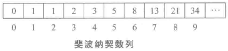
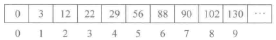
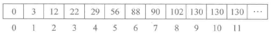

## 斐波那契查找

斐波那契查找是利用黄金分割原理来实现的。

斐波那契查找算法的明显优点在于它只涉及加法和减法运算，而不用除法。因为除法比加减法要占去更多的机时，因此，斐波那契查找的平均性能要比折半查找好。

有序表的元素个数为n，并且n正好是某个斐波那契数减1，即满足n = F[k] - 1 时，才能使用斐波那契查找。如果元素个数n不满足这个关系，那么就要将查找表扩展，直到n满足这个关系。例如：

斐波那契数列



数组arr



数组arr有10个元素，即n=10，不满足n = F[k] - 1，最近的数据是13 - 1 = 12，那么就把数组arr由10个元素扩展到12个，用最后一个元素来扩展另外两个空间。扩展后的数组如下所示：



在斐波那契数列查找中，分割点mid = begin + F[k-1] -1，查找表arr元素个数为F[k] - 1，mid将查找表分成了两部分，左边的长度为F[k-1] -1，右边的长度为F[k] - 1 - （F[k-1] -1）= F[k-2] - 1

```c++
#define  _CRT_SECURE_NO_WARNINGS
#define  MAXSIZE 13
#include <stdio.h>
#include <stdlib.h>

void fibonacci(int *f)
{
	f[0] = 1;
	f[1] = 1;
	for (int i = 2; i < MAXSIZE; ++i)
		f[i] = f[i - 2] + f[i - 1];
}
int fibonacci_search(int *a, int key, int n)
{
	int low = 0, high = n - 1;
	int mid = 0;
	int k = 0;
	int F[MAXSIZE];
	fibonacci(F);

	while (n > F[k] - 1) //计算出n在斐波那契中的数列  
		++k;

	for (int i = n; i < F[k] - 1; ++i) //把数组补全  
	{
		a[i] = a[high];
	}

	while (low <= high)
	{
		mid = low + F[k - 1] - 1;  //根据斐波那契数列进行黄金分割  
		if (a[mid] > key)
		{
			high = mid - 1;
			k = k - 1;
		}
		else if (a[mid] < key)
		{
			low = mid + 1;
			k = k - 2;
		}
		else{
			if (mid <= high) //如果为真则找到相应的位置  
				return mid;
			else
				return -1;
		}
	}
	return -1;
}

int main()
{
	int a[MAXSIZE] = { 5, 15, 19, 20, 25, 31, 38, 41, 45, 49, 52, 55, 57 };
	int k;
	printf("请输入要查找的数字:\n");
	scanf("%d", &k);
	int pos = fibonacci_search(a, k, 13);
	if (pos != -1)
		printf("在数组的第%d个位置找到元素:%d\n", pos + 1, k);
	else
		printf("未在数组中找到元素:%d\n", k);

	system("pause");
	return 0;
}
```