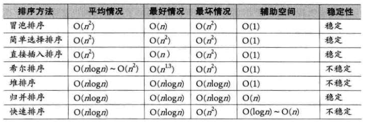

排序定义——将一个数据元素（或记录）的任意序列，重新排列成一个按关键字有序的序列叫排序

## 排序分类

按待排序记录所在位置

- 内部排序：待排序记录存放在内存
- 外部排序：待排序的记录数量很大，以致内存一次不能容纳全部记录，排序过程中需对外存进行访问的排序

按排序依据原则

- 插入排序：直接插入排序、折半插入排序、希尔排序
- 交换排序：冒泡排序、快速排序
- 选择排序：简单选择排序、树形选择排序、堆排序
- 归并排序：2-路归并排序
- 分配类排序：基数排序

按排序所需工作量

- 简单的排序方法：T(n)=O(n²)
- 先进的排序方法：T(n)=O(nlog₂n)

## 排序算法对比

