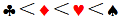
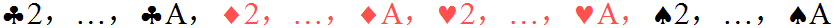
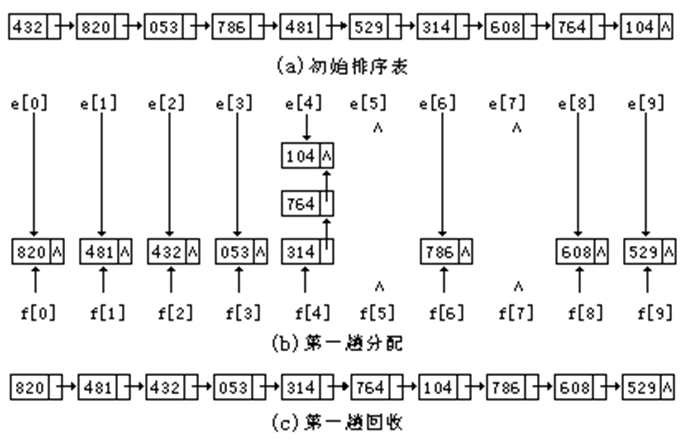
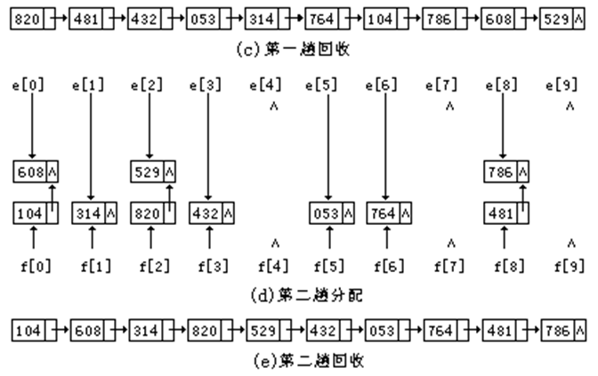

## 基数排序

基数排序又被称为桶排序。与前面介绍的几种排序方法相比较，基数排序和它们有明显的不同。前面所介绍的排序方法都是建立在对数据元素关键字进行比较的基础上，所以可以称为基于比较的排序；而基数排序首先将待排序数据元素依次“分配”到不同的桶里，然后再把各桶中的数据元素“收集”到一起。通过使用对多关键字进行排序的这种“分配”和“收集”的方法，基数排序实现了对多关键字进行排序。

多关键字排序

- MSD
- LSD

## 多关键字排序

每张扑克牌有两个“关键字”：花色和面值。其大小顺序为：

- 花色：
- 面值：2＜3＜……＜K＜A

扑克牌的大小先根据花色比较，花色大的牌比花色小的牌大；花色一样的牌再根据面值比较大小。所以，将扑克牌按从小到大的次序排列，可得到以下序列：



这种排序相当于有两个关键字的排序，一般有两种方法实现。

其一：可以先按花色分成四堆（每一堆牌具有相同的花色），然后在每一堆牌里再按面值从小到大的次序排序，最后把已排好序的四堆牌按花色从小到大次序叠放在一起就得到排序的结果。

其二：可以先按面值排序分成十三堆（每一堆牌具有相同的面值），然后将这十三堆牌按面值从小到大的顺序叠放在一起，再把整副牌按顺序根据花色再分成四堆（每一堆牌已按面值从小到大的顺序有序），最后将这四堆牌按花色从小到大合在一起就得到排序的结果。 

给定排序表中有n个数据元素（Arr[0]、Arr[1]、…、Arr[n-1]）。其中，每个数据元素Arr[i]（0≤i≤n-1）含有d个关键字 $ (k_i^1，k_i^2，…，k_i^d) $ 。如果对于序列中任意两个数据元素Arr[j]和Arr[i](0≤j<i≤n-1)都满足：$ (k_j^1，k_j^2，…，k_j^d) < (k_i^1，k_i^2，…，k_i^d) $ 则称数据元素序列以关键字 $ (k^1，k^2，…，k^d) $ 有序。在次，$ k^1 $ 称为最高位关键字，$ k^d $ 称为最低位关键字。 

实现多关键字排序有两种常用的方法，一种方法被称为最高位优先法MSD(Most Significant Digit first)，另一种方法被称为最低位优先法LSD(Last Significant Digit first)。

最高位优先法通常是一个递归的过程：

- 首先根据最高位关键字k1进行排序，按k1值的不同，将整个排序表分成若干个子表，每个子表中的数据元素具有相同的关键字k1。
- 然后分别对每一个每个子表中的数据元素根据关键字（k2，…，kd）用最高位优先法进行排序。如此递归，直到对关键字kd完成排序为止。

最低位优先法的算法思想：

- 首先依据最低位关键字kd对排序表中所有数据元素进行一趟排序，
- 然后依据次低位关键字kd-1对上一趟排序的结果再排序，依次重复，直到按关键字k1最后一趟排序完成，就可以得到排序的结果。

使用这种排序方法时，每一趟排序都是对整个排序表操作，且需采用稳定的排序方法。

## 链式基数排序

基数排序是一种典型的LSD排序方法，它利用“分配”和“收集”这两种运算对单关键字进行排序。在这种方法中，把关键字k看成是一个d元组：(k1，k2，…，kd)

其中为基数的每一个分量也可以看成是一个关键字，假设分量kj(1≤j≤d)有radix种取值，则称radix 。 

基数排序的算法思想：

- 对d元组中的每一个分量kj，把排序表中的所有数据元素，按kj的取值，先“分配”到radix个队列（桶）中去，
- 然后再按各队列的顺序，依次把数据元素从队列中“收集”起来，这样所有数据元素按kj取值排序完成。
- 如果对排序表中所有数据元素按关键字（k1，k2，…，kd），依次对各分量kj（j＝d，d-1，…，1），分别用这种“分配”、“收集”的运算逐趟进行排序，在最后一趟“分配”、“收集”完成后，所有数据元素就按其关键字的值从小到大排序好了。

链式基数排序的第一趟“分配”和“回收”示例






## 链式基数排序算法的C++描述

```c++
template <class Type> 
void RadixSort (sortlinklist <Type> &table const int d, const int radix ) {
    int e[radix], f[radix], p;
    for ( int i = 0; i < table.CurrentSize; i++ ){
        table.Arr[i].setlink(i+1);
    }
    table.Arr[table.CurrentSize].setlink(-1);      
    for ( i = d-1; i >= 0; i-- ) {    //做d 趟分配、收集
       p = table.Arr[0].getLink();    //初始化链表搜索指针  
      for ( int j = 0; j < radix; j++ )  f[j] = 0; //初始化各分配队列

      while ( p != 0 ) {       //逐个数据元素分配
        int k = table.Arr[p].key[i];  
        if ( f[k] == 0)
            f[k] = p;   //原链表为空时，数据元素入队列
          else                   //原链表非空时，数据元素入队尾
            table.Arr[e[k]].setLink(p);
        e[k] = p;      //修改链尾指针
        p = table.Arr[p].getLink();  //取链表中下一个结点
       }

       j = 0                //开始数据收集
       while ( f[j] == 0 ) j++;     //空队列跳过
       table.Arr[0].srtlink(f[j] )    
       p = e[j];   
       for ( k = j+1; k < radix; k++)  //逐个队列链接
         if ( f[k] ) {    //非空队列链入
              table.Arr[p].setLink(f[k]); 
              p = e[k];
         }
       table.Arr[p].setLink(-1);
    }
}
```

对于有n个数据元素的链表，若每个关键字有d位，算法需要重复执行d趟“分配”与“收集”。

每趟进行“分配”的循环需要执行n次，把n个数据元素分配到radix个队列中去；进行“收集”的循环需要执行radix次，把radix个队列中的数据元素收集起来按顺序链接。所以总的时间复杂度为0(d(n+radix))。

算法所需要的附加存储空间是为每个是数据元素结点增设的链接指针，及为每一个队列设置的队头和队尾指针，总共为n+2*radix。在基数排序中不需要移动数据元素，并且它是一种稳定的排序方法。 