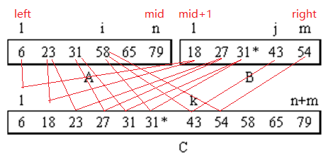
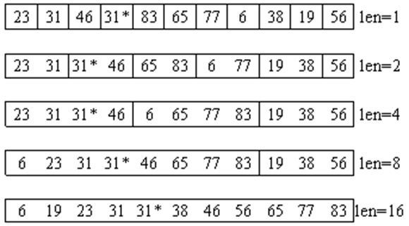
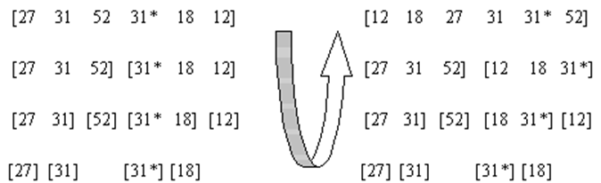
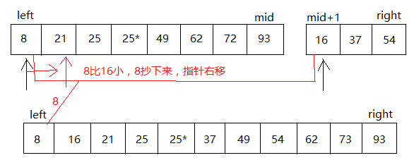
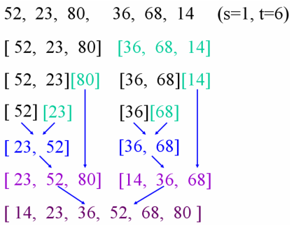

## 归并排序

所谓归并，就是将两个或两个以上的有序表合并成一个新的有序表。如下图所示，有两个已经排好序的有序表A[1]~A[n]和B[1]~B[m]（在图中只给出了它们的关键字），通过归并把它们合成一个有序表C[1]~C[m+n]。 

基本思想：归并（Merge）排序法是将两个（或两个以上）有序表合并成一个新的有序表，即把待排序序列分为若干个子序列，每个子序列是有序的。然后再把有序子序列合并为整体有序序列。


## 两路归并算法的C++描述 



在这个算法中，两个待归并的有序表首尾相接存放在数组sourceTable.Arr[]中，其中第一个表的下标范围是从 left 到 mid，另一个表的下标范围从 mid+1 到 right。归并后得到的新有序表存放在另一个辅助数组中 mergedTable.Arr[] 中，其下标范围从 left 到 right。

```c++
template <class Type>
void merge ( sortlist<Type> & sourceTable, sortlist <Type> & mergedTable,
 const int left, const int mid,  const int right ) {
    int i = left,  j = mid+1,  k =left;//指针初始化
    while ( i <= mid && j <= right ){
		if ( sourceTable.Arr[i].getKey() <= sourceTable.Arr[j].getKey()){ 
          	mergedTable.Arr[k] = sourceTable.Arr[i];
            i++;  
          	k++; 
        } else { 
          	mergedTable.Arr[k] = sourceTable.Arr[j]; 
          	j++;  
          	k++; 
        }
    }
    if ( i <= mid ){
		for ( int p = k, q = i;  q <= mid;  p++, q++ ){
          	mergedTable.Arr[p] = sourceTable.Arr[q]; 
		}
    } else {
      	for ( int p = k, q = j; q <= right; p++, q++){
          	mergedTable.Arr[q] = sourceTable.Arr[p];
      	}
    }
}
```

## 两路归并排序

两路归并排序就是利用两路归并算法进行排序。

其算法基本思想是：假设初始排序表有n个数据元素，首先把它看成是长度为1的首尾相接的n个有序子表(以后称它们为归并项)，先做两两归并，得 ⌈n/2⌉ 个长度为2的归并项(如果n为奇数，则最后一个归并项的长度为1)；再做两两归并，……，如此重复，最后得到一个长度为n的有序序列。 



一趟归并的算法描述如下

```c++
template <class Type> 
void MergePass ( sortlist<Type> & sourceTable,
               sortlist<Type> & mergedTable,  const int len ) {
    int i =0;
    while ( i+2*len <= CurrentSize-1 ){
      	merge ( sourceTable, mergedTable, i, i+len-1, i+2*len-1);
      	i += 2 * len; 
    }
  	if ( i+len <= CurrentSize-1 ){
      	merge ( sourceTable, mergedTable,i, i+len-1, CurrentSize-1 );
  	}else{
      	for ( int j=i; j <= CurrentSize-1; j++ ){
          	mergedTable.Arr[j] = sorceTable.Arr[j];
      	}
  	}        
}
```

两路归并排序算法描述如下

```c++
template <class Type> 
void MergeSort ( sortlist<Type> & table ) {
    sortlist<Type> & tempTable;
    int len = 1;
    while ( len < table.CurrentSize ) {
         MergePass (table , tempTable, len );   len *= 2;
         MergePass (tempTable , list , len );   len *= 2;
    }
    delete []tempTable;
}
```

在两路归并排序算法中，函数MergePass( )做一趟归并，要调用merge( )函数 ⌈n/(2\*len)⌉ ≈ O(n/len)次，而每次merge( )要执行比较次数不超过2\*len-1，为O(len)，函数MergeSort( )调用MergePass( )正好  ⌈log2n⌉ 次，所以两路归并排序算法总的时间复杂度为O(nlog₂n)。

两路归并排序占用附加存储较多，需要另外一个与原待排序数据元素数组同样大小的辅助数组，所以其空间复杂度为O(n）。 两路归并排序是一个稳定的排序方法。 

## 递归的归并排序

在递归的归并排序方法中，首先要把整个排序表划分为长度大致相等的左右两个部分，分别称之为左子表和右子表，对这两个子表分别进行归并排序（递归），然后再把已排好序的这两个子表进行两路归并，得到一个有序表。 

递归的归并排序示例



在递归的归并排序过程中，如果使用前面给出的两路归并算法，需要进行数组元素的传递，这非常影响归并的效率。如果排序表采用链表的存储表示，可以得到一种有效的归并排序算法。

在此排序表以静态链表存储，设待排序的数据元素存放在类型为的静态链表table中。table.Arr[0]用于表示结果链表的头结点。函数linkListMerge()是将两个有序的单链表归并成一个有序单链表的算法。  

静态链表上的递归归并排序示例


在静态链表上实现两路归并的算法描述如下

```c++
template <class Type> 
int linkListMerge (sortlinklist<Type> &table, const int p, const int q ) {
   int k = 0, i = p, j = q;
   //初始化指针,其中k为结果链表的尾结点指针,i、j为搜索指针
   while ( i !=-1 && j !=-1 ){
   		if ( table.Arr[i].getKey()<=table.Arr[j].getKey() ){ 
          	table.Arr[k].setLink(i);
            k = i; 
          	i = table.Arr[i].getLink( ); 
        }else  { 
          	table.Arr[k].setLink(j);
          	k = j; 
          	j = table.Arr[j].getLink( ); 
        }
   }      
   if (!i){
     	table.Arr[k].setlink(j); 
   }else{
     	table.Arr[k].setLink(i);
   }
   return table.Arr[0].getLink();
}
```

递归归并排序算法

```c++
template <class Type>
int linkListMergeSort (sortlinklist<Type> &table, const int low, const int high )
{
    if ( low >= high ) return low;
    int mid = ( low + high ) / 2;
    return linkListMerge (table, linkListMergeSort ( table, low, mid ),
                          linkListMergeSort ( table,mid+1, right ) );
}
```

在静态链表上实现的递归归并排序算法，通过链接指针的修改以实现数据元素接点的逻辑有序链接，因此不需要数据元素移动。计算时间可以用数据元素关键字的比较次数来测量。

算法的递归深度为O(log₂n)，所以总的时间复杂度为0(nlog₂n)。它也是一种稳定的排序方法。

## 归并排序的C++实现

设两个有序的子文件(相当于输入堆)放在同一向量中相邻的位置上：R[low...m]，R[m+1...high]，先将它们合并到一个局部的暂存向量R1(相当于输出堆)中，待合并完成后将R1复制回R[low...high]中。  

合并过程：

1. 设置i，j和p三个指针，其初值分别指向这三个记录区的起始位置;
2. 合并时依次比较R[i]和R[j]的关键字，取关键字较小的记录复制到R1[p]中;
3. 然后将被复制记录的指针i或j加1，以及指向复制位置的指针p加1。
4. 重复这一过程直至两个输入的子文件有一个已全部复制完毕(不妨称其为空)，此时将另一非空的子文件中剩余记录依次复制到R1中即可。 





```c++
void Merge(int src[], int des[], int low, int mid, int high)
{
	int i = low;
	int j = mid + 1;
	int k = low;

	while( (i <= mid) && (j <= high) ) //将小的放到目的地中
	{
		if( src[i] < src[j] )
		{
			des[k++] = src[i++];
		}
		else
		{
			des[k++] = src[j++];
		}
	}

	while( i <= mid )  //若还剩几个尾部元素
	{
		des[k++] = src[i++];
	}

	while( j <= high ) //若还剩几个尾部元素
	{
		des[k++] = src[j++];
	}
}

//每次分为两路 当只剩下一个元素时，就不需要在划分。先划分再归并。
void MSort(int src[], int des[], int low, int high, int max)
{
	if( low == high ) //只有一个元素，不需要归并，结果赋给des[low]
	{
		des[low] = src[low]; 
	}
	else //如果多个元素，进行两路划分
	{
		int mid = (low + high) / 2;
		int* space = (int*)malloc(sizeof(int) * max);

		//递归进行两路，两路的划分 
		//当剩下一个元素的时，递归划分结束，然后开始merge归并操作
		if( space != NULL )
		{
			MSort(src, space, low, mid, max); 
			MSort(src, space, mid+1, high, max);
			Merge(space, des, low, mid, high); //调用归并函数进行归并
		}

		free(space);
	}
}

void MergeSort(int array[], int len)
{
	MSort(array, array, 0, len-1, len);
}
```

## 归并排序的Java实现

```c++
/*
 * 归并操作(merge)，也叫归并算法，指的是将两个已经排序的序列合并成一个序列的操作。 　　
 * 如设有数列{6，202，100，301，38，8，1} 　　
 * 初始状态： [6] [202] [100] [301] [38] [8] [1] 比较次数 　　
 * i=1 [6 202 ] [ 100 301] [ 8 38] [ 1 ]　3 　　
 * i=2 [ 6 100 202 301 ] [ 1 8 38 ]　4 　　
 * i=3　[ 1 6 8 38 100 202 301 ] 4 
 */
public class MergeSort {
	public static void sort(int[] data) {
		int[] temp = new int[data.length];
		mergeSort(data, temp, 0, data.length - 1);
	}

	private static void mergeSort(int[] data, int[] temp, int l, int r) {
		int mid = (l + r) / 2;
		if (l == r)
			return;
		mergeSort(data, temp, l, mid);
		mergeSort(data, temp, mid + 1, r);

		for (int i = l; i <= r; i++) {
			temp[i] = data[i];
		}
		int i1 = l;
		int i2 = mid + 1;
		for (int cur = l; cur <= r; cur++) {
			if (i1 == mid + 1)
				data[cur] = temp[i2++];
			else if (i2 > r)
				data[cur] = temp[i1++];
			else if (temp[i1] < temp[i2])
				data[cur] = temp[i1++];
			else
				data[cur] = temp[i2++];
		}
	}
}
```