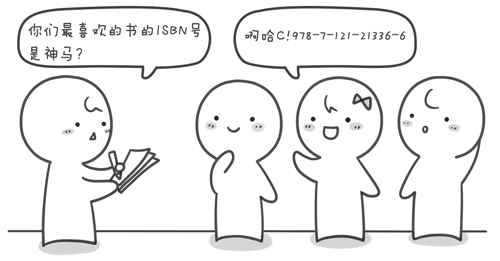

之前讲了三种常用的经典排序。排序算法还有很多，例如选择排序、计数排序、基数排序、插入排序、归并排序和堆排序等等。堆排序是基于二叉树的排序，以后再说吧。先分享一个超酷的排序算法的视频。

再来看一个具体的例子《小哼买书》来看看三个排序在应用上的区别和局限性。 小哼的学校要建立一个图书角，老师派小哼去找一些同学做调查，看看同学们都喜欢读哪些书。小哼让每个同学写出一个自己最想读的书的ISBN号（你知道吗？每本书都有唯一的ISBN号，不信话你去找本书翻到背面看看）。当然有一些好书会有很多同学都喜欢，这样就会收集到很多重复的ISBN号。小哼需要去掉其中重复的ISBN号，即每个ISBN号只保留一个，也就说同样的书只买一本（学校真是够抠门的）。然后再把这些ISBN号从小到大排序，小哼将按照排序好的ISBN号去书店去买书。请你协助小哼完成“去重”与“排序”的工作。



输入有2行，第1行为一个正整数，表示有n个同学参与调查（n<=100）。第2行有n个用空格隔开的正整数，为每本图书的ISBN号（假设图书的ISBN号在1~1000之间）。

输出也是2行，第1行为一个正整数k，表示需要买多少本书。第2行为k个用空格隔开的正整数，为从小到大已排好序的需要购买的图书ISBN号。

例如输入

```
102040326740208930040015
```

则输出

```
8152032406789300400
```

最后，程序运行的时间限制为：1秒。

解决这个问题的方法大致有两种，第一种方法：先将这n个图书的ISBN号去重，再进行从小到大排序并输出。第二种方法：先从小到大排序，输出的时候再去重。这两种方法都可以。

先来看第一种方法。通过第一节的学习我们发现桶排序稍加改动正好可以起到去重的效果，因此我们可以使用桶排序的方法来解决此问题。

```c
#include <stdio.h>
int main()
{
    int a[1001],n,i,t;
    for(i=1;i<=1000;i++)
         a[i]=0; //初始化
                               
    scanf("%d",&n); //读入n
    for(i=1;i<=n;i++) //循环读入n个图书的ISBN号
    {
        scanf("%d",&t); //把每一个ISBN号读到变量t中
        a[t]=1; //标记出现过的ISBN号
    }
                               
    for(i=1;i<=1000;i++) //依次判断1~1000这个1000个桶
    {
          if(a[i]==1)//如果这个ISBN号出现过则打印出来
             printf("%d ",i);
    }
                             
    getchar();getchar();
    return 0;
}
```

这种方法的时间复杂度是就是桶排序的时间复杂度为O(N+M)。

第二种方法我们需要先排序再去重。排序我们可以用冒泡排序或者快速排序。

20 40 32 67 40 20 89 300 400 15

将这10个数从小到大排序之后为 15 20 20 32 40 40 67 89 300 400。

接下来，要在输出的时候去掉重复的。因为我们已经排好序，因此相同的数都会紧挨在一起。只要在输出的时候，预先判断一下当前这个数a与前面一个数a[i-1]是否相同。如果相同则表示这个数之前已经输出过了，不同再次输出。不同则表示这个数是第一次出现需要，则需要输出这个数。

```c
#include <stdio.h>
int main()
{
    int a[101],n,i,j,t;
                        
    scanf("%d",&n);   //读入n
    for(i=1;i<=n;i++) //循环读入n个图书ISBN号
    {
        scanf("%d",&a[i]);
    }
                        
   //开始冒泡排序
    for(i=1;i<=n-1;i++)
    {
         for(j=1;j<=n-i;j++)
        {
             if(a[j]>a[j+1])
            {  t=a[j]; a[j]=a[j+1]; a[j+1]=t;  }
        }
    }
    printf("%d ",a[1]); //输出第1个数
    for(i=2;i<=n;i++) //从2循环到n
    {
         if( a[i] != a[i-1] ) //如果当前这个数是第一次出现则输出
             printf("%d ",a[i]);
    }
                      
    getchar();getchar();
    return 0;
}
```

这种方法的时间复杂度由两部分组成，一部分是冒泡排序时间复杂度是O(N2)，另一部分是读入和输出都是O(N)，因此整个算法的时间复杂度是O(2\*N+N2)。相对于N2来说，2\*N可以忽略（我们通常忽略低阶），最终该方法的时间复杂度是O(N2)。

接下来我们还需要看下数据范围。每个图书ISBN号都是1~1000之间的整数，并且参加调查的同学人数不超过100，即n<=100。之前已经说过，在粗略计算时间复杂度的时候，我们通常认为计算机每秒钟大约运行10亿次（当然实际情况要更快）。因此以上两种方法都可以在1秒钟内计算出解。如果题目图书ISBN号范围不是在1~1000之间，而是-2147483648~2147483647之间的话，那么第一种方法就不可行了，因为你无法申请出这么大数组来标记每一个ISBN号是否出现过。另外如果n的范围不是小于等于100而是小于等于10万，那么第二种方法的排序部分也不能使用冒泡排序。因为题目要求的时间限制是1秒，使用冒泡排序对10万个数的排序，计算机需要运行100亿次，需要10秒钟，需要替换为快速排序，快速排序只需要100000×log2100000≈100000×17≈170万次，这还不到0.0017秒。是不是很神奇，同样的问题使用不同的算法竟然有如此之大的时间差距，这就是算法的魅力！

我们来回顾一下本章三种排序算法的时间复杂度。桶排序是最快的，它的时间复杂度是O(N+M)；冒泡排序是O(N2)；快速排序是O(NlogN)。