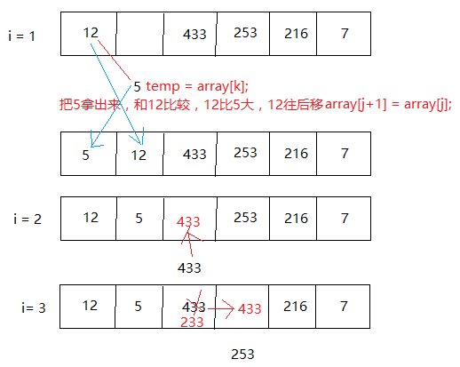

## 插入排序

排序过程：整个排序过程为n-1趟插入，即先将序列中第1个记录看成是一个有序子序列，然后从第2个记录开始，逐个进行插入，直至整个序列有序。

排序思想：第二个数据依次往前比较，如果发现比自己大，该数据往后瞬移，否则该数据插入找到数据的后面

实质：对线性表执行n-1次插入操作，只是先要找到插入位置。

### 实现方法1

```java
/*
 * 插入排序基本思想
 * 将n个元素的数列分为已有序和无序两个部分，如插入排序过程示例下所示： 　　
 * {{a1}，{a2，a3，a4，…，an}} 　　
 * {{a1⑴，a2⑴}，{a3⑴，a4⑴ …，an⑴}} 　
 * {{a1(n-1），a2(n-1) ，…},{an(n-1)}} 　　
 * 每次处理就是将无序数列的第一个元素与有序数列的元素从后往前逐个进行比较，
 * 找出插入位置，将该元素插入到有序数列的合适位置中。
 */

public static void insertSort(int datas[]) {
    int j = 0; // 第二个数据开始插入的下标
    int i = 0;// 插入的次数
    for (i = 1; i < datas.length; i++) {
        int temp = datas[i];
        for (j = i - 1; j >= 0; j--) {
            if (datas[j] > temp) {
                datas[j + 1] = datas[j];//往后移
            } else {
                break;
            }
        }
        // 判断 j == -1 或者 就是第一个小于等于temp数据的位置
        datas[j + 1] = temp;
    }
}
```

### 实现方法2

把元素拿出来，符合条件的元素往后移



```c++
void InertionSort(int array[], int len)
{
	int i = 0;
	int j = 0;
	int k = -1;
	int temp = -1;

	for(i=1; i<len; i++)
	{
		k = i; //待插入位置
		temp = array[k];//把插入元素拿出来

		for(j=i-1; (j>=0) && (array[j]>temp); j--)
		{ 
			array[j+1] = array[j]; //元素后移
			k = j; //k需要插入的位置
		}

		array[k] = temp;//元素插入
	}
}
```