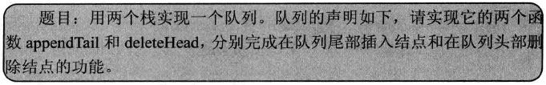
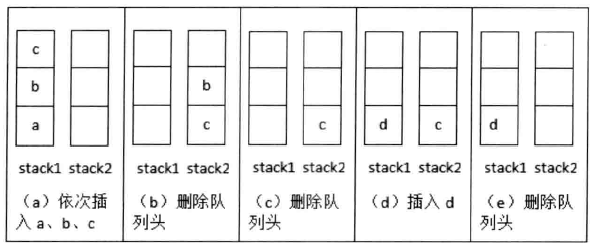

## 用两个栈实现队列



```c++
template <typename T> class CQueue
{
public:
    CQueue(void);
    ~CQueue(void);
    
    // 在队列末尾添加一个结点
    void appendTail(const T& node);

    // 删除队列的头结点
    T deleteHead();

private:
    stack<T> stack1;
    stack<T> stack2;
};
```

```c++
template<typename T> void CQueue<T>::appendTail(const T& element)
{
    stack1.push(element);
} 

template<typename T> T CQueue<T>::deleteHead()
{
    if(stack2.size()<= 0)
    {
        while(stack1.size()>0)
        {
            T& data = stack1.top();
            stack1.pop();
            stack2.push(data);
        }
    }

    if(stack2.size() == 0)
        throw new exception("queue is empty");

    T head = stack2.top();
    stack2.pop();

    return head;
}
```