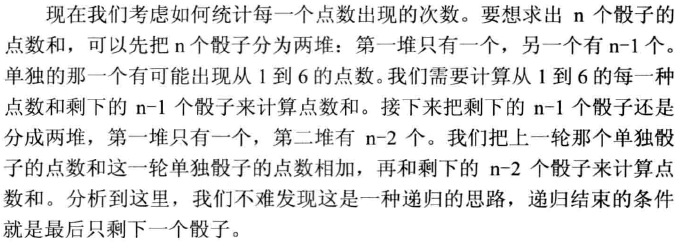
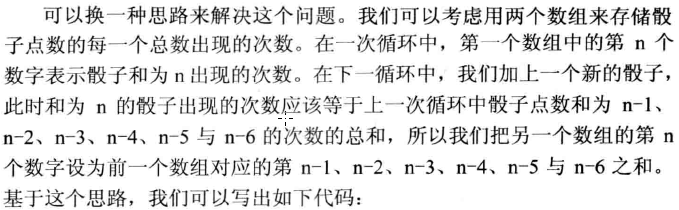

## n个骰子的点数

把n个骰子扔在地上，所有骰子朝上一面的点数之和为s。输入n，打印s所有可能的值出现的概率。

### 方法1：递归



```c++
void PrintProbability_Solution1(int number)
{
    if(number < 1)
        return;
 
    int maxSum = number * g_maxValue; 
    int* pProbabilities = new int[maxSum - number + 1]; 
    for(int i = number; i <= maxSum; ++i)
        pProbabilities[i - number] = 0;
 
    Probability(number, pProbabilities);
 
    int total = pow((double)g_maxValue, number);
    for(int i = number; i <= maxSum; ++i)
    {
        double ratio = (double)pProbabilities[i - number] / total;
        printf("%d: %e\n", i, ratio);
    }
 
    delete[] pProbabilities;
}
 
void Probability(int number, int* pProbabilities)
{
    for(int i = 1; i <= g_maxValue; ++i)
        Probability(number, number, i, pProbabilities);
}
 
void Probability(int original, int current, int sum, int* pProbabilities)
{
    if(current == 1)
    {
        pProbabilities[sum - original]++;
    }
    else
    {
        for(int i = 1; i <= g_maxValue; ++i)
        {
            Probability(original, current - 1, i + sum, pProbabilities);
        }
    }
} 
```

### 方法2：循环



```c++
void PrintProbability_Solution2(int number)
{
    if(number < 1)
        return;

    int* pProbabilities[2];
    pProbabilities[0] = new int[g_maxValue * number + 1];
    pProbabilities[1] = new int[g_maxValue * number + 1];
    for(int i = 0; i < g_maxValue * number + 1; ++i)
    {
        pProbabilities[0][i] = 0;
        pProbabilities[1][i] = 0;
    }
 
    int flag = 0;
    for (int i = 1; i <= g_maxValue; ++i) 
        pProbabilities[flag][i] = 1; 
    
    for (int k = 2; k <= number; ++k) 
    {
        for(int i = 0; i < k; ++i)
            pProbabilities[1 - flag][i] = 0;

        for (int i = k; i <= g_maxValue * k; ++i) 
        {
            pProbabilities[1 - flag][i] = 0;
            for(int j = 1; j <= i && j <= g_maxValue; ++j) 
                pProbabilities[1 - flag][i] += pProbabilities[flag][i - j];
        }
 
        flag = 1 - flag;
    }
 
    double total = pow((double)g_maxValue, number);
    for(int i = number; i <= g_maxValue * number; ++i)
    {
        double ratio = (double)pProbabilities[flag][i] / total;
        printf("%d: %e\n", i, ratio);
    }
 
    delete[] pProbabilities[0];
    delete[] pProbabilities[1];
}
```