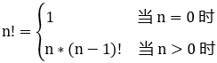
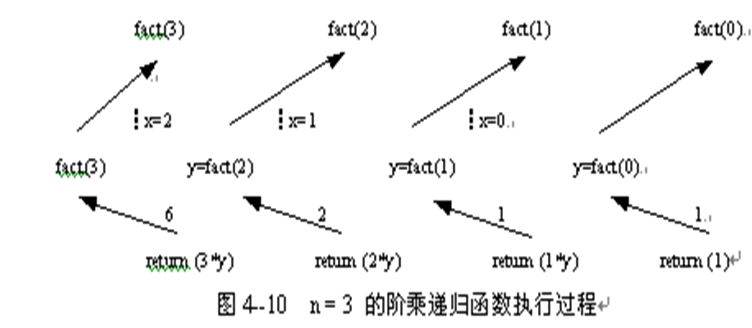
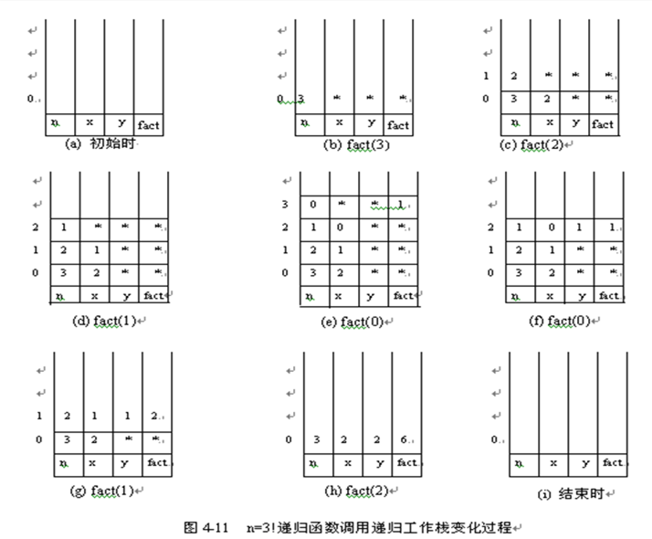
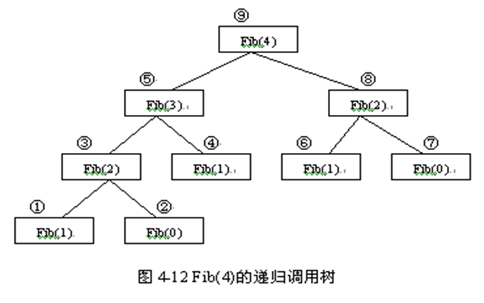

## 递归的概念

递归是在计算机科学、数学等领域运用非常广泛的一种方法。使用递归的方法解决问题，一般具有这样的特征：我们在寻求一个复杂问题的解时，不能立即给出答案，然而从一个规模较小的相同问题的答案开始，却可以较为容易的求解复杂的问题。

递归（recursion）在数学及程序设计中是一种很重要的工具。递归的定义是：若一个对象部分地包含它自己，或用它自己给自己定义，则这个对象是递归的；若一个过程直接地或间接地调用自己，则称这个过程是递归的过程。

在实际应用中使用递归可以解决以下多方面的问题：

- 问题本身的定义就是递归的，例如许多数学定义就是递归的。 
- 问题本身虽然不是递归定义的，但是它所用到的数据结构是递归的，例如链表、树就可以看成是递归定义的数据结构。 
- 问题的解法满足递归的性质。

在以下两种情况下，常常用到递归的方法。

### 定义是递归的

许多对象的定义是递归的，像阶乘函数，斐波那契数列等。例如，阶乘的定义是：



又例如，链表结点的定义，也是递归的。链表结点node的定义由数据域data和指针域next组成，，而指针next则由node定义。

再例如，单链表的递归定义可以写为：

- 单个结点，其指针域next的值为NULL，是一个单链表；
- 一个结点，其指针域next指向一个单链表，整个仍是一个单链表。

### 问题的解法是递归的

汉诺塔问题是递归求解的一个典型问题，汉诺塔问题是：设有3根标号为A、B、C的针，在A 针上穿有n个盘子，一个比一个小。要求把A针上的盘子全部移到C针上。移动的规则是：

（1）一次只能移动一个盘子；

（2）移动过程中大盘子不能放在小盘子上面；

（3）在移动过程中盘子可以放在A、B、C的任意一根针上。

问题的解法为

如果n = 1，则将这一个盘子直接从A针移到C针上。否则执行以下三步：

（1） 用C针做过渡，将A针上的（n-1）个盘子移到B针上；
（2） 将A针上最后一个盘子直接移到C针上；
（3） 用A针做过渡，将B针上的(n-1)个盘子移到C针上。

移动过程如图4-9所示，图中n = 4。


移动n个盘子的汉诺塔问题归结为移动（n-1）个盘子的汉诺塔问题。与此类似，移动（n-1）个盘子的汉诺塔问题又可归结为移动（n-2）个盘子的汉诺塔问题，……，最后总可以归结到只移动一个盘子的汉诺塔问题。

求解汉诺塔问题的算法

```c++
# include <iostream.h>
void Hanoi (int n, char A, char B, char C)  {
	//把n 个盘子从A针借助B针移到C针上
	if (n == 1 ){ //递归出口，一个盘子直接移动
      	cout<<"Move"<<A<<"to"<<C<<endl;
	}else{
      	Hanoi (n-1 , A , C , B);       //将上面n-1个盘子移到B针上
      	cout<<"Move"<<A<<"to"<<C<<endl;//最后一个移到C针上
      	Hanoi (n-1, B,A,C);     //将B针上的n-1个盘子移到C针上
	}
}
```

### 递归过程与递归工作栈

我们知道，对一个非递归函数的调用，在函数调用前要保存以下三方面的信息：

- 返回地址
- 本函数调用时，与形参结合的实参值，包括函数名和函数参数。
- 本函数的局部变量值。

当函数调用返回时，要释放当初保存的实参值和局部变量值，然后按保存的返回地址返回。

对于一个递归函数的调用也是如此，在函数调用前也要保存上述三方面的信息。但因为递归函数的自调用特性，上述所保存的信息将由于函数不断地调用自身而互相重叠，如没有合适的存储结构来保存，这些信息就无法使用。在高级语言的处理程序中，使用了一个“递归工作栈”来进行处理。每一层递归调用所需保存的信息构成一个工作记录，每一个工作记录包括与前述类似的三方面的信息：

- 返回地址，即上一层中本次调用自身的语句的后继语句处
- 本次函数调用时，与形参结合的实参值，包括函数名、引用参数和值参数等
- 本层的局部变量值

在每进入一层递归时，系统就要建立一个新的工作记录，把上述项目登入，加到递归工作栈的栈顶。每退出一层递归，就从递归工作栈退出一个工作记录，栈顶的工作记录必定是当前正在执行的这一层的工作记录，也称其为“活动记录”。

通常在一个函数执行过程中需要调用另一个函数时，在运行被调用函数之前系统通常需要完成如下工作： 

- 对调用函数的运行现场进行保护，主要是参数与返回地址等信息的保存；
- 创建被调用函数的运行环境； 
- 将程序控制转移到被调用函数的入口。

在被调用函数执行结束之后，返回调用函数之前，系统同样需要完成3件工作： 

- 保存被调函数的返回结果； 
- 释放被调用函数的数据区； 
- 依照保存的调用函数的返回地址将程序控制转移到调用函数。

如果上述函数调用的过程中发生了新的调用，即被调函数在执行完成之前又调用了其他函数，此时构成了多个函数的嵌套调用。当发生嵌套调用时按照后调用先返回的原则处理，如此则形成了一个保存函数运行时环境变量的“后进先出”的使用过程，因此整个函数调用期间的相关信息的保存需要使用一个堆栈来实现。系统将整个程序运行时需要的数据空间安排在一个堆栈中，每当调用一个函数时就为它在栈顶分配一个存储区，每当从一个函数返回时就释放它的存储区。

一个递归算法的实现实际上就是多个相同函数的嵌套调用。

下面以计算阶乘的递归函数为例，对于n为3时，分析递归函数的执行过程，以及递归函数调用时递归工作栈的变化过程。根据阶乘的定义


阶乘递归函数设计如下

```c++
long fact (int n) {
	if (n == 0){
      	return 1; //递归出口
	}else if{
      	return  n * fact(n-1); //递归调用
	}
}
```

计算3的阶乘时，递归函数调用的执行过程如图4-10所示。图中的x是自变量，y是x的阶乘，都是中间变量。图中箭头旁的数值代表函数的返回值y，最终fact(3) = 6。

当递归调用返回时，返回到上一层递归调用的下一语句，而这个返回位置正好是算法的结束处。这样，每次递归调用时保存的返回地址就不使用了。

n=3的阶乘递归函数调用的系统栈区的动态变化过程如图所示，图中符号 “*”表示值尚未知。 






## 基于归纳的递归

基于归纳的递归是一种较为简单并且也是一种基本的递归算法设计方法。它的主要思想是把数学归纳法应用于算法设计之中。

对于一个规模为n的问题P(n)，归纳法的步骤是：

- 基本项：A1是问题P(1)的解
- 递归项：对于所有的k，1<k<n ，若Ak是问题P(k)的解，则存在f使得f(Ak)是P(k+1)的解。其中f是对Ak的某种运算或处理。

因此，为求问题P(n)的解An，可以先求P(n-1)的解An-1然后对An-1进行f运算或处理。而为求P(n-1)的解，先求P(n-2)得解，如此不断的递归求解，直到P(1)为止。

## 递推关系求解

### 数学归纳法

递归算法的时间复杂度是使用递推关系给出的。求解递推关系可以先观察前几项，猜测f(n)的通项，然后用数学归纳法证明，最后得出时间复杂度。使用这种方法的一个问题是要有足够的观察力猜出通项，这使得使用这种方法存在一定难度。

### 迭代法

求解递推关系的另外一种方法就是迭代法，用这个方法估计递归方程解的渐近阶不要求推测解的渐近表达式，但要求较多的代数运算。方法的思想是迭代地展开递归方程的右端，使之成为一个非递归的和式，然后通过对和式的估计来达到对方程左端即方程的解的估计。

### 递归树

在一棵递归树中，每个节点代表了一组递推表达式中函数符号所表示的子问题的代价。我们求出树中每层节点的代价之和就得到一层的代价和，然后我们将树中每层的代价和求出来就可以确定所有递归调用的代价。它对描述分治算法的递归方程特别有效。

## 消除递归

递归虽然有简洁的优点，但它同时也有显著的缺点。递归由于是函数调用自身，而函数调用是有时间和空间消耗的：每一次函数调用，都需要在内存栈中分配空间以保存参数，返回地址以及临时变量，而且往栈里压入数据和弹出数据都需要时间。

另外，递归中很多计算有可能都是重复的，从而对性能带来很大的负面影响。递归的本质是把一个问题分解成两个或者多个小问题。如果多个小问题存在重叠的部分，那么就存在重复的计算。

除了效率之外，递归还有可能引起更严重的问题：调用栈溢出。每一次函数调用会在内存栈中分配空间，而每个进程的栈空间是有限的。当递归调用的层级太多时，就会超出栈的容量，从而导致调用栈溢出。

根据前面的介绍可知，递归算法是一种分而治之的方法，它把复杂问题分解为简单问题来求解。对于某些复杂问题，用递归算法来分析比较有效，用递归算法来描述也比较自然、易理解。但递归算法的时间效率通常比较差。因此，在求解某些问题时，人们希望用递归算法来分析问题，用非递归算法来求解问题；另外，有些计算机语言不支持递归功能，这就需要把递归算法转化为非递归算法。

把递归算法转化为非递归算法通常采用如下两种方法：

- 对于尾递归和单向递归的算法，可用循环结构的算法来替代。
- 自己用栈来模拟系统运行时的栈，保存有关的信息，从而用非递归算法来模拟递归算法

### 尾递归和单向递归的消除

尾递归是指在递归算法的函数中，递归调用语句只有一个，而且是处在函数的最后，如前述的求解阶乘的函数。由于当递归调用返回时，是返回到上一层递归调用的下一语句，而这个返回位置正好是算法的结束处。因此，每次递归调用时保存的返回地址就不使用了，事实上，函数返回值和函数的参数也是不使用的。由此可知，对于尾递归形式的算法，不必利用系统的运行时的栈来保存各种信息。尾递归形式的算法可以很方便地用循环结构的形式来替代。

阶乘的求解可以写成如下循环结构的非递归算法：

```c++
long fact(int n){
      int product=1;
      for (int i=1; i<=n; i++)
        product= producti
      return product
}
```

单向递归是指递归函数中虽然有递归调用语句，但各递归调用语句的参数只和主调用函数有关，相互之间参数无关，并且这些递归调用语句都处在算法的最后。显然，尾递归是单向递归的特例。单向递归的一个典型例子就是斐波那契数列的递归算法。

斐波那契数列的递归定义是：


计算此数列的递归函数如下：

```c++
long Fib(int n)
{ if (n == 0 || n ==1 ) return  n;     //递归出口
  else   return Fib(n-1)+Fib(n-2);     //递归调用
}
```

上述递归函数求Fib(4)过程可以用如图所示的递归调用树来描述。

为了计算Fib(4)，必须先计算Fib(3)；为了计算Fib(3)，必须先计算Fib(2)，…。求解的顺序在图上由数字①②③…表示。 



在Fib(4)的求解过程中，Fib(4)、Fib(3)、Fib(2)、Fib(1)、Fib(0)的计算次数分别是1、1、2、3、2，累计递归调用次数是9。

实际上Fib(n)的递归调用次数NumberOfCall(n)与Fib(n)有关，它们之间的关系是：NumberOfCall(n)=2*Fib(n+1)-1。

例如：NumberOfCall(4)=2\*Fib(5)-1=2\*5-1=9，NumberOfCall(5)=2\*Fib(6)-1=2\*8-1=15

上述计算斐波那契数列的递归函数Fib(n)的时间复杂度为O(2ⁿ)。所以，用递归方法重复地调用函数和多次地传递参数，运行效率是很低的。实际上求解斐波那契数列Fib(n)的过程是一种单向递归的过程：为计算Fib(n)，先要计算Fib(n－1)和Fib(n－2)；为计算Fib(n－1)，又要计算Fib(n－2)和Fib(n－3)；…。

可直接考虑用简单的循环来计算斐波那契数列的第n项Fib(n)。算法的时间复杂度为O(n)。比递归算法的时间效率要高得多。

算法如下：

```c++
long Fib (int n) //用循环计算Fib(n)
{
	if (n == 0 || n == 1) return  n;      //Fib(0) 或Fib(1)的情况
	long twoback =0, oneback =1, current; //n>=2的情况
	for (int i = 2; i<= n; i++)
	{
      	current = twoback+oneback;
		twoback = oneback;
	 	oneback = current;
	}
	return current;
}
```

### 用栈模拟系统运行时的栈

如果要把一个非单句递归算法转换成非递归算法，就必须使用一个栈来模拟系统在运行递归算法时的栈，从而消除递归。现以汉诺塔问题为例来介绍这种方法。

在上述例子中给出的求解汉诺塔问题的递归算法中有两处递归调用语句，再加上主调用函数，所以在非递归模拟算法中应有三个模仿的返回地址。这三个返回地址分别返回主调用函数、第一次递归调用处和第二次递归调用处，用L1、L2和L3来分别对应这三个返回地址。另外，还使用了一个取值为1，2，3的变量模仿返回地址。在非递归模拟算法中每次需要保存四个参数和一个模仿返回地址，用来模拟系统运行时的栈是一个顺序栈。

```c++
struct Datatypes
{
  short int retAddr;         //模仿返回地址
  int nDisk;                 //参数n
  char SourcePeg;            //参数A
  char AuxPeg;               //参数B
  char DestPeg;              //参数C
};                           //定义顺序堆栈类的Datatype
```

```c++
#include ” SeqStack.h ” // 包括顺序堆栈类

void SimuTowers( int n, char A, char B, char C )
{
    Datatype    currArea; // 当前工作区
    SeqStack    s; // 模拟系统运行时的堆栈
    char        temp;
    short int   i;
// 当前工作区初始化
    currArea.retAddr    = 1;
    currArea.nDisk      = n;
    currArea.SourcePeg  = A;
    currArea.AuxPeg     = B;
    currArea.DestPeg    = C;
    s.Push( currArea ); // 当前工作区入栈
// 以下为模拟出口
start:
    if ( currArea.nDisk == 1 )
    {
        cout<< ” Move Disk 1 from Peg ” << currArea.SourcePeg
            << ” to Peg ” << currArea.DestPeg << endl;
        i = currarea.retAddr;
        currArea = s.Pop(); // 出栈恢复当前工作区
        switch ( i )
        {
        case 1: goto  L1;
        case 2: goto  L2;
case3: goto L3;
        }
    }
    // 以下模拟递归自调用过程
    s.Push( currArea ); // 当前工作区入栈
    currArea.nDisk--;
    temp = currArea.AuxPeg;
    currArea.AuxPeg     = currArea.DestPeg;
    currArea.DestPeg;   = temp;
    currArea.retAddr    = 2;
    goto start;
// 以下模拟返回第一次递归调用
L2:
    cout<< “ Move Disk ” << currArea.nDisk << “ from Peg ”
        << currArea.SourcePeg << ” to Peg ”
        << currArea.DestPeg << endl;
    s.Push( currArea );  // 当前工作区入栈
    currArea.nDisk--;
    temp = currArea.SourcePeg;
    currArea.SourcePeg  = currArea.AuxPeg;
    currArea.AuxPeg     = temp;
    currArea.retAddr    = 3;
    goto start;
// 以下模拟返回第二次递归调用
L3:
    i = currArea.retAddr;
    currArea = s.Pop();  // 出栈恢复当前工作区
    switch ( i )
    {
    case 1: goto L1;
    case 2: goto L2;
    case 3: goto L3 :
    }
    // 以下模拟返回主函数
    L1 :
    return;
}
```