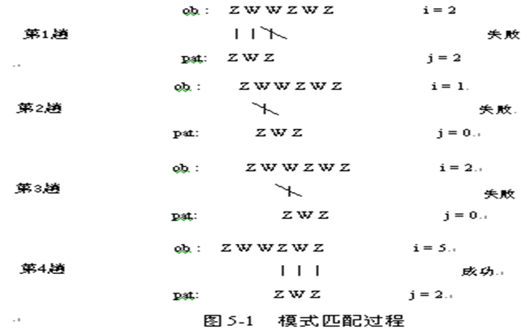
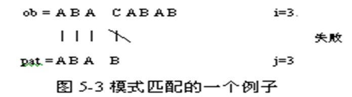
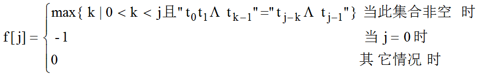
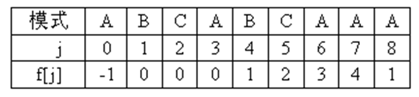

## 字符串、数组和广义表

计算机上的非数值处理对象基本上是字符串数据。在较早的程序设计语言中，字符串是作为输入和输出的常量出现的，随着语言加工程序的发展，产生了字符串处理，C++中提供了关于字符串的基本函数。

数组和广义表是与前述的线性表有所区别的数据结构。它们可以看成是线性表在下述含义上的扩展：线性表中的元素本身也是一个数据结构。

## 字符串的定义、存储结构

字符串(string)是由n (n≥0) 个字符组成的有限序列。字符串简称为串，一般记为：s = "a<sub>0</sub> a<sub>1</sub> … a<sub>n-1</sub>"

其中s是串名；用双引号括起来的字符序列是串值；a<sub>i</sub>(0≤i<n)可以是ASCII码字符中的可打印字符，通常是字母、数字等字符；i称为字符ai 在串中的位置；n称为串的长度；n =0时，s称为空串。容易与空串相混淆的一种串是空格串，空格串是由一个或多个空格组成的串，如4个空格组成的空格串“    ”，它的长度是4，而空串的长度为0。

串中任意多个连续的字符组成的子序列称为该串的子串。子串在该串中的位置就是子串的首字符在该串中的位置。
如果两个字符串对应位置的字符都相等，且它们长度相等，则称这两个字符串相等。

在C++中，串值必须用一对双引号括起来，但双引号本身不属于串。而字符用单引号括起来。串“w”和字符‘w’是两个不同的概念，前者是字符串，后者是字符。

串是一种线性结构，因此，串既可以用顺序存储结构来存储，也可以用链表存储结构来存储。由于每个字符占空间很小，只占8位二进制，所以串通常采用顺序存储结构存储，它比用链式存储结构存储效率高，实现起来也方便。

采用顺序存储结构时，数组名指出了串在内存中的首地址。有两种表示串长度的方法：

（1）在存储串的数组末尾添加一个结束标识符；
（2）用一个单独的长度参数。

计算机高级语言一般采用第一种方法表示串的长度。实际上，C++是在存储串的数组末尾添加一个ASCII编码值为0的空字符(标识符为NULL)作为结束标识符。

下述语句定义了一个字符数组并赋初值"Data Structure"：

```c++
char str[ ]= "Data Structure";
```
字符串"Data Structure"在内存中的存储形式如下： 


## 串的操作

下面讨论串的操作，为了方便讨论，我们先定义如下几个串：

- s1 = "It is a car"
- s2 = "jeep"
- s3 = "car"

串的操作主要有：

（1）  求串的长度。例如，s1的长度为11，s2的长度为4。

（2）  把一个串的值赋值给另一个串。若有s4＝s3，则s4 的值为 "car"。

（3）  把两个串连接形成一个长度为两个串长度之和的新串。设s5为s2和s3连接形成的新串，则s5="jeepcar"，即将后面的串连接在前面串的尾部。

（4）   比较两个串的ASCII码值的大小。设str1和str2为两个串，按下述规则得到两个串的比较结果。

- 若str1小于str2，比较结果为－1
- 若str1等于str2，比较结果为0
- 若str1大于str2，比较结果为1

（5）  在一个串（称为主串）中查找是否存在和另一个串相等的子串。

设在串str1中查找串str2，这里str1是主串， str2是子串。若主串str1中存在和串str2相等的子串，则操作结果为str2在串str1中首次出现的位置，即str2的首字符在str1中匹配的位置；若主串str1中不存在和串str2相等的子串，则操作结果为－1。

例如，在串s1中查找到存在和串s3相等的子串，则操作结果为8。在串s1中未查找到和串s2相等的子串，则操作结果为－1。

（6）   在一个串中是否存在一个字符。

设在串str中查找字符ch，若串str中存在字符ch，则操作结果为字符ch在串str中第一次出现的位置；若串str中不存在字符ch，则操作结果为－=1。例如，在串s2中查找字符'e'，则操作结果为1；在串s2中查找字符'c'，则操作结果为－1。

（7）  截取子串形成一个新串。

设str为要截取的串，pos为要截取的起始位置，length为要截取的长度，则形成的新串长度为length。如果从s1串截取起始位置为3（这里是从0开始）、长度为2的子串放在s6中，则s6＝"is"。

（8）  在一个串中插入另一个串。设把串str2插入到串str1中，pos为要插入的起始位置，则操作结果形成的新串长度为str1和str2之和。例如，把串s7=" not"，插入到串s1的位置5处，则操作结果形成的新串s8="It is not a car"。

（9）  从一个串中删除一个子串。设在串str中要删除长度为length的子串，pos为要删除的子串在str中的起始位置，则删除后的新串长度为原长度减去length。例如，要在s8中删除长度为4的子串，起始位置为5，则删除后的新串为s1。

（10）从键盘输入一个字符序列。

（11）在屏幕上显示一个字符序列。

## 常用的C++字符串函数

C++的串库(string.h)中提供了许多字符串操作函数。但C++的串库中提供的实现字符串操作的函数功能和前面讨论的字符串的基本操作功能不完全相同。

几个常用的C++字符串函数及其使用方法如下：

假设我们已有如下定义语句：

- char s1[ ] = "It is a car"；
- char s2[ ] = "jeep"；
- char s3[ ] = "car"；
- int result；
- char s4[20], *p;

（1）串长度   `int strlen(char *str)`

```c++
cout << strlen(s1)<<endl；　　//输出11
cout << strlen(s2)<<endl；　　//输出4
```

（2）串拷贝　`char *strcpy(char *str1，char *str2)`

```c++
strcpy(s4，s2); //s4 = "jeep"
```

（3）串连接　`char *strcat(char *str1，char *str2)`

```c++
strcat(s2，s3)； //s4 = "jeepcar"
```

（4）串比较　`char *strcmp(char *str1，char *str2)`

```c++
result = strcmp(s2，s3)；      //result>0
result = strcmp(s2，s2)；      //result=0
result = strcmp(s3，s2)；      //result<0
```

（5）串中字符定位　`char *strchr(char *str , char ch)`

```c++
p = strchr(s1 , 'c'); //p指在s1中字符'c'首次出现的位置
strcpy(p , s2); //s1 = "It is a jeep" 
```
C++的流库（iostream.h）为字符输入流cin（键盘）和字符输出流cout（屏幕）提供I/O操作，使用方法如下：

（1）读串` Stream Variable >>str`

```c++
cin>>s4; //若输入"Hello!"，则s4 = "Hello!"
```

（2）写串`Stream Variable <<str`

```c++
cout << s4; //输出"Hello!"
```

C++的串库提供的实现字符串操作的函数功能较强，但由于函数定位通常用字符指针，所以使用的难度较大。 

例：名和姓的对换问题。英国和美国人的姓名是名在前姓在后，中间由一个空格符分隔，如Jeffer Offutt。但在有些情况下，需要把姓名写成姓在前名在后中间加一个逗号的形式。编写一个程序，把名在前姓在后的姓名表示法转换成姓在前名在后中间加一个逗号的姓名表示法。

```c++
#include "assistance.h"

void reversename(char *name , char *newname)
{
    char *p;
    p = strchr(name , ' '); 
    *p = '\0';             
    strcpy(newname , p+1);     
    strcat(newname , ",");  
    strcat(newname , name); 
    *p = ' '; 
    return;
}

int main() {
    char name[30], newname[30];
    cout << “输入一个人姓名(长度不超过30个字符：名在前，姓在后，中间有一个空格分隔。" << endl; 
    cin.getline(name,30,'\n'); 
    reversename(name , newname);
    cout << “reversename:” << newname << endl;
    system("PAUSE");
    return 0;
}
```

程序运行如下：

```
Jeffer Offutt               	//键盘输入
reversename:Offutt, Jeffer      //屏幕输出
```

## 串类及其实现

C++提供的丰富的串库函数有很强的串操作功能，对于经验丰富的程序员来说，是实现高效的串操作的得心应手的工具包。

可以使用重载操作符的办法，使得C++中的一些运算符具有新的功能。如："=="具有串的比较功能，等等。可以定义满足如下要求的串类：

- 可以把串对象或C++串赋给另一串对象
- 串对象的连接用"+"算符完成
- 串比较是用关系算符执行的
- 串对象可用C++串或另一串对象初始化
- 串必须拥有任意可变长度
- 可以把串对象转换为C++串
- 可以查找子串

### 串的定义

```c++
class String {
protected:
		char *sVal;	// 串值
		int length;	 // 串长	
public:                           
		String();	// 构造函数 
		virtual ~String();	// 析构函数
		String(const String &s);	// 复制构造函数
		String(const char *s);	// 转换构造函数
		int Length() const;	// 求串长度			 
		bool IsEmpty() const;	// 判断串是否为空
		String &operator =(const String &s);	// 赋值语句重载
		const char *CStr() const;// 将串转换成字符数组
		char &String::operator [](int p) const;	// 重载下标运算符
};
```

### 串类函数成员的实现

（1）构造函数

操作结果：初始化一个空串 
```c++
String::String() 
{
	length = 0;		// 串长度为0
	sVal = NULL;  	// 空串
} 
```
（2）析构函数

操作结果：销毁串，释放串的存储空间
```c++
String::~String() 
{
	delete []sVal;	// 释放串的存储空间sVal
}
```
### 串的相关函数定义
```c++
// 输出串
void Write(const String &s);	
// 将串s2复制到串s1
void Copy(String &s1, const String &s2);
// 将串s2复制n个字符到串s1 
void Copy(String &s1, const String &s2, int n);
// 将字符串s2插入到s1的p位置
Status Insert(String &s1, const String &s2, int p);
// 删除字符串s中从p位置开始长度为n的字符串
Status Delete(String &s, int p, int n);
// 求串s的第p个字符开始的长度为n的子串
String SubString(const String &s, int p, int n);
// 重载连接运算符+
String operator +(const String &s1, const String &s2);
// 重载关系运算符==
bool operator ==(const String &s1, const String &s2);
// 重载关系运算符<
bool operator <(const String &s1, const String &s2);
// 重载关系运算符>
bool operator >(const String &s1, const String &s2);
// 重载关系运算符<=
bool operator <=(const String &s1, const String &s2);
// 重载关系运算符>=
bool operator >=(const String &s1, const String &s2);
// 重载关系运算符!=
bool operator !=(const String &s1, const String &s2);
```
### 串的相关函数实现

对于以上定义的串相关函数，下面给出其实现的代码。

（1）串的输出

操作结果：输出串的值

```c++
void Write(const String &str) 
{
	cout << str.CStr() << endl;	// 输出串值
}
```

（2）串的复制

操作结果：将串s2复制到串s1

```c++
void Copy(String &s1, const String &s2)
{
	const char *cs2 = s2.CStr();    // 初始串
	char *cs1 = new char[strlen(cs2) + 1];   // 申请临时空间
	strcpy(cs1, cs2);	// 复制串
	s1 = cs1;		// 串赋值
	delete []cs1;	// 释放临时空间
}
```

### string的实现

- string.h

```c
#ifndef _STRING_H_
#define _STRING_H_

typedef struct string
{
	char * str;
	int length;
}String;

void strAssign(String* s, char* p); //将p串的值赋值给s
int strLength(String* s); //求串的长度
int strEqual(String* s, String* t);//判断两个串是否相等
int strCompete(String* s, String* t); //比较两串大小
void strConnect(String* s, String* t); //连接两个字符串
void strCopy(String* s, String* t); //将串t复制到串s中
void Insert(String *s, int pos, char* p); //在pos位置插入串p
void Delete(String* s, int pos, int len); //删除pos位置及后面长度为len的串

void print(String* s); //打印串

#endif
```

- string.c

```c
#include <stdio.h>

typedef struct string
{
	char * str; //指向串的指针
	int length; //串的长度
}String;
void strAssign(String* s, char* p) //赋值
{
	//先计算p串的长度，然后按照这个长度为s中的str开辟空间
	int i = 0;
	while (p[i] != '\0')
		i++;
	s->str = (char*)malloc((i + 1)*sizeof(char));
	//然后将p串赋值给s串
	int j = 0;
	for (j = 0; j <= i; j++)
		s->str[j] = p[j];
	s->str[j + 1] = '\0'; //末尾赋值\0
	s->length = i; //串长度记录
}
int strLength(String* s) //求串的长度
{
	return s->length;
}
void strCopy(String* s, String* t) //将串t复制到串s中
{
	//重新为s串分配内存，大小等于t串
	s->str = (char*)malloc((t->length)*sizeof(char));
	memset(s->str, '\0', t->length + 1);
	for (int i = 0; i <= t->length; i++)
		s->str[i] = t->str[i];
}
int strEqual(String* s, String* t) //判断两串是否相等
{
	if (s->length == t->length)
	{
		while (*(s->str++) != *(t->str++))
		{
			printf("两个串不相等！\n");
			return 0;
		}
		printf("两个串相等！\n");
		return 1;
	}
	printf("两个串不相等！\n");
	return 0;
}
void strConnect(String* s, String* t) //连接两个串
{
	int len = s->length + t->length;
	char* temp = (char*)malloc((s->length + t->length)*sizeof(char)); //申请缓存
	memset(temp, '\0', s->length);
	int i, j;
	for (i = 0; i < s->length; i++) //将s串先存入缓存中
		temp[i] = s->str[i];
	for (j = 0; j < t->length; j++, i++) //再将t串存入进来
		temp[i] = t->str[j];
	temp[i] = '\0';
	s->str = temp; //将s串指向temp
	s->length = s->length + t->length;
}

int strCompete(String* s, String* t) //比较串大小
{
	if (s && t) //传入的两个串都不为空（健壮性判断）
	{
		int sl = s->length, tl = t->length; //记录两个串的长度
		while (*(s->str) != '\0' && *(t->str) != '\0')
		{
			if (*(s->str) < *(t->str))
				return -1;
			if (*(s->str) == *(t->str))
			{
				s->str++;
				t->str++;
			}
			if (*(s->str) > *(t->str))
				return 1;
			s->str++;
			t->str++;
		}
		//如果循环结束，即有一个串已经到尾部
		//那么这种情况，必有一个是子串一个是主串
		//此时比较两个串的长度大小
		if (sl < tl)
			return -1;
		if (sl == tl)
			return 0;
		if (sl > tl)
			return 1;
	}
}
void Insert(String *s, int pos, char* p) //插入串
{
	if (pos < 0 || pos > s->length)
		return;
	//先求出串p的长度
	int plen = 0;
	while (p[plen] != '\0')
	{
		plen++;
	}
	//循环结束后，plen就记录了串p的长度
	//分配一个临时缓存，将串s与串p存入进来
	char* temp = (char*)malloc((plen + s->length)*sizeof(char));
	int i;
	for (i = 0; i < pos; i++) //将s串pos位置前的存入进来
	{
		temp[i] = s->str[i];
	}
	//然后将p串存入到pos位置后
	int j = 0;
	while (p[j] != '\0')
	{
		temp[i] = p[j];
		i++, j++;
	}
	//将p串插入进来后，接着将剩下的s串补到后面
	for (; pos < s->length; pos++)
	{
		temp[i] = s->str[pos];
		i++;
	}
	temp[i] = '\0';
	s->str = temp;
	s->length = s->length + plen;
	printf("插入之后：%s\n", temp);
}
void Delete(String* s, int pos, int len) //删除某一个子串
{
	if (pos < 0 || pos > s->length || len > s->length - pos)
		return;
	//先创建一个缓存，大小为s->length - len
	char* temp = (char*)malloc((s->length - len)*sizeof(char));
	int i;
	for (i = 0; i < pos; i++) //将s串中pos位置前的串复制到temp缓存中
	{
		temp[i] = s->str[i];
	}

	int j = pos + len;
	for (; j < s->length; j++)//将去掉子串后面剩余的串复制到temp中
	{
		temp[i] = s->str[j];
		i++;
	}
	temp[i] = '\0';
	s->str = temp;
	s->length = s->length - len;
	printf("删除子串后：%s\n", temp);
}
void print(String* s)
{
	if (s)
		printf("%s\n", s->str);
}
```

## 模式匹配算法

设有两个字符串ob和pat，若要在串ob中查找与串pat相等的子串，则称ob为主串（或称目标串），pat为模式串，并称查找模式串在主串中的匹配位置的运算为模式匹配。

该运算从ob的头1个字符开始查找一个与串pat (称作模式串) 相同的子串。

如果在串ob中查找到一个与模式串pat相同的子串，则函数返回模式串pat的头一个字符在串ob中的位置；

如在主串中未查找到一个与模式串pat相同的子串，则函数返回－1。

在类String中的成员函数find ( )就是模式匹配函数。

### Brute-Force算法

Brute-Forc算法的主要思想是：从主串ob = “s0 s1 … sm-1”的第一个字符开始与模式串pat = “t0 t1 … tn-1”的第一个字符比较：

- 若相等，则继续比较后续字符；
- 否则，从主串ob的第二个字符开始重新与模式串pat 的第一个字符比较。
- 如此继续，若在主串ob中有一个与模式串相等的连续字符序列，则匹配成功，函数返回模式串pat的首字符在串ob中的位置；
- 否则，匹配失败，函数返回－1。

看一个模式匹配的例子。设主串ob = “ZWWZWZ”，模式串pat = “ZWZ”，ob的长度为m = 6，pat的长度为n = 3，用变量i指示主串ob的当前比较字符的下标，用变量j指示模式串pat的当前比较字符的下标。

此例的模式匹配过程如图所示。



对于一般的模式匹配过程如图5-2所示，这里给出了某一趟比较的状态和下一趟比较时下标变化的一般过程。


```c++
int BF_find(const String &ob, const String &pat, const int p = 0)
{
	int i = p, j = 0;
	while (i < ob.Length() && j < pat.Length())
		&& pat.Length() - j <= ob.Length() - i)
	if (ob[i] == pat[j])	{		// 继续比较后续字符
		i++; j++;
	 }
  	else	{	           	// 指针回退,重新开始新的匹配
		i = i - j + 1; j = 0;
	 }
	if (j >= pat.Length())
      	return i - j;			// 匹配成功
	else
       	return -1;			// 匹配失败
}
```

Brute-Force算法是一种带回溯的算法，也叫朴素的模式匹配算法。在最坏情况下，最多要比较m－n＋1趟，每趟比较在最后才出现不等，要做n次比较，总比较次数要达到(m－n＋1)\*n。通常n会远远小于m，因此，算法的最坏情况下运行时间为O(m*n)。

```c
#define _CRT_SECURE_NO_WARNINGS
#include <stdio.h>
#include <stdlib.h>
#include <string.h>

int find(char* s, char* t) //模式匹配算法
{
	int i = 0, j = 0;
	while (i < strlen(s) && j < strlen(t))
	{
		if (s[i] == t[j]) //如果两个字符相等，则比对后续字符
		{
			i++;
			j++;
		}
		else //如果两个字符不相等
		{
			i = i - j + 1; //主串从下一个位置开始
              j = 0; //模式t从头开始
		}
	}
	//循环结束后，要查看i与j的位置
	if (j == strlen(t)) //如果j的值等于模式t的长度，则说明t已完全匹配
		return i - strlen(t); 
	else
		return -1;
}

int main()
{
	char s[1024], t[100];
	printf("请输入主串s：\n");
	scanf("%s", s);
	printf("请输入模式t:\n");
	scanf("%s", t);
	printf("s长度：%d\n", strlen(s));
	printf("t长度：%d\n", strlen(t));

	int ret = find(s, t);
	if (ret == -1)
		printf("匹配失败！\n");
	else
		printf("匹配成功，t串在s串中第一次出现的位置是%d\n", ret);

	system("pause");
	return 0;
}
```

### 模式匹配的KMP算法

KMP算法是由D.E.Knuth、J.H.Morris和V.R.Pratt三人设计的。该算法是Brute-Force算法的改进。它消除了Brute-Force算法的如下缺点：主串下标i在若干次对应的字符比较相等后，只要有一次对应字符比较不相等便需要回退。

下面分两种情况来讨论KMP算法的匹配过程：

（1）模式串中无真子串（模式串中的真子串将在下面讨论），即从第一个字符开始的“部分匹配子串”，在下图中主串ob= "ZWWZWZ"、模式串pat= "ZWZ"的模式匹配过程中，当s0＝t0，s1＝t1，s2≠t2时，算法中取i =1，j =0，使主串下标i值回退，然后比较s1和t0。但是因为t1≠t0，所以一定有s1≠t0，实际上接下来就可直接比较s2和t0。

（2）模式串中有真子串，设主串ob= "ABACABAB"、模式串pat= "ABAB"。第一次匹配过程如下图。此时，因t0≠t1，s1＝t1，必有s1≠t0；又因t0＝t2，s2＝t2，必有s2＝t0，因此接下来可直接比较s3和t1。



由此可见，一旦si和tj比较不相等，主串ob的下标值可不必回退，主串的si（或si+1）可直接与模式串的tk（0≤k＜j）比较。

Knuth等人发现，k 的确定与主串ob并无关系，而只与模式串pat本身的构成有关，即从模式串本身就可求出k的值。

下面来讨论一般情况。设ob = “s0 s1 … sm-1”，pat = “t0 t1 … tn-1”，当si≠tj (0≤i＜m，0≤j＜n)时，模式串“向右滑动”，可行的距离多远呢?

换句话说，当主串中第i个字符与模式串中第j个字符“失配”（即比较不等）时，主串中的si应与模式串中的哪个字符再比较？

因为已有："si-j si-j+1 … si-1" = "t0 t1 … tj-1"

我们可分两种情况来讨论：

（1）若模式串中存在相互重叠的真子串，满足"t0 t1 … tk-1"= "tj-ktj-k+1 … tj-1"    (0＜k＜j）
   则说明模式串中的子串"t0 t1 … tk-1"已和主串" si-ksi-k+1 … si-1" 匹配，下一次可直接比较si和tk。

（2）若模式串中不存在相互重叠的真子串，则说明在模式串“t0 t1 … tj-1”中不存在任何以t0为首字符的字符串与      "si-j si-j+1 … si-1“  中以si-1为末字符的字符串匹配，下一次可直接比较si和t0。

现在来讨论模式串中的真子串。模式串中的真子串定义为从第一个字符到满足下式的第f[j]个字符所构成的字符串。其中：



若模式串t中存在真子串"t0 t1 … tk-1"= "tj-ktj-k+1 … tj-1"且满足0＜k＜j，则f[j]表示当模式串pat中的tj与主串ob的si比较不相等时，模式串pat中需重新与主串ob的si比较的字符下标为k，即接下来比较si和tk；

当j=0时，f[j]=-1，此处-1为一标记，表示接下来比较si+1和t0；

若模式串pat中不存在如上所说的真子串，有f[j]=0，则接下来比较si和t0。

这里的函数f[j]被称为失效函数(failure function)，又称为失败函数。

总之，KMP算法对Brute-Force算法的改进就是利用已经得到的部分匹配结果将模式串pat右滑一段距离再继续比较，从而无需回退主串ob的下标值

给出一个求失效函数f[j]的例子。计算pat= "ABCABCAAA"的f[j]。



- 当j＝0时，f[0]＝-1；当j＝1时，f[1]＝0；
- 当j＝2时，t0≠t1，f[2]＝0；当j＝3时，t0≠t2，f[3]＝0；
- 当j＝4时，t0＝t3＝'A'，f[4]＝1；
- 当j＝5时，t0 t1＝t3 t4＝'AB'，f[5]＝2；
- 当j＝6时，t0 t1 t2＝t3t4 t5＝'ABC'，f[6]＝3；
- 当j＝7时，t0 t1 t2 t3≠t4 t5 t6 t7，t0＝t6＝'A'，f[7]＝1；
- 当j＝8时，t0 t1≠t6 t7，t0＝t7＝'A'，f[7]＝1；

KMP算法的思想是：设ob为主串，pat为模式串，i为串ob当前比较字符的下标，j为模式串pat当前比较字符的下标，令i和j的初值为0。

当si=tj或者j＝-1时，i和j分别增1再继续比较；否则，i不变，j变为f[j]，再继续比较。直到主串ob或者是模式串pat的字符比较完为止。

在已知失效函数f[j]的情况下，findsubstr( )函数可设计为：在已知失效函数f[j]的情况下，findsubstr( )函数可设计为：

```c++
int KMP_find(const String &ob, const String &pat, int p = 0){
	int *f = new int[pat.Length()];   // 为失效函数值数组f分配空间
	GetFailure(pat, f);	              // 求模式串pat的f数组的元素值
	int i = p, j = 0;			
	while (i < ob.Length() && j < pat.Length()
		&& pat.Length() - j <= ob.Length() - i)
      	if (j == -1 || pat[j] == ob[i])	{
		   i++; j++;	       // 模式串pat与目标串ob的当前位置向后移
            }
		else	               // pat[j]与ob[i]不匹配
		   j = f[j];	       // 寻找新的模式串pat的匹配字符位置
     delete []f;               // 释f所占用的存储空间
	if (j < pat.Length())
        return -1;	           // 匹配失败
	else
        return i - j;    	  // 匹配成功
}
```

该算法的时间复杂度取决于其中的while循环，由于该算法中无回溯，在进行对应的字符比较后，要么是ob的下标值加1，要么是调整模式串的下标值，继续向后比较。字符比较的次数最多为O(ob.size)

下面再来讨论求失效函数f[j]的算法。

从上面计算f[j]的例子可以看出f[j]的计算是一个递推计算问题。设有f[j] = k，即在模式串pat中存在 "t0 t1 … tk-1“ = "tj-ktj-k+1 … tj-1"（0＜k＜j），其中k为满足等式的最大值，则计算f[j+1]的值有两种情况：

（1）若tk= tj，则表明在模式串pat中有"t0 t1 … tk“ = "tj-ktj-k+1 … tj"，且不可能存在任何k'＞k满足上式，因此有：f[j+1] = f [j] +1 = k+1

### KMP算法的实现

- head.h

```c
#include <stdio.h>
#include <stdlib.h>

void get_Next(char* t, int* next)
{
	//求模式串t的next值并存入数组next中
	int i = 0, j = -1;
	next[0] = -1;
	while (t[i] != '\0') //循环条件
	{
		if (j == -1 || t[i] == t[j])
		{
			i++, j++;
			if (t[i] != t[j])
				next[i] = j;
			else
				next[i] = next[j];
		}
		else
			j = next[j];
	}

	//将next值打印显示
	for (int n = 0; n < i; n++)
		printf("%d  ", next[n]);
	printf("\n");
}
int KMP(char* s, char* t, int next[])
{
	if (s == NULL || t == NULL)
		return -1;
	//先求算出主串s与模式串t的长度
	int len = 0;
	char* temp = t;
	while (*temp++ != '\0') //求t的长度
		len++;

	//开始模式匹配
	int i = 0, j = 0;
	while (s[i] != '\0' && t[j] != '\0') //循环条件
	{
		if (j == -1 || s[i] == t[j]) //如果j=-1或者两个字符相等，就比对后面的字符
			i++, j++;
		else
			j = next[j]; //i不变，j改变，消除了主串的回溯

		//如果j的值等于模式t的大小，则证明t已经匹配到末尾
		if (j == len)
			return i - len;
	}
	return -1;
}
```

- main.c

```c
#define _CRT_SECURE_NO_WARNINGS
#include "head.h"

int main()
{
	char s[1024], t[100];
	int next[100]; //存储t串的模式值
	printf("请输入主串s：\n");
	scanf("%s", s);
	printf("请输入模式t:\n");
	scanf("%s", t);
	printf("s长度：%d\n", strlen(s));
	printf("t长度：%d\n", strlen(t));

	printf("模式串t的next值：");
	get_Next(t, next);

	int ret = KMP(s, t, next);
	if (ret == -1)
		printf("匹配失败！\n");
	else
		printf("匹配成功，t串在s串中第一次出现的位置是%d\n", ret);

	system("pause");
	return 0;
}
```