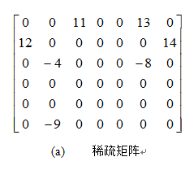

## 十字链表

当矩阵非零元的位置或个数经常变动时，三元组顺序表就不适合于作稀疏矩阵的存储结构。像作两个矩阵A与B的加法，把结果保存到A中，将会引起非零元的的变化，并导致非零元的插入和删除。此时，采用链式存储结构更好些。

稀疏矩阵的十字链表，由行链表和列链表组成，每一个矩阵元素既处于行链表中，又处于列链表中。这里的行链表是一个不带表头结点的单链表，列链表亦是一个不带表头结点的单链表。

### 十字链表中非零元素结点类

```c++
#include "triple.h"	// 三元组类
// 十字链表非零元素结点类
template<class ElemType>
struct CrossNode   {
// 数据成员:
	Triple<ElemType> triElem;	// 三元组
	CrossNode<ElemType> *right, *down;// 行表与列表的后继指针域 
// 构造函数:
	CrossNode();	
	CrossNode(const Triple<ElemType> &e,
           CrossNode<ElemType> *rLink = NULL,
	       CrossNode<ElemType> *dLink = NULL);	
};
```

在十字链表中，每行有一个不带表头的单链表，每列也有一个不带表头的单链表。




### 十字链表类的定义

```c++
template<class ElemType>  class CrossList  {
protected:
	CrossNode<ElemType> **rowHead, **colHead;// 行列链表头数组
	int rows, cols, num;	// 稀疏矩阵的行数,列数及非零元个数
public:
  	// 构造一个rs行cs列的空稀疏矩阵
	CrossList(int rs = DEFAULT_SIZE, int cs = DEFAULT_SIZE);
	~CrossList();	// 析构函数
	void Clear();	// 清空稀疏矩阵
	int GetRows() const { return rows; };	// 返回稀疏矩阵行数
    int GetCols() const { return cols; };	// 返回稀疏矩阵列数
    int GetNum() const { return num; };		// 返回稀疏矩阵非零元个数
	Status SetElem(int r, int c, const ElemType &v);
    // 设置指定位置的元素值
	Status GetElem(int r, int c, ElemType &v);// 取指定位置的元素值
	CrossList(const CrossList<ElemType> &b);	// 复制构造函数
	CrossList<ElemType> &operator =(const CrossList<ElemType> &b); 
	// 重载赋值运算符 
	CrossList<ElemType> operator +(const CrossList<ElemType> &b); 
	// 重载加法运算符 
};
```
## 十字链表的实现

### Mat.h

```c
#include <stdio.h>
#include <stdlib.h>

#define ROW 3
#define COL 4
#define Max ((ROW)>(COL)?(ROW):(COL))
typedef int ElemType;
typedef struct MatrixPointer
{
	int row;
	int col;
	struct MatrixPointer *right, *down;
	union
	{
		ElemType value;
		struct MatrixPointer *link;
	}tag;
}MatNode;		//十字链表类型定义
//创建一个十字链表，并使用数组a初始化
void cmatCreate(MatNode *&hm, ElemType a[ROW][COL]);
//输出
void cmatPrint(MatNode *hm);
```

### Mat.cpp

```c
#include "Mat.h"
//创建一个十字链表，并使用数组a初始化
void cmatCreate(MatNode *&hm, ElemType a[ROW][COL])
{
	int i, j;
	//头结点指针
	MatNode *h[Max], *p, *q, *r;
	hm = (MatNode*)malloc(sizeof(MatNode));			//矩阵指针hm
	hm->row = ROW;									//初始化行
	hm->col = COL;									//初始化列
	r = hm;
	for (i = 0; i < Max; i++)
	{
		h[i] = (MatNode*)malloc(sizeof(MatNode));
		h[i]->right = h[i];							//构成循环
		h[i]->down = h[i];
		r->tag.link = h[i];							//将头指针链接起来
		r = h[i];
	}
	r->tag.link = hm;								//将指针重新指向矩阵头结点
	for (i = 0; i < ROW; i++)
	{
		for (j = 0; j < COL; j++)
		{
			if (a[i][j] != 0)						//赋值初始化
			{
				p = (MatNode*)malloc(sizeof(MatNode));
				p->row = i;
				p->col = j;
				p->tag.value = a[i][j];
				q = h[i];
				//插入行链表
				while (q->right != h[i] && q->right->col < j)
					q = q->right;
				p->right = q->right;
				q->right = p;
				q = h[j];
				//插入列链表
				while (q->down != h[j] && q->down->row < i)
					q = q->down;
				p->down = q->down;
				q->down = p;
			}
		}
	}
}

void cmatPrint(MatNode *hm)
{
	MatNode *p, *q;
	printf("行 = %d，列 = %d\n", hm->row, hm->col);
	p = hm->tag.link;
	while (p != hm)
	{
		q = p->right;
		while (p != q)
		{
			printf("(%d,%d,%d)\n", q->row + 1, q->col + 1, q->tag.value);
			q = q->right;
		}
		p = p->tag.link;
	}
}
```

### main.cpp

```c
#include "Mat.h"

int main()
{
	ElemType a[ROW][COL] = { { 1, 0, 0, 2 }, { 0, 0, 1, 0 }, { 0, 0, 0, 1 } };
	MatNode *mat;
	cmatCreate(mat, a);
	cmatPrint(mat);
	return 0;
}
```