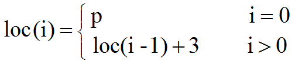

## 数组

线性表是一种线性结构，它是具有相同类型的n(n≥0)个数据元素组成的有限序列。本章先介绍线性表的几个基本组成部分：数组、单向链表、双向链表；随后给出双向链表的C、C++和Java三种语言的实现

数组是读者已经很熟悉的一种数据结构，几乎所有的程序设计语言都把数组类型设定为固有类型。事实上，在前几章中，已经使用了C++的一维数组来存放线性表。在本节中介绍数组的定义以及相应的存储结构，并讨论了稀疏的矩阵的定义和实现。

通常，一维数组A(array)是n (n≥0)个相同数据类型的数据元素a<sub>0</sub>, a<sub>1</sub>, ... , a<sub>n-1</sub>构成的有限线性序列。其中n叫做数组长度或数组大小，若n＝0就是空数组。当每一个数组元素a<sub>i</sub>（0≤i≤n-1）本身又是一个一维数组时，则A就是一个二维数组。类似地，我们可以构成一个多维数组,一个m(m≥2)维数组中的每一个数组元素是一个m-1维的数组。

可见在一个m(m≥2)维数组中，每一个数组元素受m个线性关系的约束，如果一个元素在每一维中的序号分别为i1、i2、…、im，则称该元素的下标为：i<sub>1</sub>、i<sub>2</sub>、…、i<sub>m</sub>。如果一个数组名为a，则a<sub>i1i2…im</sub>表示下标为i1、i2、…、im的数组元素。

数组有上界和下界，数组的元素在上下界内是连续的。存储10,20,30,40,50的数组的示意图如下


数组的特点是：数据是连续的；随机访问速度快。

数组中稍微复杂一点的是多维数组和动态数组。对于C语言而言，多维数组本质上也是通过一维数组实现的。至于动态数组，是指数组的容量能动态增长的数组；对于C语言而言，若要提供动态数组，需要手动实现；而对于C++而言，STL提供了Vector；对于Java而言，Collection集合中提供了ArrayList和Vector。

## 数组的顺序存储结构

采用顺序存储结构存储数组的元素，就是按某种顺序将数组元素依次存放在内存中的一片连续的存储单元中。
数组的每个元素的数据类型都相同，因而占有相同的存储空间。对于一维数组，相邻元素的起始地址之差为一常数。

例如，下图是一维数组a[5]的5个元素顺序存储的示意图。


每个元素占3个存储单元，数组第1个元素a[0]的起始地址为loc(0) = p，则该数组的任一数组元素a[i]的起始地址loc(i)可由以下的递推公式计算：



实际上即有：loc (i) = p+i*3       (i = 0，1，2，3，4) 

现在来讨论二维数组的顺序存储结构。由于计算机的存储单元是一维的结构，所以，n（n≥2）维数组的顺序存储实际上还是按一维数组的方式实现的。

用一组连续存储单元存放二维数组就是将它的下标映射到其相应的一维数组的存储位置，这里就有个次序约定问题。

可有两种存储方式：一种是以行序为主序的存储方式。如，C，C++，PASCAL等语言都采用这种存储方式。

另一种是以列序为主序的存储方式，例如FORTRAN语言就采用这种存储方式。

对于二维数组a\[m][n]，用aij来表示数组元素a\[i][j]，则二维数组a可以表示为： 


下图显示了以行序为主序的存储方式，图5-6(b)显示了以列序为主序的存储方式。


假设二维数组a\[m][n]的首地址为p，即a\[0][0]的起始地址为p，每个元素占L个存储单元，以行序为主序存储方式来存储数组a，计算数组元素a\[i][j]的起始地址loc(i，j)。因为对于一维数组a中的第k个元素的起始地址是：loc(k) = p+k*L

因此只要计算出a\[i][j]是数组的第几个元素就可计算出loc(i, j)。

若设其为k，则有`k = i*n+j`，所以：`loc(i, j) = p+ (i*n+j ) *L`

对于以列序为主序存储任一数组元素存储地址的推导类同。

在三维数组a\[m1]\[m2][m3]中，总共有`m1*m2*m3`个数组元素，每一个数组元素a\[i]\[j]\[k](0≤i≤m1－1，0≤j≤m2－1，0≤k≤m3－1)同时处于三个向量之中。数组元素a\[i]\[j][k]在数组中的位置应由下标的三元组\[i]\[j][k]唯一确定。如果要想把三维数组a\[m1]\[m2][m3]用一个一维数组来表示，也需要先确定各数组元素的排列顺序。

一种方式是下标从左到右优先顺序，即下标变动得最快的是第三维。在这种情况下，对于某一个固定的下标i来说，将有m2*m3个数组元素。对于任一数组元素a\[i]\[j][k]来说，每变动一个i，行下标j和列下标k将重新变动。

设a\[0]\[0][0]的起始地址为p，每一个数组元素占L个单元，则a\[i]\[j][k]的起始地址为

```
loc(i,j,k)= p+(loc(i,0,0)- loc(0,0,0) + j*m3+k) *L
= p+(loc(i-1,0,0)- loc(0,0,0) + m2m3 +j m3+k) *L
= p+(loc(i-2,0,0)- loc(0,0,0) + 2m2m3 +j* m3+k) *L
= …
= p+(loc(0,0,0)- loc(0,0,0) + im2m3 +j* m3+k) *L
= p+(im2m3 +j* m3+k) *L
```

推而广之，对于n维数组a\[m1]\[m2] … [mn]来说，若设它的头一个数组元素a\[0][0] … [0]的起始地址为p，每一个数组元素占L个单元，那么，任意一个数组元素a\[i1][i2] … [in]的存储地址为 


另一种方式是下标从右到左优先的顺序，即下标变动得最快的是第一维，相关推导留给读者去完成。 

## 数组类的定义及其实现

在此，从抽象数据类型的观点出发给出数组上更多的操作，同时将避免C++数组操作的不足。在数组类中将实现以下功能：

- 可以通过数组的整体复制来建立数组
- 把一个数组赋值给另一个数组
- 重载函数运算符
- 重载赋值运算符
- 重载加法运算符


### 数组类的定义

```c++
template<class ElemType>
class Array {
protected:
	ElemType *arrVal;	// 数组元素的存储空间 
	int dim;			// 数组维数
	int *bounds;		// 数组各维长度
	int *constants;		// 数组映象函数常量
 	int Locate(int sub0, va_list &va) const
public:
	Array(int d, ...);		// 构造数组
	~Array();				// 析构函数
	Array(const Array<ElemType> &copy);	// 复制构造函数
	ElemType &operator()(int sub0, ...);// 重载函数运算符
	Array<ElemType> &operator =(const Array<ElemType> &arr
	Array<ElemType> &operator +(const Array<ElemType> &arr); 
};
```

### 数组类中函数成员的实现

(1) 构造函数

操作结果：构造一个d维数组

```c++
template <class ElemType>Array<ElemType>::Array(int d, ...){
	if (d < 1)				
		throw Error("维数不能小于1!");// 抛出异常
	dim = d;				// 数组维数为d
	bounds = new int[dim];	// 申请数组各维长度存储空间
	va_list va;				// 变长参数变量
	int elemTotal =1;		// 元素总数
	va_start(va, d);		// 初始化变量va,用于存储变长参数信息
	for (int i = 0; i < dim; i++)	{
		bounds[i] = va_arg(va, int);// 取出变长参数作为各维长度
		elemTotal = elemTotal * bounds[i];	// 统计数组总元素个数
	}
	va_end(va); 
	arrVal = new ElemType[elemTotal];	// 申请数组元素空间
	constants = new int[dim];		// 申请数组映象函数常量空间
	constants[dim - 1] = 1;
	for (int i = dim - 2; i >= 0; --i)		// 计算数组映象函数常量
	constants[i] = bounds[i + 1] * constants[i + 1]; 
}
```