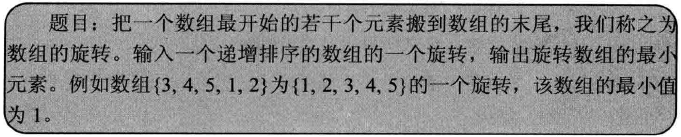

## 旋转数组的最小数字




```c++
int Min(int* numbers, int length)
{
    if(numbers == NULL || length <= 0)
        throw new std::exception("Invalid parameters");
 
    int index1 = 0;
    int index2 = length - 1;
    int indexMid = index1;
    while(numbers[index1] >= numbers[index2])
    {
        // 如果index1和index2指向相邻的两个数，
        // 则index1指向第一个递增子数组的最后一个数字，
        // index2指向第二个子数组的第一个数字，也就是数组中的最小数字
        if(index2 - index1 == 1)
        {
            indexMid = index2;
            break;
        }
 
        // 如果下标为index1、index2和indexMid指向的三个数字相等，
        // 则只能顺序查找
        indexMid = (index1 + index2) / 2;
        if(numbers[index1] == numbers[index2] && numbers[indexMid] == numbers[index1])
            return MinInOrder(numbers, index1, index2);

        // 缩小查找范围
        if(numbers[indexMid] >= numbers[index1])
            index1 = indexMid;
        else if(numbers[indexMid] <= numbers[index2])
            index2 = indexMid;
    }
 
    return numbers[indexMid];
}

int MinInOrder(int* numbers, int index1, int index2)
{
    int result = numbers[index1];
    for(int i = index1 + 1; i <= index2; ++i)
    {
        if(result > numbers[i])
            result = numbers[i];
    }

    return result;
}
```