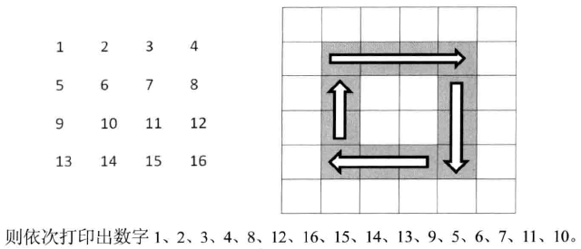

## 旋转数组

顺时针打印数组



```c++
void PrintMatrixClockwisely(int** numbers, int columns, int rows)
{
    if(numbers == NULL || columns <= 0 || rows <= 0)
        return;

    int start = 0;

    while(columns > start * 2 && rows > start * 2)
    {
        PrintMatrixInCircle(numbers, columns, rows, start);

        ++start;
    }
}

void PrintMatrixInCircle(int** numbers, int columns, int rows, int start)
{
    int endX = columns - 1 - start;
    int endY = rows - 1 - start;

    // 从左到右打印一行
    for(int i = start; i <= endX; ++i)
    {
        int number = numbers[start][i];
        printNumber(number);
    }

    // 从上到下打印一列
    if(start < endY)
    {
        for(int i = start + 1; i <= endY; ++i)
        {
            int number = numbers[i][endX];
            printNumber(number);
        }
    }

    // 从右到左打印一行
    if(start < endX && start < endY)
    {
        for(int i = endX - 1; i >= start; --i)
        {
            int number = numbers[endY][i];
            printNumber(number);
        }
    }

    // 从下到上打印一行
    if(start < endX && start < endY - 1)
    {
        for(int i = endY - 1; i >= start + 1; --i)
        {
            int number = numbers[i][start];
            printNumber(number);
        }
    }
}

void printNumber(int number)
{
    printf("%d\t", number);
}
```