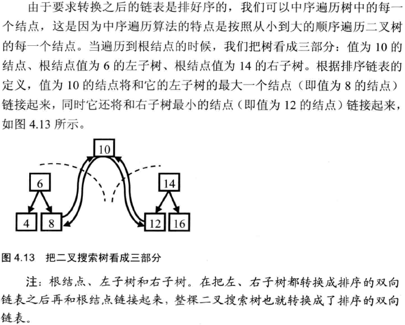

## 二叉搜索树与双向链表

输入一棵二叉搜索树，将该二叉搜索树转换成一个排序的双向链表。要求不能创建任何新的结点，只能调整树中结点指针的指向。


```c++
struct BinaryTreeNode 
{
    int                    m_nValue; 
    BinaryTreeNode*        m_pLeft;  
    BinaryTreeNode*        m_pRight; 
};
```



```c++
BinaryTreeNode* Convert(BinaryTreeNode* pRootOfTree)
{
    BinaryTreeNode *pLastNodeInList = NULL;
    ConvertNode(pRootOfTree, &pLastNodeInList);

    // pLastNodeInList指向双向链表的尾结点，
    // 我们需要返回头结点
    BinaryTreeNode *pHeadOfList = pLastNodeInList;
    while(pHeadOfList != NULL && pHeadOfList->m_pLeft != NULL)
        pHeadOfList = pHeadOfList->m_pLeft;

    return pHeadOfList;
}

void ConvertNode(BinaryTreeNode* pNode, BinaryTreeNode** pLastNodeInList)
{
    if(pNode == NULL)
        return;

    BinaryTreeNode *pCurrent = pNode;

    if (pCurrent->m_pLeft != NULL)
        ConvertNode(pCurrent->m_pLeft, pLastNodeInList);

    pCurrent->m_pLeft = *pLastNodeInList; 
    if(*pLastNodeInList != NULL)
        (*pLastNodeInList)->m_pRight = pCurrent;

    *pLastNodeInList = pCurrent;

    if (pCurrent->m_pRight != NULL)
        ConvertNode(pCurrent->m_pRight, pLastNodeInList);
}
```