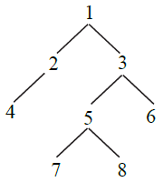
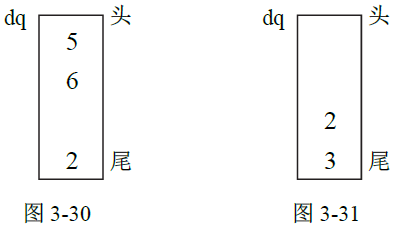

## 层序遍历打印二叉树

给定一棵二叉树的头节点head，分别实现按层打印和ZigZag 打印二叉树的函数。例如，二叉树如图所示。



按层打印时，输出格式必须如下：

Level 1 : 1
Level 2 : 2 3
Level 3 : 4 5 6
Level 4 : 7 8

ZigZag 打印时，输出格式必须如下：

Level 1 from left to right: 1
Level 2 from right to left: 3 2
Level 3 from left to right: 4 5 6
Level 4 from right to left: 8 7

### 按层打印的实现

按层打印原本是十分基础的内容，对二叉树做简单的宽度优先遍历即可，但本题确有额外的要求，那就是同一层的节点必须打印在一行上，并且要求输出行号。这就需要我们在原来宽度优先遍历的基础上做一些改进。所以关键问题是如何知道该换行。只需要用两个node 类型的变量last 和nLast 就可以解决这个问题，last 变量表示正在打印的当前行的最右节点，nLast 表示下一行的最右节点。假设我们每一层都做从左到右的宽度优先遍历，如果发现遍历到的节点等于last，说明该换行了。换行之后只要令last=nLast，就可以继续下一行的打印过程，此过程重复，直到所有的节点都打印完。那么问题就变成了如何更新nLast？只需要让nLast 一直跟踪记录宽度优先队列中的最新加入的节点即可。这是因为最新加入队列的节点一定是目前已经发现的下一行的最右节点。所以在当前行打印完时，nLast 一定是下一行所有节点中的最右节点。接下来结合题目的例子来说明整个过程。

开始时，last=节点1，nLast=null，把节点1 放入队列queue，遍历开始，queue={1}。

从queue 中弹出节点1 并打印，然后把节点1 的孩子依次放入queue，放入节点2 时，nLast=节点2，放入节点3 时，nLast=节点3，此时发现弹出的节点1==last。所以换行，并令last=nLast=节点3，queue={2,3}。

从queue 中弹出节点2 并打印，然后把节点2 的孩子放入queue，放入节点4 时，nLast=节点4，queue={3,4}。

从queue 中弹出节点3 并打印，然后把节点3 的孩子放入queue，放入节点5 时，nLast=节点5，放入节点6 时，nLast=节点6，此时发现弹出的节点3==last。所以换行，并令last=nLast=节点6，queue={4,5,6}。

从queue 中弹出节点4 并打印，节点4 没有孩子，所以不放入任何节点，nLast 也不更新。

从queue 中弹出节点5 并打印，然后把节点5 的孩子依次放入queue，放入节点7 时，nLast=节点7，放入节点8 时，nLast=节点8，queue={6,7,8}。

从queue 中弹出节点6 并打印，节点6 没有孩子，所以不放入任何节点，nLast 也不更新，此时发现弹出的节点6==last。所以换行，并令last=nLast=节点8，queue={7,8}。

用同样的判断过程打印节点7 和节点8，整个过程结束。

按层打印的详细过程请参看如下代码中的printByLevel 方法。

```java
public class Node {
	public int	value;
	public Node	left;
	public Node	right;
	public Node( int data )
	{
		this.value = data;
	}
}
public void printByLevel( Node head )
{
	if ( head == null )
	{
		return;
	}
	Queue<Node>	queue	= new LinkedList<Node>();
	int		level	= 1;
	Node		last	= head;
	Node		nLast	= null;
	queue.offer( head );
	System.out.print( "Level " + (level++) + " : " );
	while ( !queue.isEmpty() )
	{
		head = queue.poll();
		System.out.print( head.value + " " );
		if ( head.left != null )
		{
			queue.offer( head.left );
			nLast = head.left;
		}
		if ( head.right != null )
		{
			queue.offer( head.right );
			nLast = head.right;
		}
		if ( head == last && !queue.isEmpty() )
		{
			System.out.print( "\nLevel " + (level++) + " : " );
			last = nLast;
		}
	}
	System.out.println();
}
```
### ZigZag 打印的实现

先简单介绍一种不推荐的方法，即使用ArrayList 结构的方法。两个ArrayList 结构记为list1 和list2，用list1 去收集当前层的节点，然后从左到右打印当前层，接着把当前层的孩子节点放进list2，并从右到左打印，接下来再把list2 的所有节点的孩子节点放入list1，如此反复。不推荐的原因是ArrayList 结构为动态数组，在这个结构中，当元素数量到一定规模时将发生扩容操作，扩容操作的时间复杂度为O(N)是比较高的，这个结构增加和删除元素的时间复杂度也较高。总之，用这个结构对本题来讲数据结构不够纯粹和干净，如果读者不充分理解这个结构的底层实现，最好不要使用，而且还需要两个ArrayList 结构。

本书提供的方法只使用了一个双端队列，具体为Java 中的LinkedList 结构，这个结构的底层实现就是非常纯粹的双端队列结构，本书的方法也仅使用双端队列结构的基本操作。

先举题目的例子来展示大体过程，首先生成双端队列结构dq，将节点1 从dq 的头部放入dq。

原则1：如果是从左到右的过程，那么一律从dq 的头部弹出节点，如果弹出的节点没有孩子节点，当然不用放入任何节点到dq 中；如果当前节点有孩子节点，先让左孩子从尾部进入dq，再让右孩子从尾部进入dq。

根据原则1，先从dq 头部弹出节点1 并打印，然后先让节点2 从dq 尾部进入，再让节点3 从dq 尾部进入，如图3-30 所示。

原则2：如果是从右到左的过程，那么一律从dq 的尾部弹出节点，如果弹出的节点没有孩子节点，当然不用放入任何节点到dq 中；如果当前节点有孩子节点，先让右孩子从头部进入dq，再让左孩子从头部进入dq。

根据原则2，先从dq 尾部弹出节点3 并打印，然后先让节点6 从dq 头部进入，再让节点5 从dq 头部进入，如图3-31 所示。



```c++
#include<iostream>
#include<cstdlib>
#include<vector>
#include<queue>
using namespace std;

vector<char>::size_type n=0;
struct TreeNode {
    int val;
    struct TreeNode *left;
    struct TreeNode *right;
    TreeNode(int x):val(x), left(NULL), right(NULL) 
	{
    }
};
class Serialize
{
public:
	void serialize(TreeNode* head,vector<char> &B)
	//先序序列化：B存放序列化结果
	{
		if(!head)
		{
			B.push_back('#');
			B.push_back('!');
			return;
		}
		int value=head->val;
		if(!value)
		{
			B.push_back('0');
			B.push_back('!');
			serialize(head->left,B);
			serialize(head->right,B);
			return;
		}
		int a=0;
		vector<int> A;
		while(value)
		{
			a=value%10;
			A.push_back(a);
			value/=10;
		}
		while(!A.empty())
		{
			a=A.back();
			A.pop_back();
			B.push_back('0'+a);
		}
		B.push_back('!');
		serialize(head->left,B);
		serialize(head->right,B);
		return;
	}

};
class DeSerialize
{
public:
	void deserialize(vector<char> A,TreeNode* & head)
	//先序反序列化:#空结点，！当前结点结束,n表示当前读的字符位置,A为输入原序列
	{
		int i,j,value=0;
		if((n>A.size()-1)||A[n]=='#')
			return;
		i=j=n;
		while(A[j]!='!')
				j++;
		while(j>i)
		{
			value=(A[i]-'0')+value*10;
		    i++;
		}
		head=(TreeNode*)malloc(sizeof(TreeNode));
		(*head).val=value;
		(*head).right=(*head).left=NULL;
		n=i+1;
		deserialize(A,(*head).left);
		deserialize(A,(*head).right);
	}

};

class TreePrinter {
public:
    vector<vector<int> > printTree(TreeNode* root) 
	{
		vector<vector<int> > res;
		vector<int> temp;
		queue<TreeNode*> que;
		que.push(root);
		TreeNode *last=root,*nlast=NULL,*Now=NULL;
		while(!que.empty())
		{
			Now=que.front();
			cout<<Now->val;
			temp.push_back(Now->val);
			if(Now->left)
			{
				que.push(Now->left);
				nlast=Now->left;
			}
			if(Now->right)
			{
				que.push(Now->right);
				nlast=Now->right;
			}
			if(Now==last)
			{
				res.push_back(temp);
				temp.clear();
				cout<<endl;
				last=nlast;
			}
			que.pop();

		}
		return res;
    }
};
int main()
{
	char a[11]={'1','2','!','3','!','#','!','#','!','#','!'};
	vector<char> sor(a,a+11);
	DeSerialize b;
	TreeNode* T=NULL;
	b.deserialize(sor,T);
	Serialize c;
	vector<char> res;
	c.serialize(T,res);
	for(int i=0;i!=res.size();i++)
		cout<<res[i]<<" ";
	cout<<endl;
	vector<vector<int> > res1;
	TreePrinter d;
	res1=d.printTree(T);
	for(vector<vector<int> >::iterator iter1=res1.begin();iter1!=res1.end();iter1++)
	{
		for(vector<int>::iterator iter2=(*iter1).begin();iter2!=(*iter1).end();iter2++)
			cout<<*iter2<<" ";
		cout<<endl;
	}
	return 0;
}
```