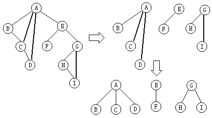

## 树和森林

前面几节对二叉树作了比较详细的介绍。尽管二叉树和树、森林是不同的数据结构，但它们还是存在着某种联系，可以将树和森林的问题归为二叉树问题去解决。

树作为一种数据结构，既可以采用顺序存储结构，也可以采用非顺序存储结构。但不论采用何种存储结构，都要求存储结构不但能存储各结点本身的数据信息，同时还要能准确地反映树中各结点之间的逻辑关系。下面将介绍树的几种基本存储结构，以及树、森林同二叉树之间的相互转化。 

## 树的存储结构

### 双亲表示法

由树的定义可以知道，在树中除根结点外的每个结点都有唯一的一个双亲结点，因此，可以考虑用一组连续的存储空间存储树中的每一个结点，数组中的一个元素表示为树中的一个结点。

在数组元素中除包括结点本身的数据信息外，还保存该结点的双亲结点在数组中的序号（根结点赋于-1）。树的这种存储方法也称为双亲表示法。

### 孩子表示法

由于树中的每个结点有零个或多个孩子结点，因此，可以考虑用一个多重链表表示树，链表中的每个结点包括一个数据域和多个指针域。

数据域存储树中结点的自身信息，每个指针指向该结点的一个孩子结点，通过各个指针反映树中各结点之间的关系。在这种表示法中，树中每个结点有多个指针域，形成了多重链。树的这种存储方法又常称作多重链表法。

在一棵树中，由于各结点的度数各异，因此结点的指针域个数的设置有两种方法：

- 方法一，每个结点指针域的个数等于该结点的度数；
- 方法二，每个结点指针域的个数等于树的度数。

### 双亲孩子表示法

当然，还可以将双亲表示法和孩子表示法结合起来。

分别将各结点的孩子结点组成一个单链表，同时用一维数组顺序存储树中的各结点，数组元素包括结点的自身信息、双亲结点在数组中的序号以及该结点的孩子结点链表的头指针。

单链表中的每一个结点表示其双亲的一个孩子结点，它有两个域组成，其中一个域表示该孩子结点在数组中的序号，另外一个域存储指向兄弟结点的指针。

### 孩子—兄弟表示法

在这种链式存储结构中，链表中一个结点代表树中的一个结点，它除信息域外，另外还有两个指针域分别指向该结点的第一个孩子结点和下一个兄弟结点。

在这种存储结构中，由于每个结点有两个指针域，所以又称这种方法为二重链表表示法。 

## 树、森林和二叉树的转换

从树的孩子—兄弟表示法可以看出，树（森林）和二叉树之间的存在着某种联系，它们之间可以相互转化，下面分别介绍。 

### 树转化为二叉树

由树的孩子—兄弟表示法得到启发，可以将树转化为二叉树。

由于一般的树通常是无序树，结点的各孩子的次序是无关紧要的，而二叉树中结点的左、右孩子结点是有区别的。

为避免发生混淆，我们约定树中每一个结点的孩子结点按从左到右的次序顺序编号，也就是说，把树作为有序树看待。

将一棵树转化为二叉树的方法是：

（1）连线：树中所有相邻兄弟结点之间加一条线；
（2）删线：对树中的每个结点，只保留它与第一个孩子结点之间的连线，删去它与其他孩子结点之间的连线。
（3）美化：以树的根结点为轴心，将这棵树顺时针转动45o度使其层次分明。

### 森林转化为二叉树

由森林的概念可以知道，森林是若干棵树的集合。树可以转化为二叉树，同样森林也可以转化为二叉树。森林转化为二义树的方法

（1）依次将森林中的每棵树转化成相应的二叉树；

（2）从第二棵二叉树开始，依次把当前的二叉树作为前一棵二叉树根结点的右子树，此时所得到的二叉树就是由森林转化得到的二叉树。

### 二叉树转化为森林

（1）连线：若结点P是其双亲结点F的左孩子，则把从结点P沿右分支所找到的所有结点和结点F用线连起来；

（2）删线：删除二叉树中所有结点和其右孩子结点之间的连线；

（3）美化：整理由(1)，(2)两步所得到的树或森林，使之结构层次分明。

## 森林的遍历

根据森林与二叉树的转化关系以及森林和二叉树的遍历定义可以得知，森林的先根遍历与其转化后相应二叉树的前序遍历的结果序列相同；森林的中根遍历与其转化后相应二叉树的中序遍历的结果序列相同；森林的后根遍历与其转化后相应二叉树的后序遍历的结果序列相同。因此，森林的遍历算法也可采用相应的二叉树的遍历算法实现。

