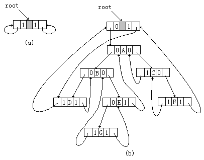
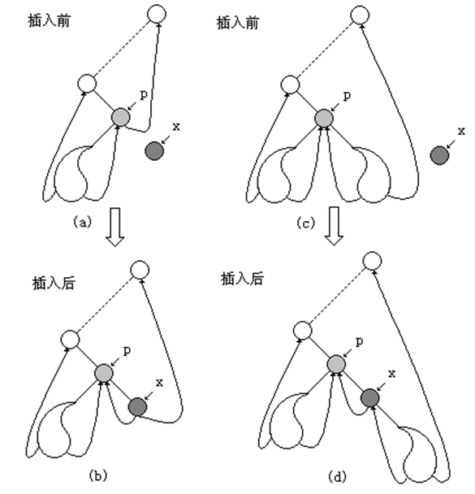

## 线索二叉树 

一棵具有n个结点的二叉树，当它采用二叉链表作存储结构时，二叉链表中的所有结点共有n+1个空指针域。因此，可以设法利用这些空指针域来存放结点的前驱结点和后继结点的指针信息。在此，可以作这样的规定：

- 当某结点的左指针域为空时，令其指向依某种方式遍历时所得到的该结点的前驱结点，否则指向它的左孩子；
- 当某结点的右指针域为空时，令其指向依某种方式遍历时所得到的该结点的后继结点，否则指向它的右孩子。

普通二叉树只能找到结点的左右孩子信息，而该结点的直接前驱和直接后继只能在遍历过程中获得。

若可将遍历后对应的有关前驱和后继预存起来，则从第一个结点开始就能很快“顺藤摸瓜”而遍历整个树了。

若结点有左子树，则lchild指向其左孩子；否则， lchild指向其直接前驱(即线索)；

若结点有右子树，则rchild指向其右孩子；否则， rchild指向其直接后继(即线索) 。

在线索化二叉树中，并不是每个结点都能直接找到其后继的，当标志为0时，则需要通过一定运算才能找到它的后继。

二叉线索树思想是干什么的?中序遍历这棵树 -> 转换成链表访问

有关线索二叉树的几个术语


- 线索链表：用上面结点结构所构成的二叉链表
- 线索：指向结点前驱和后继的指针
- 线索二叉树：加上线索的二叉树
- 线索化：对二叉树以某种次序遍历使其变为线索二叉树的过程

## 线索二叉树的定义 

在线性结构中，各结点的逻辑关系是线性的，结点的直接前驱结点和直接后继结点是惟一的。对于二叉树，它是一种层次结构，树中的结点存在惟一的直接前驱结点（根结点没有前驱结点），但直接后继结点不一定是惟一的（叶子结点没有后继结点）。在对二叉树以某种方式遍历后，就可以得到二叉树中所有结点的一个线性序列。在这种意义上，二叉树中的结点就有了惟一直接前驱结点和惟一直接后继结点的概念。

二叉树通常采用二叉链表作为存储结构。在这种存储结构下，由于每个结点有两个分别指向其左孩子和右孩子的指针，所以寻找其左、右孩子结点很方便，但要找该结点的在某种遍历下的前驱结点和后继结点则比较困难。例如，要在中序遍历的前提下，寻找任一结点的前驱结点，如果该结点存在左孩子结点，那么从它的左孩子结点开始，沿着右孩子指针不断地向下找，直到找到结点的右指针域为空为止，该结点就是所要找的前驱结点；如果某结点不存在左孩子结点，则需遍历二叉树才能确定该结点的前驱结点。

为方便寻找二叉树中结点的前驱结点或后继结点，可以通过一次遍历记下各结点在遍历过程中所得的线性序列中的相对位置。保存这种信息的一种简单的方法是在每个结点中增设两个指针域，使它们分别指向按某种次序遍历时所得到的该结点的前驱结点和后继结点，显然这样做要浪费相当数量的存储空间。仔细分析一棵具有就会发现，当它采用二叉链表作存储结构时，二叉链表中的所有结点共有 个空指针域。因此，可以设法利用这些空指针域来存放结点的前驱结点和后继结点的指针信息。在此，可以作这样的规定：当某结点的左指针域为空时，令其指向依某种方式遍历时所得到的该结点的前驱结点，否则指向它的左孩子；当某结点的右指针域为空时，令其指向依某种方式遍历时所得到的该结点的后继结点，否则指向它的右孩子。对一棵二叉树遍历的方式不同，所得到的线索树也不同。二叉树一般有前序、中序和后序三种遍历方式，所以线索二叉树就有前序线索二叉树、中序线索二叉树和后序线索二叉树三种。如图所示分别给出了其前序线索二叉树、中序线索二叉树和后序线索二叉树。

一棵具有n个结点的二叉树，当它采用二叉链表作存储结构时，二叉链表中的所有结点共有n+1个空指针域。因此，可以设法利用这些空指针域来存放结点的前驱结点和后继结点的指针信息。在此，可以作这样的规定：当某结点的左指针域为空时，令其指向依某种方式遍历时所得到的该结点的前驱结点，否则指向它的左孩子；当某结点的右指针域为空时，令其指向依某种方式遍历时所得到的该结点的后继结点，否则指向它的右孩子。


在每个结点中增设两个标志位leftTag和rightTag，令：

- 当leftTag = 0 时，leftChild为左孩子指针
- 当leftTag = 1 时，leftChild为前驱线索
- 当rightTag = 0 时，rightChild为右孩子指针
- 当rightTag = 1 时，rightChild为后继指针


为算法设计方便起见，通常在线索链表中添加一个与二叉树中结点的类型相同的头结点，令头结点的数据域为空；其leftChild指向二叉树的根结点，但当二叉树为空时，leftChild指向头结点本身；其rightChild域指向以某种方式遍历二叉树时第一个访问的结点，而当二叉树为空时，rightChild域指向该结点本身。并令原来指向二叉树根结点的头指针指向该头结点。以某种方式遍历二叉树时第一个被访问结点的左指针和最后一个被访问结点的右指针如果是线索，也指向头结点。这样一来，就相当于为二叉树建立了带头结点的双向循环链表。 



### 线索二叉树的结点类

```c++
template <class Type> class ThreadBinTreeNode {
friend class ThreadBinTree;          
 //线索二叉树的类
friend class ThreadPreorderTree;           
//前序线索二叉树的类
friend class ThreadInorderTree;            
//中序线索二叉树的类
friend class ThreadPostorderTree;          
//后序线索二叉树的类
Public:
    ThreadBinTreeNode ( const Type d ) :     //构造函数
    data (d),leftChild (NULL),rightChild (NULL),
                   leftTag(0), rightTag (0) { }
    Type &GetData ( ) const { return data; } 
    ThreadBinTreeNode<Type> *GetLeftChild ( )
                     const { return leftChild; }
    ThreadBinTreeNode<Type>*GetRightChild ( ) 
                      const { return rightChild; }   
    void SetData ( const Type & d ) { data = d; }
    void SetLeftChild (ThreadBinTreeNode <Type> *p )
                       { leftChild = p; }
    void SetRightChild (ThreadBinTreeNode <Type> *p )
                        { rightChild = p; }
private:
    int leftTag, rightTag;    //左右标志位
    ThreadBinTreeNode<Type> *leftChild, *rightChild;
    Type data;   //结点数据
};
```

### 线索二叉树的类

```c++
template <class Type> class ThreadBinTreeBinTree {
friend class ThreadPreorderTree;  //前序线索二叉树的类
friend class ThreadInorderTree;   //中序线索二叉树的类
friend class ThreadPostorderTree; //后序线索二叉树的类
public:
    ThreadBinTree (  ) : root(NULL) {  } 
private:
    ThreadBinTreeNode<Type> *root;
};
```

### 前序线索二叉树的类

```c++
template <class Type> class ThreadPreorderTree {
private:
    ThreadBinTree<Type> & T ;  //线索二叉树
    ThreadBinTreeNode<Type> *current;  //当前结点指针
    void preThread ( ThreadBinTreeNode<Type> *r,
	ThreadBinTreeNode<Type> *pre ) ; 
    //前序线索化以r为根的二叉树，pre为前序序历中第一个结点的前驱
public:
    ThreadPreorderTree  (ThreadBinTree<Type> & Tree ) :
        T(Tree) { current=T.root  } 
    ThreadBinTreeNode<Type> * ThreadPreOrderFirst ( ); 
    //当前结点指针指向前序遍历的第一个结点
    ThreadBinTreeNode<Type> * ThreadPreOrderLast ( );
    //当前结点指针指向前序遍历的最后一个结点    
	ThreadBinTreeNode<Type> * ThreadPreOrderNext ( ); 
    //当前结点指针指向其后继结点
    ThreadBinTreeNode<Type> * ThreadPreOrderPrior ( );
    //当前结点指针指向其前驱结点
    void Preorder ( ) ;  //前序遍历
    void CreatePreThread ( ); //建立前序线索二叉树
};
```

### 中序线索二叉树的类

```c++
template <class Type> class ThreadInorderTree {
private:
    ThreadBinTree<Type> & T ;  //线索二叉树
    ThreadBinTreeNode<Type> *current;  //当前结点指针
    void inThread ( ThreadBinTreeNode<Type> *r,
	ThreadBinTreeNode<Type> *pre ) ; 
    //中序线索化以r为根的二叉树，pre为中序序历中第一个结点的前驱
public:
    ThreadInorderTree  (ThreadBinTree<Type> & Tree ) :
      T(Tree) { current=T.root  } 
    ThreadBinTreeNode<Type> * ThreadInOrderFirst ( );
    //当前结点指针指向中序遍历的第一个结点
    ThreadBinTreeNode<Type> * ThreadInOrderLast ( );
    //当前结点指针指向中序遍历的最后一个结点    
    ThreadBinTreeNode<Type> * ThreadInOrderNext ( );
    //当前结点指针指向其后继结点
    ThreadBinTreeNode<Type> * ThreadInOrderPrior ( );
    //当前结点指针指向其前驱结点
    void Inorder ( ) ;  //中序遍历
    void CreateInThread ( ); //建立中序线索二叉树
};
```

### 后序线索二叉树的类

```c++
template <class Type> class ThreadPostorderTree {
private:
	ThreadBinTree<Type> & T ;  //线索二叉树
    ThreadBinTreeNode<Type> *current;  //当前结点指针
    void postThread ( ThreadBinTreeNode<Type> *r,
	ThreadBinTreeNode<Type> *pre ) ; 
    //后序线索化以r为根的二叉树，pre为后序序历中第一个结点的前驱
public:
    ThreadPostorderTree  (ThreadBinTree<Type> & Tree ) :
        T(Tree) { current=T.root  } 
    ThreadBinTreeNode<Type> * ThreadPostOrderFirst ( );
    //当前结点指针指向后序遍历的第一个结点
    ThreadBinTreeNode<Type> * ThreadPostOrderLast ( );
    //当前结点指针指向后序遍历的最后一个结点    
	ThreadBinTreeNode<Type> * ThreadPostOrderNext ( ); 
    //当前结点指针指向其后继结点
    ThreadBinTreeNode<Type> * ThreadPostOrderPrior ( ); 
    //当前结点指针指向其前驱结点
    void Postorder ( ) ;  //后序遍历
    void CreatePostThread ( ); //建立后序线索二叉树
};
```

## 构造和遍历线索二叉树

中序线索二叉树 :

下面以中序线索二义树为例，讨论线索二叉树的建立、线索二叉树的遍历以及在线索二叉树中查找前驱结点、查找后继结点、插入结点和删除结点等操作的实现算法。

1、建立中序线索二叉树 

建立线索二叉树，或者说对二叉树线索化，实质上就是遍历一棵二叉树。在遍历的过程中检查当前结点的左、右指针域是否为空。如果为空，将它们改为指向前驱结点或后继结点的线索。另外，在对一棵二叉树加线索时，必须首先申请一个头结点，并使头结点的leftchild指向二叉树的根结点。对二叉树线索化后，还须建立最后一个结点到头结点的线索；并使头结点的rightchild指向第一个结点。 

```c++
template <class Type> void ThreadBinTree<Type> ::
InThread ( ThreadBinTreeNode<Type> *r, ThreadBinTreeNode<Type> *pre ) {
//利用中序遍历线索化以r为根的二叉树，pre为中序序历中第一个结点的前驱
    if ( r != NULL ) {
       InThread ( r->GetLeftChild( ), pre );  //中序线索化current的左子树
       if ( r->GetLeftChild( ) == NULL ) 
        { r->SetLeftChild( pre ); r->leftTag = 1; } //建立前驱线索
       if ( pre->GetRightChild( ) == NULL ) 
		{ pre->SetRightChild( r ); pre->rightTag = 1; } //建立后继线索
       pre = r;
       InThread ( r->GetRightChild( ), pre );  //中序线索化r的右子树
    }
} 
template <class Type> void ThreadBinTree<Type>::
CreateInThread ( ) { //建立中序线索二叉树
    ThreadBinTreeNode<Type> *pre;
    root = new ThreadBinTreeNode<Type>;   //建立头结点
    root->leftTag= 1;  root->rightTag = 1;
    if ( this == NULL )
       { root->SetLeftChild( root ); root->SetRightChild( root );} //二叉树为空树
    else { current = = this; root->SetLeftChild( this ); root->leftThread = 0;
        pre = root; InThread ( current, pre );                   //中序线索化
        pre->SetRightChild( root ); //最后一个结点的后续线索指向头结点
        pre->rightTag = 1; 
        root->SetRightChild( ThreadInOrderFirst ( )) ;
        //头结点的rightChild指向中序序列的第一个结点
    }
}
```

2、中序线索化二叉树中的部分成员函数的实现

在中序线索树中寻找中序序列中的最后一个结点的算法如下：

```c++
template <class Type>
ThreadBinTreeNode<Type>*ThreadInorderTree<Type>::
ThreadInOrderLast( ) {
    if (T.root->leftTag == 0) {
      current = T.root->GetLeftChild( );
      while ( current->rightTag == 0 ) 
         current = current->GetRightChild( );
      return current; }
     else return  NULL;
}
```

中序线索树中寻找当前结点CURRENT的中序后继结点的算法如下：

```c++
template <class Type>
ThreadBinTreeNode<Type>*ThreadInorderTree<Type>::
ThreadInOrderNext(){
//在线索树中寻找CURRENT的中序后继
    ThreadBinTreeNode<Type> *p = current->GetRightChild( );
    if ( current->rightTag == 0 )  //CURRENT有右孩子
      while ( p->leftTag == 0 ) p = p->GetLeftChild( );
    current = p;
    if ( current == T.root ) return NULL;
    else return current;
}
```

在中序线索树中进行中序遍历，可以通过从第一个结点开始依次找当前结点的后继来完成。算法的描述如下： 

```c++
template <class Type> void 
ThreadInorderTree<Type> ::Inorder ( ) {
    ThreadBinTreeNode<Type> * p;  
    for( p = T.root->GetLeftChild( )); p != NULL; 
                  p = ThreadInOrderNext ( ) ) 
        cout << p.GetData << endl;
}
```

3、在中序线索二叉树上插入结点 

在中序线索二叉树上插入结点有两种方法：一种是将新结点插入到二叉树中作为某结点的左孩子结点；另一种方法是将新结点插入到二叉树中作为某结点的右孩子结点。在此讨论后一种情况。 

假设指针p指向线索二叉树中的某一结点，指针x指向要插入的新结点，新结点x将插入到二叉树中作为结点p的右孩子。此时，将有两种情况

第一种情况：结点p没有右孩子，则插入过程很简单，下图 (a)、(b)给出了这种情况下插入前后二叉树的两种形态。这时结点P原来的后继结点变为结点x的后继结点，结点p为结点x的前驱结点，结点 x成为结点p的右孩子。

第二种情况：若结点P有右子树，结点x插入后，令结点p原来的右子树成为结点x的右子树，x为P的右孩子。此时，结点p成为结点x的前驱结点，根据中序线索二叉树的定义，这时还需修改结点p原来右子树中最左下结点的左指针，使它由原来指向结点p改为指向结点x。下图 (c)、(d)给出了这种情况下插入前后二叉树的两种形态。



插入结点的算法如下：

```c++
template<class  type>  void  ThreadBinTree<type>::
         insertRight(ThreadBinTreeNode<type> *p,
         ThreadBinTreeNode<type>* x){
       ThreadBinTreeNode<type>*q 
       x->SetRightChild( p.GetRightChild() );
       x->rightTag = p->rightTag;
       x->SetLeftChild( p ); x->leftTag=1;       
           p->SetRightChild( x ); p->rightTag=0;
       if (x->rightTag==0){
          q=x->GetRightChild( );
          q= ThreadInOrderFirst (q); 
          q->SetLeftChild( x ); 
    }
}
```

### 建立中序线索二叉树 

线索化过程就是在遍历过程中修改空指针的过程：将空的lchild改为结点的直接前驱；将空的rchild改为结点的直接后继。

- 以结点p为根的子树中序线索化算法步骤


```c++
#define  _CRT_SECURE_NO_WARNINGS 
#include "string.h"
#include "stdio.h"    
#include "stdlib.h"   

// Link==0表示指向左右孩子指针
// Thread==1表示指向前驱或后继的线索
#define Thread 1
#define Link	0

typedef  struct BiThrNode	// 二叉线索存储结点结构
{
	char		data;	    // 结点数据
	struct BiThrNode *lchild, *rchild;	// 左右孩子指针
	int			LTag;
	int			RTag;		// 左右标志
} BiThrNode, *BiThrTree;

char Nil='#'; // 字符型以空格符为空

// 按前序输入二叉线索树中结点的值,构造二叉线索树T
BiThrNode* CreateBiThrTree()
{ 
	BiThrNode *tmp = NULL;
	char ch;
	scanf("%c",&ch);

	if (ch == '#')
	{
		return NULL;
	}	
	else
	{
		tmp = (BiThrNode *)malloc(sizeof(BiThrNode));
		if (tmp == NULL)
		{
			return NULL;
		}
		memset(tmp, 0, sizeof(BiThrNode));
		tmp->data = ch;

		tmp->lchild = CreateBiThrTree(); // 递归构造左子树
		tmp->rchild = CreateBiThrTree();
	}
	return tmp;
}

BiThrNode  *pre; // 全局变量,始终指向刚刚访问过的结点
// 中序遍历进行中序线索化
void InThreading(BiThrNode *p)
{ 
	if(p)
	{
		InThreading(p->lchild); // 递归左子树线索化 
		if(p->lchild == NULL)	// 没有左孩子 
		{
			p->LTag = Thread; 	 
          	p->lchild = pre;	//前驱线索 左孩子指针指向前驱 
		}
		if(pre->rchild == NULL) // 前驱没有右孩子 
		{
			pre->RTag = Thread;  
          	pre->rchild = p;	// 后继线索 前驱右孩子指针指向后继(当前结点p) 
		}
		pre = p;				// 保持pre指向p的前驱 
		InThreading(p->rchild); // 递归右子树线索化 
	}
}

// 中序遍历二叉树T,并将其中序线索化,Thrt指向头结点
BiThrNode* InOrderThreading(BiThrTree T)
{
	BiThrNode *Thrt = NULL;

	Thrt = (BiThrNode *)malloc(sizeof(BiThrNode)); //建头结点 
	if (Thrt == NULL)
	{
		return NULL;
	}
	memset(Thrt, 0, sizeof(BiThrNode));

	Thrt->LTag = Link;  //头结点有左孩子，若树非空，则其左孩子为树根
	Thrt->RTag = Thread; //头结点的右孩子指针为右线索
	Thrt->rchild = Thrt; // 初始化时右指针指向自己
	if(T == NULL) // 若二叉树空,则左指针也指向自己
	{
		Thrt->lchild  = Thrt;
	}
	else
	{
		Thrt->lchild = T;
		pre = Thrt ;
		InThreading(T);		// 中序遍历进行中序线索化 
		pre->rchild = Thrt;	
		pre->RTag = Thread;	// 最后一个结点线索化 
		Thrt->rchild = pre;
	}
	return Thrt;
}

// 中序遍历二叉线索树T(头结点)的非递归算法
int InOrderTraverse_Thr(BiThrNode* T)
{ 
	BiThrNode* p;
	p = T->lchild; // p指向根结点
	while (p != T)
	{ 
		// 空树或遍历结束时,p==T
		while (p->LTag == Link)
			p = p->lchild;
		printf("%c ", p->data);

		//如果中序遍历的最后一个结点的 右孩子 == T 说明到最后一个结点 ,遍历结束
		while (p->RTag==Thread && p->rchild!=T)
		{
			p = p->rchild;
			printf("%c ", p->data);
		}
		p = p->rchild;
	}
	return 0;
}

// 中序遍历二叉线索树T(头结点)的非递归算法
int InOrderTraverse_Thr2(BiThrNode* T)
{ 
	BiThrNode* p;
	p = T->rchild; // p指向根结点
	while (p != T)
	{ 
		// 空树或遍历结束时,p==T
		while (p->RTag == Link)
			p = p->rchild;
		printf("%c ", p->data);

		//如果中序遍历的最后一个结点的 右孩子 == T 说明到最后一个结点 ,遍历结束
		while (p->LTag==Thread && p->lchild!=T)
		{
			p = p->lchild;
			printf("%c ", p->data);
		}
		p = p->lchild;
	}
	return 0;
}

int main()
{
	BiThrTree T, H;
	printf("请按前序输入二叉树(如:'ABDH##I##EJ###CF##G##')\n");
	T = CreateBiThrTree(); // 按前序产生二叉树 
	H = InOrderThreading(T); // 中序遍历,并中序线索化二叉树 
	printf("中序遍历(输出)二叉线索树:\n");
	InOrderTraverse_Thr(H); // 中序遍历(输出)二叉线索树 

	printf("\n逆序访问:");
	InOrderTraverse_Thr2(H);

	printf("\n");

	system("pause");
	return 0;
}
```

线索化过程就是在遍历过程（假设是中序遍历）中修改空指针的过程：将空的lchild改为结点的直接前驱；将空的rchild改为结点的直接后继。

线索化的本质：让前后结点，建立关系

- 两个辅助指针变量形成差值后：后继结点的左孩子指向前驱结点，前驱结点的右孩子指向后继结点。
- 赋值指针变量和业务操作的逻辑关系


线索二叉树，等于是把一棵二叉树转变成了一个双向链表，这样对我们的插入删除结点，查找某个结点都带来了方便。

有了线索二叉树后，我们对它进行遍历其实就等于操作一个双向链表结构。

## 线索化的第二种方法

第一种方法在遍历的过程中需要修改结点属性，第二种方法是在中序遍历的过程中，把每一结点都存到一个链表中，这样就可以通过链表访问整个树。