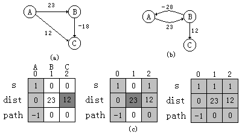

## 弧上权值为任意值的单源点最短路径问题 

在上一节中讨论了弧上权值为非负值的情况，接下来讨论更一般的情况，假设带权有向图G上弧的权值可能为负值。

例如，对于如图所示的带权有向图来说，利用上节给出的迪克斯特拉算法，不一定能得到正确的结果。



为了能够求解弧上带有负权值的单源最短路径问题，贝尔曼（BelLnam）和福特（Ford）提出了从源点逐次经过其它顶点，以缩短到达终点的最短路径长度的方法。该方法有一个限制条件，即要求图中不能有路径长度为负值的回路。

当图中没有路径长度为负值的回路时，有n个顶点的图中任意两个顶点之间如果存在最短路径，此路径最多有n-1条弧。 

在贝尔曼—福特算法中，构造一个最短路径长度的数组序列：$ dist^1[\;]、dist^2[\;]、…、dist^{n-1}[ \;] $ 。

其中，$ dist^1[u] $ 表示从源点v0直接到终点u的最短路径的长度，即 $ dist^1[u]＝Arcs[v_0][u] $；

而 $dist^2[u]$ 表示从源点v0出发最多经过两条弧（一个中间顶点）到达终点u的最短路径的长度，…，

$dist^k[u]$ 是从源点v0出发最多经过不构成带负长度回路的k条弧（k-1个中间顶点）到达终点u的最短路径的长度。算法的结果就是计算出$dist^{n-1}[u]$。

可以用递推方式计算 $dist^{n-1}[\;]$ 。

设已经求出dist<sup>k-1</sup>[i]，i＝0，1，…，n-1，此即从源点v0出发最多经过不构成带负长度回路的k-1条到达终点i的最短路径的长度。

从图的邻接矩阵中可以找到从任一顶点i直接到达另一顶点u的距离Arcs\[i]\[u]，计算min{dist<sup>k-1</sup>\[i]+Arcs\[i]\[u]}，用它与 $ dist^{k-1}[u] $ 比较，取小者作为 $dist^k[u]$ 的值，就可得到从源点v0出发最多经过k条弧（k-1个中间顶点）构成不带负长度回路而到达终点u的最短路径的长度。

因此，可得递推公式：

dist<sup>1</sup>\[u]＝Arcs\[v0]\[u]；

dist<sup>k</sup>\[u]=min{ dist<sup>k-1</sup>\[u]，min{ dist<sup>k-1</sup>\[i]+ Arcs\[i]\[u]}}

下图是一个有7个顶点的带权有向图，其中给出了求最短路径长度时利用上述递推公式计算出相应的dist[ ]数组序列。 


对于每一条边e(u, v)，如果Distant[u] + w(u, v) < Distant[v]，则另Distant[v] = Distant[u]+w(u, v)。w(u, v)为边e(u,v)的权值。

## 贝尔曼—福特算法的实现

1. 初始化所有点。每一个点保存一个值，表示从原点到达这个点的距离，将原点的值设为0，其它的点的值设为无穷大（表示不可达）。
2. 进行循环，循环下标为从1到n－1（n等于图中点的个数）。在循环内部，遍历所有的边，进行松弛计算。
3. 遍历途中所有的边（edge（u，v）），判断是否存在这样情况：若 d(v) > d (u) + w(u,v)，则返回false，表示途中存在从源点可达的权为负的回路。

```c++
void graph :: BellmanFord(int n, int v) {
    dist = new float[n];
  	path = new int[n];
  	s = new int[n];

    for (int i=0 ; i<n ; i++) {
    	dist[i]=Arcs[v][i];
      	if (i!=v && dist[i]<MAXNUM) path[i]=v;
        else  path[i]=-1;
     }    

    for (int k=2 ; k<n ; k++)
        for (int u=0 ; u<n ; u++)
            if (u!=v)
                for ( i=0 ; i<n ; i++)
                    if ( i!=v && dist[u] > (dist[i]+Arcs[i][u])){
                        dist[u]= dist[i]+Arcs[i][u];
                        path[u]=i;
                    }
}
```
```c++
#include <iostream>
using namespace std;
const int maxnum = 100;
const int maxint = 99999;
 
// 边
typedef struct Edge{
	int u, v;    // 起点，终点
	int weight;  // 边的权值
}Edge;
 
Edge edge[maxnum];     // 保存边的值
int  dist[maxnum];     // 结点到源点最小距离
 
int nodenum, edgenum, source;    // 结点数，边数，源点
 
// 初始化图
void init()
{
	// 输入结点数，边数，源点
	cin >> nodenum >> edgenum >> source;
	for(int i=1; i<=nodenum; ++i)
		dist[i] = maxint;
	dist[source] = 0;
	for(int i=1; i<=edgenum; ++i)
	{
		cin >> edge[i].u >> edge[i].v >> edge[i].weight;
		if(edge[i].u == source) //注意这里设置初始情况
			dist[edge[i].v] = edge[i].weight;
	}
}
 
// 松弛计算
void relax(int u, int v, int weight)
{
	if(dist[v] > dist[u] + weight)
		dist[v] = dist[u] + weight;
}
 
bool Bellman_Ford()
{
	for(int i=1; i<=nodenum-1; ++i)
		for(int j=1; j<=edgenum; ++j)
			relax(edge[j].u, edge[j].v, edge[j].weight);
	bool flag = 1;
	// 判断是否有负环路
	for(int i=1; i<=edgenum; ++i)
		if(dist[edge[i].v] > dist[edge[i].u] + edge[i].weight)
		{
			flag = 0;
			break;
		}
	return flag;
}
```