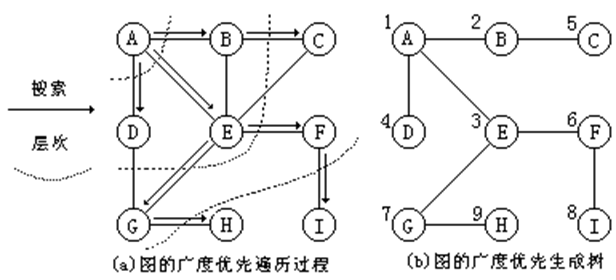
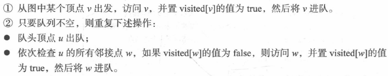
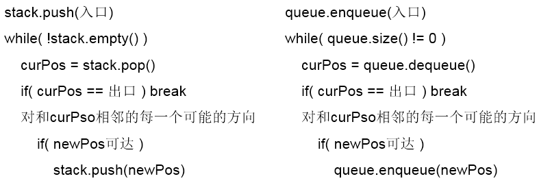
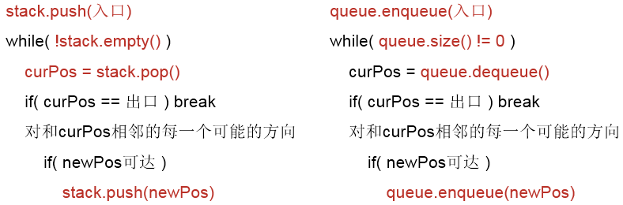
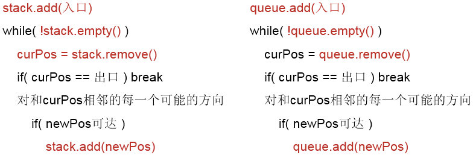
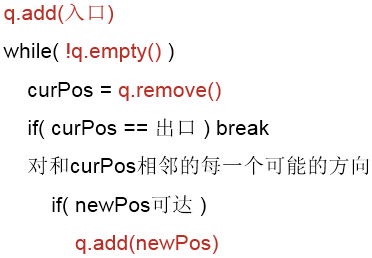

## 广度优先搜索的图文介绍

### 广度优先搜索介绍

广度优先搜索算法(Breadth First Search)，又称为"宽度优先搜索"或"横向优先搜索"，简称BFS。

它的思想是：从图中某顶点v出发，在访问了v之后依次访问v的各个未曾访问过的邻接点，然后分别从这些邻接点出发依次访问它们的邻接点，并使得“先被访问的顶点的邻接点“先于”后被访问的顶点的邻接点“被访问，直至图中所有已被访问的顶点的邻接点都被访问到。如果此时图中尚有顶点未被访问，则需要另选一个未曾被访问过的顶点作为新的起始点，重复上述过程，直至图中所有顶点都被访问到为止。

换句话说，广度优先搜索遍历图的过程是以v为起点，由近至远，依次访问和v有路径相通且路径长度为1,2...的顶点。

## 广度优先搜索图解

### 无向图的广度优先搜索

下面以"无向图"为例，来对广度优先搜索进行演示。还是以上面的图G1为例进行说明。


- 第1步：访问A。
- 第2步：依次访问C、D、F。

在访问了A之后，接下来访问A的邻接点。前面已经说过，在本文实现中，顶点ABCDEFG按照顺序存储的，C在"D和F"的前面，因此，先访问C。再访问完C之后，再依次访问D,F。

- 第3步：依次访问B,G。

在第2步访问完C,D,F之后，再依次访问它们的邻接点。首先访问C的邻接点B，再访问F的邻接点G。

- 第4步：访问E。

在第3步访问完B,G之后，再依次访问它们的邻接点。只有G有邻接点E，因此访问G的邻接点E。

因此访问顺序是：A -> C -> D -> F -> B -> G -> E

### 有向图的广度优先搜索

下面以"有向图"为例，来对广度优先搜索进行演示。还是以上面的图G2为例进行说明。


- 第1步：访问A。
- 第2步：访问B。
- 第3步：依次访问C,E,F。

在访问了B之后，接下来访问B的出边的另一个顶点，即C,E,F。前面已经说过，在本文实现中，顶点ABCDEFG按照顺序存储的，因此会先访问C，再依次访问E,F。

- 第4步：依次访问D,G。

在访问完C,E,F之后，再依次访问它们的出边的另一个顶点。还是按照C,E,F的顺序访问，C的已经全部访问过了，那么就只剩下E,F；先访问E的邻接点D，再访问F的邻接点G。

因此访问顺序是：A -> B -> C -> E -> F -> D -> G

## 广度优先遍历

图的广度优先遍历基于广度优先搜索BFS (Breadth First Search)，广度优先搜索是从图中某一顶点v出发，在访问顶点v后再访问v的各个未曾被访问过的邻接顶点w<sub>1</sub>、w<sub>2</sub>、…、w<sub>k</sub>，然后再依次访问w<sub>1</sub>、w<sub>2</sub>、…、w<sub>k</sub>的所有还未被访问过的邻接顶点。再从这些访问过的顶点出发，再访问它们的所有还未被访问过的邻接顶点，……，如此下去，直到图中所有和顶点v由路径连通的顶点都被访问到为止。 

下图(a)给出了一个从顶点A出发进行广度优先搜索的示例。图(b)给出了由广度优先搜索得到的广度优先生成树，它由搜索时访问过的n个顶点和搜索时经历的n-1条边组成，各顶点旁边附的数字标明了顶点被访问的顺序。 



广度优先搜索是一种分层的搜索过程，它类似于树的层次遍历。从图中可以看出，搜索每向前走一步可能访问一批顶点，不像深度优先搜索那样有往回退的情况，因此，广度优先遍历不是一个递归的过程，其算法也不是递归的。为了实现逐层访问，算法中使用了一个队列，以记录刚才访问过的上一层和本层顶点，以便于向下一层访问。从指定的结点v开始进行广度优先搜索的算法步骤是：

（1）访问结点v，并标记v已被访问，同时顶点v入队列			
（2）当队列空时算法结束，否则继续步骤（3）		
（3）队头顶点出队列为v			
（4）取顶点v的第一个邻接顶点w		
（5）若顶点w不存在，转步骤（3）；否则继续步骤（6）				
（6）若顶点w未被访问，则访问顶点w，并标记w已被访问，同时顶点w入队列；否则继续步骤				
（7）使w为顶点v的在原来w之后的下一个邻接顶点，转到步骤（5）

广度优先遍历的主要思想是：首先以一个未被访问过的顶点作为起始顶点，访问其所有相邻的顶点，然后对每个相邻的顶点，再访问它们相邻的未被访问过的顶点，直到所有的顶点都被访问过，遍历结束。

广度优先遍历类似于树的层序遍历。


```c++
// 广度优先遍历的算法
template<class vertexType, class arcType>void Graph <vertexType, arcType> ::
BFTraverse (void visit( vertexType v )) { 
    int i, n = NumberOfVertexes() ;//取图的顶点个数
    int * visited = new int [n]; //定义访问标记数组 visited
    for ( i = 0; i < n; i++ ) 
        visited [i] = 0;  //访问标记数组 visited 初始化
    for ( i = 0; i < n; i++ ) //对图中的每一个顶点进行判断
      if (!visited [i]) BFS (i, visited, visit);
    delete [ ] visited;                   //释放 visited 
}

// 广度优先搜索的算法
template<class vertexType, class arcType> void Graph <vertexType, arcType> ::
BFS (const int v, int visited [ ], void visit( vertexType v )) {
    linkqueue <int> q; //定义队列q
    visit( GetValue (v));  //访问顶点 v
    visited[v] = 1;          //顶点 v 作已访问标记
    q.EnQueue (v);  //顶点 v 进队列q
    while ( !q.IsEmpty ( ) ) { 
        v = q.DeQueue ( ); //否则, 队头元素出队列
        int w = GetFirstNeighbor (v);        
        while ( w != -1 ) { //若邻接顶点 w 存在
            if ( !visited[w] ) {    //若该邻接顶点未访问过
              visit( GetValue (w)); //访问顶点 w
              visited[w] = 1;       //顶点 w 作已访问标记
              q.EnQueue (w);        //顶点 w 进队列q       
            }
            w = GetNextNeighbor (v, w);
        } //重复检测 v 的所有邻接顶点
	}    //外层循环，判队列空否
}
```
在图的广度优先遍历算法中，图中每一个顶点需进队列一次且仅进队列一次，而在遍历过程中是通过边来搜索邻接点的。所以，图的广度优先遍历算法的时间复杂度和图的深度优先遍历算法的时间复杂度类似，如果使用邻接表表示图，则其时间复杂度为 O(n+e) ；如果使用邻接矩阵表示图，则其时间复杂度为 O(n<sup>2</sup>) 。

### 广度优先搜索遍历的算法实现


算法步骤



算法描述

```c++
void BFS (Graph G, int v){ 
    //按广度优先非递归遍历连通图G 
	sqQueue Q;
	ArcType u;
	ArcType w;
	//访问第v个顶点，并置访问标志数组相应分量值为true 
    cout << G.vexs[v] << "  ";    visited[v] = true; 
  	//辅助队列Q初始化，置空
    InitQueue(Q);              													
    EnQueue(Q, v);          //v进队 
    while(!QueueEmpty(Q)){  //队列非空 
		DeQueue(Q, u);      //队头元素出队并置为u
		for(w = FirstAdjVex(G, u); w >= 0; w = NextAdjVex(G, u, w)){
			//依次检查u的所有邻接点w ，FirstAdjVex(G, u)表示u的第一个邻接点 
			//NextAdjVex(G, u, w)表示u相对于w的下一个邻接点，w≥0表示存在邻接点
			if(!visited[w]){ //w为u的尚未访问的邻接顶点
              	//访问w，并置访问标志数组相应分量值为true 
				cout << G.vexs[w] << "  ";   visited[w] = true;					
				EnQueue(Q, w); //w进队
			}
		}
    }
}
```
## 最少转机


```c
#include<stdio.h>

struct node{
  	int x; // 城市编号
  	int s; // 转机次数
}

int main(){
  	struct node queue[25];
  	int e[5][5] = {0}, book[25] = {0};
  	int head, tail;
  	int m = n = 5, cur, end=4, flag = 0;
  	head = tail = 0; // 队列初始化
  	queue[tail].x = 0;
  	queue[tail].s = 0;
  	tail++;
  	book[0] = 1;
  	while(head < tail){
      	cur = queue[head].x;
      	for(int i=0; i<n; i++){
          	if(e[cur][i] != 9999999 && book[i] == 0){
              	book[i] = 1;
              	queue[tail].x = i;
              	queue[tail].s = queue[head].s + 1;
              	tail++;
          	}
          	if(queue[tail].x == end){
              	flag = 1;
              	break;
          	}
      	}
      	if(flag == 1) break;
      	head++;
  	}
  	printf("%d",queue[tail-1].s);
  	return 0;
}
```
## 深度优先遍历和广度优先遍历的关系

深度优先遍历的非递归实现和广度优先遍历的实现代码



深度优先遍历和广度优先遍历实现代码的不同之处







抽象队列：

可入队，可出队

LIFO(stack)；FIFO(queue)；优先队列(堆) 都可以成为是一个抽象队列

入队，出队的规则不同

如果迷宫有多个解，广度优先遍历求得的是最短解