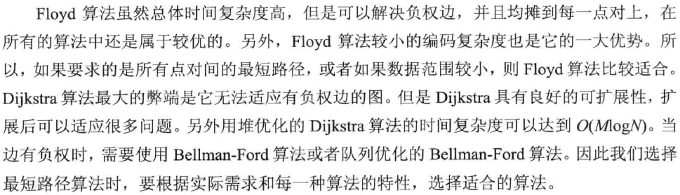

## 最短路径

利用带权的图也可以表示n个城市之间的交通运输网络。此时图中的每一个顶点用于表示一个城市，图中的每一条边用于表示两个城市之间的直接交通运输路线，每条边上所附的权值可以表示该路线的长度或沿此路线运输所花费的时间或运费等。

从图中某一顶点(称为源点)到达另一顶点(称为终点)的路径可能不止一条（也就是说两个城市之间的通路可能有多条），但人们往往比较关心的是如何找到从一个城市到另一个城市花费最少的一条路径，也就是说要寻找带权有向图中两个顶点之间路径长度最短的路径。

这个问题就是所谓的最短路径问题。本节将讨论最常见的三种求解最短路径的方法。

| 比较    | Floyd      | Dijkstra     | Bellman-Ford | 队列优化的Bellman-Ford |
| ----- | ---------- | ------------ | ------------ | ----------------- |
| 空间复杂度 | O(N²)      | O(M)         | O(M)         | O(M)              |
| 时间复杂度 | O(N³)      | O((M+N)logN) | O(NM)        | 最坏也是O(NM)         |
| 适用情况  | 稠密图和顶点关系密切 | 稠密图和顶点关系密切   | 稀疏图和边关系密切    | 稀疏图和边关系密切         |
| 负权    | 可以解决负权     | 不可以解决负权      | 可以解决负权       | 可以解决负权            |

带有“负权回路”（“负权环”）的图没有最短路径。

- Floyd

多源最短路径

- Dijkstra

单源最短路径，通过边实现松弛；不能有负权边。

- Bellman-Ford