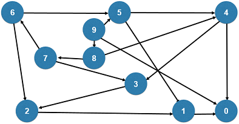

### 279. Perfect Squares

给出一个正整数n，寻找最少的完全平方数，使他们的和为n。

- 完全平方数：1, 4, 9, 16…
- 12 = 4 + 4 + 4
- 13 = 4 + 9

对问题建模：整个问题转化为一个图论问题。从n到0，每个数字表示一个节点；如果两个数字x到y相差一个完全平方数，则连接一条边。我们得到了一个无权图。原问题转化成，求这个无权图中从n到0的最短路径。



方法1：广度优先遍历

```c++
class Solution {
public:
    int numSquares(int n) {

        queue< pair<int,int> > q;
        q.push( make_pair( n , 0 ) );
        while( !q.empty() ){
            int num = q.front().first;
            int step = q.front().second;
            q.pop();

            if( num == 0 )
                return step;

            for( int i = 1 ; num - i*i >= 0 ; i ++ )
                q.push( make_pair( num - i*i , step + 1 ) );
        }

        throw invalid_argument("No Solution.");
    }
};
```

优化方法2

```c++
// 使用visited数组,记录每一个入队元素
class Solution {
public:
    int numSquares(int n) {

        queue< pair<int,int> > q;
        q.push( make_pair( n , 0 ) );

        vector<bool> visited(n+1, false);
        visited[n] = true;

        while( !q.empty() ){
            int num = q.front().first;
            int step = q.front().second;
            q.pop();

            if( num == 0 )
                return step;

            for( int i = 1 ; num - i*i >= 0 ; i ++ )
                if( !visited[num-i*i] ){
                    q.push( make_pair( num - i*i , step + 1 ) );
                    visited[num-i*i] = true;
                }
        }

        throw invalid_argument("No Solution.");
    }
};
```

优化方法3

```c++
class Solution {
public:
    int numSquares(int n) {

        if( n == 0 )
            return 0;

        queue< pair<int,int> > q;
        q.push( make_pair( n , 0 ) );

        vector<bool> visited(n+1, false);
        visited[n] = true;

        while( !q.empty() ){
            int num = q.front().first;
            int step = q.front().second;
            q.pop();

            for( int i = 1 ; ; i ++ ){
                int a = num - i*i; // 减少num-i*i的重复计算 
                if( a < 0 )
                    break;

                if( !visited[a] ){
                    if( a == 0 )
                        return step + 1;
                    q.push( make_pair( a , step + 1 ) );
                    visited[a] = true;
                }
            }
        }

        throw invalid_argument("No Solution.");
    }
};
```