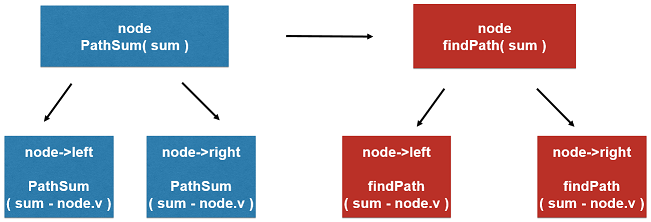

### 二叉树的定义

```c++
struct TreeNode {
    int val;
    TreeNode *left;
    TreeNode *right;
    TreeNode(int x) : val(x), left(NULL), right(NULL) {}
};
```

### 104. Maximum Depth of Binary Tree

- 求一棵二叉树的最高深度
- 从根节点到叶子节点的最长路径长度

```c++
class Solution {
public:
    int maxDepth(TreeNode* root) {

        if( root == NULL )
            return 0;

        return 1 + max( maxDepth(root->left) , maxDepth(root->right) );
    }
};
```

### 226. Invert Binary Tree

```c++
class Solution {
public:
    TreeNode* invertTree(TreeNode* root) {

        if( root == NULL)
            return NULL;

        invertTree( root->left );
        invertTree( root->right );
        swap( root->left, root->right);

        return root;
    }
};
```

### 112. Path Sum

给出一棵二叉树以及一个数字sum，判断在这棵二叉树上是否存在一条从根到叶子的路径，其路径上的所有节点和为sum。

```c++
class Solution {
public:
    bool hasPathSum(TreeNode* root, int sum) {

        if( root == NULL )
            return false;

        if( root->left == NULL && root->right == NULL ) // 叶子结点
            return sum == root->val;

        return hasPathSum( root->left , sum - root->val )
                || hasPathSum( root->right , sum - root->val );
    }
};
```

### 437. Path Sum III

给出一棵二叉树以及一个数字sum，判断在这棵二叉树上存在多少条路径，其路径上的所有节点和为sum。

- 其中路径不一定要起始于根节点；终止于叶子节点。
- 路径可以从任意节点开始，但是只能是向下走的。

分node在路径上和node不在路径上两种情况。

- sum - node.v，node结点的值一定包括在路径上



```c++
class Solution {

public:
    // 在以root为根节点的二叉树中,寻找和为sum的路径,返回这样的路径个数
    int pathSum(TreeNode* root, int sum) {

        if( root == NULL )
            return 0;

        return findPath( root , sum )
                + pathSum( root->left , sum )
                + pathSum( root->right , sum );
    }

private:

    // 在以node为根节点的二叉树中,寻找包含node的路径,和为sum
    // 返回这样的路径个数
    int findPath( TreeNode* node, int num){

        if( node == NULL )
            return 0;

        int res = 0;
        if( node->val == num )
            res += 1;

        res += findPath( node->left , num - node->val );
        res += findPath( node->right , num - node->val );

        return res;
    }
};
```

### 257. Binary Tree Paths

给定一棵二叉树，返回所有表示从根节点到叶子节点路径的字符串。

```c++
class Solution {
public:
    vector<string> binaryTreePaths(TreeNode* root) {

        vector<string> res;

        if( root == NULL )
            return res;

        if( root->left == NULL && root->right == NULL ){
            res.push_back( to_string(root->val) );
            return res;
        }

        vector<string> leftPaths = binaryTreePaths(root->left);
        for( int i = 0 ; i < leftPaths.size() ; i ++ )
            res.push_back( to_string(root->val) + "->" + leftPaths[i] );

        vector<string> rightPaths = binaryTreePaths(root->right);
        for( int i = 0 ; i < rightPaths.size() ; i ++ )
            res.push_back( to_string(root->val) + "->" + rightPaths[i] );

        return res;
    }
};
```
### 235. Lowest Common Ancestor of a Binary Search Tree

给定一棵二分搜索树和两个节点，寻找这两个节点的最近公共祖先。

- 给定两个结点的值都小于node结点的值，则在node的左子树中寻找公共祖先
- 给定两个结点的值都大于node结点的值，则在node的右子树中寻找公共祖先
- 给定两个结点中的一个小于node结点的值，另一个大于node结点的值，node就是最近公共祖先
- 两个结点中一个结点是另一个结点的父结点

```c++
class Solution {
public:
    TreeNode* lowestCommonAncestor(TreeNode* root, TreeNode* p, TreeNode* q) {

        assert( p != NULL && q != NULL );

        if( root == NULL )
            return NULL;

        if( p->val < root->val && q->val < root->val )
            return lowestCommonAncestor( root->left, p, q);
        if( p->val > root->val && q->val > root->val )
            return lowestCommonAncestor( root->right, p, q);

        assert( p->val == root->val || q->val == root->val
                || (root->val-p->val)*(root->val-q->val) < 0 );

        return root;
    }
};
```
### 230. 二叉树中的第K小数

其它类似题目，数组中的第K大/小的数，二分查找思想，快速排序思想；用最大/小堆实现查找第K大/小的数；前K大/小的数

### 108. 有序数组转成二叉树

### 100. SameTree


