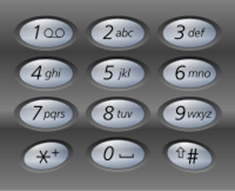
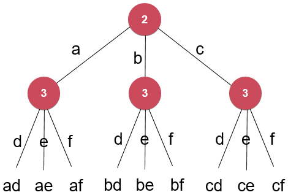

### 17. Letter Combinations of a Phone Number

给出一个数字字符串，返回这个数字字符串能表示的所有字母组合。



如对数字字符串 “23”，返回：[“ad", "ae", "af", "bd", "be", "bf", "cd", "ce", "cf"]



```
digits 是数字字符串
s(digits) 是digits所能代表的字母字符串
s(digits[0…n-1]) 
    = letter(digits[0]) + s(digits[1…n-1])
    = letter(digits[0]) + letter(digits[1]) + s(digits[2…n-1])
    = ……
```

```c++
class Solution {
private:
    const string letterMap[10] = {
            " ",    //0
            "",     //1
            "abc",  //2
            "def",  //3
            "ghi",  //4
            "jkl",  //5
            "mno",  //6
            "pqrs", //7
            "tuv",  //8
            "wxyz"  //9
    };

    vector<string> res;

    // s中保存了此时从digits[0...index-1]翻译得到的一个字母字符串
    // 寻找和digits[index]匹配的字母, 获得digits[0...index]翻译得到的解
    void findCombination(const string &digits, int index, const string &s){

        cout<<index<<" : "<<s<<endl;
        if( index == digits.size() ){
            res.push_back( s );
            cout<<"get "<<s<<" , return"<<endl;
            return;
        }

        char c = digits[index];
        assert( c >= '0' && c <= '9' && c != '1');
        string letters = letterMap[c-'0'];
        for( int i = 0 ; i < letters.size() ; i ++ ){
            cout<<"digits["<<index<<"] = "<<c<<" , use "<<letters[i]<<endl;
            findCombination(digits, index+1, s + letters[i]);
        }

        cout<<"digits["<<index<<"] = "<<c<<" complete, return"<<endl;

        return;
    }

public:
    vector<string> letterCombinations(string digits) {

        res.clear();

        if( digits == "" )
            return res;

        findCombination(digits, 0, "");

        return res;
    }
};
```

```
0 :
digits[0] = 2 , use a
1 : a
digits[1] = 3 , use d
2 : ad
digits[2] = 4 , use g
3 : adg
get adg , return
digits[2] = 4 , use h
3 : adh
get adh , return
digits[2] = 4 , use i
3 : adi
get adi , return
digits[2] = 4 complete, return
digits[1] = 3 , use e
2 : ae
digits[2] = 4 , use g
3 : aeg
get aeg , return
digits[2] = 4 , use h
3 : aeh
get aeh , return
digits[2] = 4 , use i
3 : aei
get aei , return
digits[2] = 4 complete, return
digits[1] = 3 , use f
2 : af
digits[2] = 4 , use g
3 : afg
get afg , return
digits[2] = 4 , use h
3 : afh
get afh , return
digits[2] = 4 , use i
3 : afi
get afi , return
digits[2] = 4 complete, return
digits[1] = 3 complete, return
digits[0] = 2 , use b
1 : b
digits[1] = 3 , use d
2 : bd
digits[2] = 4 , use g
3 : bdg
get bdg , return
digits[2] = 4 , use h
3 : bdh
get bdh , return
digits[2] = 4 , use i
3 : bdi
get bdi , return
digits[2] = 4 complete, return
digits[1] = 3 , use e
2 : be
digits[2] = 4 , use g
3 : beg
get beg , return
digits[2] = 4 , use h
3 : beh
get beh , return
digits[2] = 4 , use i
3 : bei
get bei , return
digits[2] = 4 complete, return
digits[1] = 3 , use f
2 : bf
digits[2] = 4 , use g
3 : bfg
get bfg , return
digits[2] = 4 , use h
3 : bfh
get bfh , return
digits[2] = 4 , use i
3 : bfi
get bfi , return
digits[2] = 4 complete, return
digits[1] = 3 complete, return
digits[0] = 2 , use c
1 : c
digits[1] = 3 , use d
2 : cd
digits[2] = 4 , use g
3 : cdg
get cdg , return
digits[2] = 4 , use h
3 : cdh
get cdh , return
digits[2] = 4 , use i
3 : cdi
get cdi , return
digits[2] = 4 complete, return
digits[1] = 3 , use e
2 : ce
digits[2] = 4 , use g
3 : ceg
get ceg , return
digits[2] = 4 , use h
3 : ceh
get ceh , return
digits[2] = 4 , use i
3 : cei
get cei , return
digits[2] = 4 complete, return
digits[1] = 3 , use f
2 : cf
digits[2] = 4 , use g
3 : cfg
get cfg , return
digits[2] = 4 , use h
3 : cfh
get cfh , return
digits[2] = 4 , use i
3 : cfi
get cfi , return
digits[2] = 4 complete, return
digits[1] = 3 complete, return
digits[0] = 2 complete, return
adg
adh
adi
aeg
aeh
aei
afg
afh
afi
bdg
bdh
bdi
beg
beh
bei
bfg
bfh
bfi
cdg
cdh
cdi
ceg
ceh
cei
cfg
cfh
cfi
```