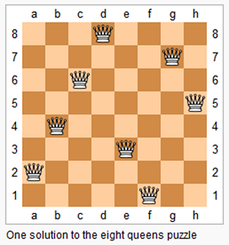
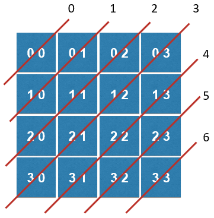
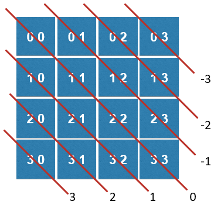

### 46. Permutations

给定一个整型数组，其中的每一个元素都各不相，返回这些元素所有排列的可能。

如对于 [1, 2, 3]，返回 [ [1,2,3] , [1,3,2] , [2,1,3] , [2,3,1] , [3,1,2] , [3,2,1] ]

```c++
class Solution {
private:
    vector<vector<int>> res;
    vector<bool> used;

    // p中保存了一个有index-1个元素的排列。
    // 向这个排列的末尾添加第index个元素, 获得一个有index个元素的排列
    void generatePermutation( const vector<int>& nums, int index, vector<int>& p){

        if( index == nums.size() ){
            res.push_back(p);
            return;
        }

        for( int i = 0 ; i < nums.size() ; i ++ )
            if( !used[i] ){
                used[i] = true;
                p.push_back( nums[i] );
                generatePermutation(nums, index+1, p );
                p.pop_back();
                used[i] = false;
            }

        return;
    }
public:
    vector<vector<int>> permute(vector<int>& nums) {

        res.clear();
        if( nums.size() == 0 )
            return res;

        used = vector<bool>(nums.size(), false);
        vector<int> p;
        generatePermutation( nums, 0, p );

        return res;
    }
};
```

### 77. Combinations

给出两个整数n和k，求在1...n这n个数字中选出k个数字的所有组合。

如 n = 4 ，k = 2，结果为 [ [1,2] , [1,3] , [1,4] , [2,3] , [2,4] , [3,4] ]

```c++
class Solution {
private:
    vector<vector<int>> res;

    // 求解C(n,k), 当前已经找到的组合存储在c中, 需要从start开始搜索新的元素
    void generateCombinations(int n, int k, int start, vector<int> &c){

        if( c.size() == k ){
            res.push_back(c);
            return;
        }

        for( int i = start ; i <= n ; i ++ ){
            c.push_back( i );
            generateCombinations(n, k, i + 1 , c );
            c.pop_back();
        }

        return;
    }
public:
    vector<vector<int>> combine(int n, int k) {

        res.clear();
        if( n <= 0 || k <= 0 || k > n )
            return res;

        vector<int> c;
        generateCombinations(n, k, 1, c);

        return res;
    }
};
```

优化解法：回溯的剪枝

```c++
class Solution {
private:
    vector<vector<int>> res;

    // 求解C(n,k), 当前已经找到的组合存储在c中, 需要从start开始搜索新的元素
    void generateCombinations(int n, int k, int start, vector<int> &c){

        if( c.size() == k ){
            res.push_back(c);
            return;
        }

        // 还有k - c.size()个空位, 所以,[i...n]中至少要有k-c.size()个元素
        // i最多为 n - (k-c.size()) + 1
        for( int i = start ; i <= n - (k-c.size()) + 1 ; i ++ ){
            c.push_back( i );
            generateCombinations(n, k, i + 1 , c );
            c.pop_back();
        }

        return;
    }
public:
    vector<vector<int>> combine(int n, int k) {

        res.clear();
        if( n <= 0 || k <= 0 || k > n )
            return res;

        vector<int> c;
        generateCombinations(n, k, 1, c);

        return res;
    }
};
```

### 79. Word Search

给定一个二维平面的字母和一个单词，看是否可以在这个二维平面上找到该单词。其中找到这个单词的规则是，从一个字母出发，可以横向或者纵向连接二维平面上的其他字母。同一个位置的字母只能使用一次。

```
[
    [ ‘A’ , ‘B’ , ‘C’ , ‘E’ ],		“ABCCED” => true
    [ ‘S’ , ‘F’ , ‘C’ , ‘S’ ],		“SEE”    => true
    [ ‘A’ , ‘D’ , ‘E’ , ‘E’ ]		“ABCB”   => false 
]
```

```c++
class Solution {
private:
    int d[4][2] = {{-1,0},{0,1},{1,0},{0,-1}};
    int m,n;
    vector<vector<bool>> visited;

    bool inArea( int x , int y ){
        return x >= 0 && x < m && y >= 0 && y < n;
    }

    // 从board[startx][starty]开始, 寻找word[index...word.size())
    bool searchWord( const vector<vector<char>> &board, const string& word, int index,
                    int startx, int starty ){

        //assert( inArea(startx,starty) );
        if( index == word.size() - 1 )
            return board[startx][starty] == word[index];

        if( board[startx][starty] == word[index] ){
            visited[startx][starty] = true;
            // 从startx, starty出发,向四个方向寻
            for( int i = 0 ; i < 4 ; i ++ ){
                int newx = startx + d[i][0];
                int newy = starty + d[i][1];
                if( inArea(newx, newy) && !visited[newx][newy] &&
                    searchWord( board , word , index + 1 , newx , newy ) )
                    return true;
            }
            visited[startx][starty] = false;
        }
        return false;
    }
public:
    bool exist(vector<vector<char>>& board, string word) {

        m = board.size();
        assert( m > 0 );
        n = board[0].size();
        visited = vector<vector<bool> >(m,vector<bool>(n,false));
        for( int i = 0 ; i < board.size() ; i ++ )
            for( int j = 0 ; j < board[i].size() ; j ++ )
                if( searchWord( board, word, 0 , i, j) )
                    return true;

        return false;
    }
};
```
### 51. N-Queens

求n皇后问题的所有解，n个皇后摆放在n*n的棋盘格中，使得横、竖和两个对角线方向均不会同时出现两个皇后。



逐行排放，然后再判断该行中从左到右的每一个位置是否合法。

快速判断不合法的情况

- 竖向：col[i]表示第i列被占用
- 对角线1：dia1[i]表示第i对角线1被占用，2*n-1个，用i+j表示



- 对角线2：dia2[i]表示第i对角线2被占用，2*n-1个，用i-j+n-1表示



```c++
class Solution {
private:
    vector<bool> col, dia1, dia2;
    vector<vector<string>> res;

    // 尝试在一个n皇后问题中, 摆放第index行的皇后位置
    void putQueen(int n , int index, vector<int> &row){

        if( index == n ){
            res.push_back( generateBoard(n,row) );
            return;
        }

        for( int i = 0 ; i < n ; i ++ )
            // 尝试将第index行的皇后摆放在第i列
            if( !col[i] && !dia1[index+i] && !dia2[index-i+n-1] ){
                row.push_back(i);
                col[i] = true;
                dia1[index+i] = true;
                dia2[index-i+n-1] = true;
                putQueen(n, index + 1, row);
                col[i] = false;
                dia1[index+i] = false;
                dia2[index-i+n-1] = false;
                row.pop_back();
            }

        return;
    }

    vector<string> generateBoard( int n, vector<int> &row ){
        assert( row.size() == n );
        vector<string> board(n, string(n, '.'));
        for( int i = 0 ; i < n ; i ++ )
            board[i][row[i]] = 'Q';
        return board;
    }
public:
    vector<vector<string>> solveNQueens(int n) {

        res.clear();
        col = vector<bool>(n, false);
        dia1 = vector<bool>(2*n-1, false);
        dia2 = vector<bool>(2*n-1, false);

        vector<int> row;
        putQueen(n , 0 , row);

        return res;
    }
};
```