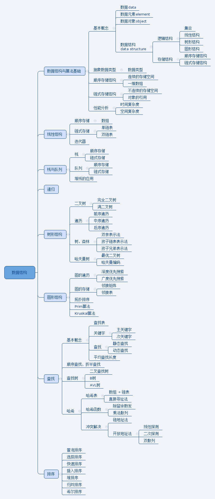

## GitBook 在线阅读，PDF、Mobi、ePub下载

https://www.gitbook.com/book/alleniverson/data-structure-and-algorithms/details

## GitHub托管

https://github.com/JackChan1999/DataStructure

## 数据结构与算法学习之路

[数据结构与算法系列](http://www.cnblogs.com/skywang12345/p/3603935.html)

[编程之法：面试和算法心得](https://github.com/julycoding/The-Art-Of-Programming-By-July)

[计算机常用基础算法](https://github.com/shijiebei2009/Algorithms)

[算法学习笔记](https://github.com/nonstriater/Learn-Algorithms)

[学 [数据结构、算法] 的资源推荐](https://zhuanlan.zhihu.com/p/23191006)

[有哪些学习算法的网站推荐？](https://www.zhihu.com/question/20368410)

## 目录

* [前言](README.md)
* [学数据结构、算法的资源推荐](source/学数据结构、算法的资源推荐.md)
* [数据结构](数据结构/数据结构.md)
* [抽象数据类型](数据结构/抽象数据类型.md)
* [数据结构各种算法的C++模板实现](数据结构/数据结构各种算法的C++模板实现.md)

----

* [第1章 顺序表](1.顺序表/README.md)
  * [线性表](1.顺序表/线性表.md)
  * [线性表的顺序存储实现1](1.顺序表/线性表的顺序存储实现1.md)
  * [线性表的顺序存储实现2](1.顺序表/线性表的顺序存储实现2.md)
  * [线性表的顺序存储实现3](1.顺序表/线性表的顺序存储实现3.md)
  * [顺序表的C++类模板实现1](1.顺序表/顺序表的C++类模板实现1.md)
  * [顺序表的C++类模板实现2](1.顺序表/顺序表的C++类模板实现2.md)

----

* [第2章 链表](1.链表/README.md)
  * [链表](1.链表/链表.md)
  * [线性表的链式存储1](1.链表/线性表的链式存储1.md)
  * [线性表的链式存储2](1.链表/线性表的链式存储2.md)
  * [单链表的C++类模板实现1](1.链表/单链表的C++类模板实现1.md)
  * [单链表的C++类模板实现2](1.链表/单链表的C++类模板实现2.md)
  * [单链表的C++类模板实现3](1.链表/单链表的C++类模板实现3.md)
  * [Linux内核链表](1.链表/Linux内核链表.md)
  * [双链表1](1.链表/双链表1.md)
  * [双链表2](1.链表/双链表2.md)
  * [双链表的Java实现1](1.链表/双链表的Java实现1.md)
  * [双链表的Java实现2](1.链表/双链表的Java实现2.md)
  * [循环链表1](1.链表/循环链表1.md)
  * [循环链表2](1.链表/循环链表2.md)
  * [约瑟夫问题求解](1.链表/约瑟夫问题求解.md)
  * [环形单链表的约瑟夫问题](1.链表/环形单链表的约瑟夫问题.md)
  * [顺序表与链表的不同](1.链表/顺序表与链表的不同.md)
  * [案例：从尾到头打印链表](1.链表/案例：从尾到头打印链表.md)
  * [在O(1)时间删除链表结点](1.链表/在O（1）时间删除链表结点.md)
  * [反转链表](1.链表/反转链表.md)
  * [复杂链表的复制](1.链表/复杂链表的复制.md)
  * [链表中倒数第k个结点](1.链表/链表中倒数第k个结点.md)

----

* [第3章 栈](3.栈/README.md)
  * [栈](3.栈/栈.md)
  * [顺序栈的实现1](3.栈/顺序栈的实现1.md)
  * [顺序栈的实现2](3.栈/顺序栈的实现2.md)
  * [顺序栈的C++类模板实现](3.栈/顺序栈的C++类模板实现.md)
  * [顺序栈的Java实现](3.栈/顺序栈的Java实现.md)
  * [顺序栈和链栈的Java实现](3.栈/顺序栈和链栈的Java实现.md)
  * [链式栈的实现1](3.栈/链式栈的实现1.md)
  * [链式栈的实现2](3.栈/链式栈的实现2.md)
  * [栈的递归应用](3.栈/栈的递归应用.md)
  * [栈的应用：后缀计算](3.栈/栈的应用：后缀计算.md)
  * [栈的应用：就近匹配](3.栈/栈的应用：就近匹配.md)
  * [栈的应用：中缀转后缀](3.栈/栈的应用：中缀转后缀.md)
  * [用栈实现四则运算](3.栈/用栈实现四则运算.md)
  * [栈实例：单词逆序](3.栈/栈实例：单词逆序.md)
  * [栈实例：分隔符匹配](3.栈/栈实例：分隔符匹配.md)
  * [进制转换](3.栈/进制转换.md)
  * [括号匹配的检验](3.栈/括号匹配的检验.md)
  * [迷宫求解](3.栈/迷宫求解.md)
  * [栈的应用：解密回文](3.栈/栈的应用：解密回文.md)
  * [包含min函数的栈](3.栈/包含min函数的栈.md)

----

* [第4章 队列](4.队列/README.md)
  * [队列](4.队列/队列.md)
  * [顺序队列的实现](4.队列/顺序队列的实现.md)
  * [队列的顺序存储实现](4.队列/队列的顺序存储实现.md)
  * [顺序队列的C++类模板实现](4.队列/顺序队列的C++类模板实现.md)
  * [顺序队列的Java实现](4.队列/顺序队列的Java实现.md)
  * [队列的链式存储实现](4.队列/队列的链式存储实现.md)
  * [链式队列的实现](4.队列/链式队列的实现.md)
  * [链式队列的C++类模板实现](4.队列/链式队列的C++类模板实现.md)
  * [队列的链式存储Java实现](4.队列/队列的链式存储Java实现.md)
  * [队列的数组和链表的Java实现](4.队列/队列的数组和链表的Java实现.md)
  * [队列的LinkedList实现](4.队列/队列的LinkedList实现.md)
  * [循环队列](4.队列/循环队列.md)
  * [优先级队列](4.队列/优先级队列.md)
  * [队列的应用](4.队列/队列的应用.md)
  * [队列：解密QQ号](4.队列/队列：解密QQ号.md)
  * [用两个栈实现队列](4.队列/用两个栈实现队列.md)

----

* [第5章 递归](5.递归/README.md)
  * [递归](5.递归/递归.md)
  * [分治法](5.递归/分治法.md)
  * [回溯法](5.递归/回溯法.md)
  * [动态规划](5.递归/动态规划.md)
  * [斐波那契数列](5.递归/斐波那契数列.md)
  * [旋转方阵](5.递归/旋转方阵.md)
  * [全排列问题](5.递归/全排列问题.md)

----

* [第6章 串](6.串/README.md)
  * [字符串](6.串/字符串.md)
  * [串的模式匹配算法](6.串/串的模式匹配.md)
  * [串的实现](6.串/string.md)
  * [字符串的排列](6.串/字符串的排列.md)

----

* [第7章 数组和广义表](7.数组和广义表/README.md)
  * [数组](7.数组和广义表/数组.md)
  * [稀疏矩阵](7.数组和广义表/稀疏矩阵.md)
  * [十字链表](7.数组和广义表/十字链表.md)
  * [广义表](7.数组和广义表/广义表.md)
  * [顺时针打印数组](7.数组和广义表/顺时针打印数组.md)
  * [旋转数组的最小数字](7.数组和广义表/旋转数组的最小数字.md)

----

* [第8章 树](8.树/README.md)
    * [二叉树](8.树/二叉树.md)
    * [二叉树概述](8.树/二叉树概述.md)
    * [二叉树的链式存储](8.树/二叉树的链式存储.md)
    * [树的非递归遍历](8.树/树的非递归遍历.md)
    * [二叉树的Morris遍历](8.树/二叉树的Morris遍历.md)
    * [二叉树的创建](8.树/二叉树的创建.md)
    * [重建二叉树](8.树/重建二叉树.md)
    * [计算树叶子结点](8.树/计算树叶子结点.md)
    * [复制二叉树](8.树/复制二叉树.md)
    * [求二叉树的高度](8.树/求二叉树的高度.md)
    * [线索二叉树](8.树/线索二叉树.md)
    * [哈夫曼树](8.树/哈夫曼树.md)
    * [二叉查找树](8.树/二叉查找树.md)
    * [堆](8.树/堆.md)
    * [堆：神奇的优先队列](8.树/堆：神奇的优先队列.md)
    * [树和森林](8.树/树和森林.md)
    * [平衡二叉树](8.树/平衡二叉树.md)
    * [判断二叉树是否为平衡二叉树](8.树/判断二叉树是否为平衡二叉树.md)
    * [并查集](8.树/并查集.md)
    * [二叉树的镜像](8.树/二叉树的镜像.md)
    * [二叉树中和为某一值的路径](8.树/二叉树中和为某一值的路径.md)
    * [二叉搜索树的后序遍历序列](8.树/二叉搜索树的后序遍历序列.md)
    * [二叉搜索树与双向链表](8.树/二叉搜索树与双向链表.md)
    * [二叉树的序列化和反序列化](8.树/二叉树的序列化和反序列化.md)

----

* [第9章 图](9.图/README.md)
  * [图的基本概念](9.图/图的基本概念.md)
  * [图的存储结构](9.图/图的存储结构.md)
    * [邻接矩阵无向图](9.图/邻接矩阵无向图.md)
    * [邻接矩阵有向图](9.图/邻接矩阵有向图.md)
    * [邻接表有向图](9.图/邻接表无向图.md)
    * [邻接表有向图](9.图/邻接表有向图.md)
    * [巧妙的邻接表（数组实现）](9.图/巧妙的邻接表（数组实现）.md)
    * [邻接多重表](9.图/邻接多重表.md)
  * [深度优先搜索](9.图/深度优先搜索.md)
  * [广度优先搜索](9.图/广度优先搜索.md)
  * [最小生成树](9.图/最小生成树.md)
  * [Kruskal算法](9.图/Kruskal算法.md)
  * [Prim算法](9.图/Prim算法.md)
  * [最短路径](9.图/最短路径.md)
  * [Dijkstra算法](9.图/Dijkstra算法.md)
  * [Dijkstra最短路径算法](9.图/Dijkstra最短路径算法.md)
  * [BellmanFord算法](9.图/BellmanFord算法.md)
  * [Floyd算法](9.图/Floyd算法.md)
  * [只有五行的Floyd最短路径算法](9.图/只有五行的Floyd最短路径算法.md)
  * [AOV网络和拓扑排序](9.图/AOV网络和拓扑排序.md)

----

* [第10章 查找](10.查找/README.md)
  * [二分查找](10.查找/二分查找.md)
  * [插值查找](10.查找/插值查找.md)
  * [斐波那契查找](10.查找/斐波那契查找.md)
  * [二叉查找树](10.查找/二叉查找树.md)
  * [平衡二叉树](10.查找/平衡二叉树.md)
  * [B-树](10.查找/B-树.md)
  * [顺序表查找](10.查找/顺序表查找.md)
  * [有序表的折半查找](10.查找/有序表的折半查找.md)
  * [索引顺序查找](10.查找/索引顺序查找.md)
  * [哈希表](10.查找/hashtable.md)
  * [哈希表查找](10.查找/哈希表查找.md)

----

* [第11章 排序](11.排序/README.md)
  * [八大排序算法](11.排序/八大排序算法.md)
  * [最快最简单的排序：桶排序](11.排序/最快最简单的排序：桶排序.md)
  * [邻居好说话：冒泡排序](11.排序/邻居好说话：冒泡排序.md)
  * [插入排序](11.排序/插入排序.md)
  * [堆排序](11.排序/堆排序.md)
  * [归并排序](11.排序/归并排序.md)
  * [锦标赛排序](11.排序/锦标赛排序.md)
  * [快速排序](11.排序/快速排序.md)
  * [排序算法](11.排序/排序算法.md)
  * [希尔排序](11.排序/希尔排序.md)
  * [排序算法](11.排序/排序算法.md)
  * [快速排序](11.排序/快速排序.md)
  * [最常用的排序：快速排序](11.排序/最常用的排序：快速排序.md)
  * [堆排序](11.排序/堆排序.md)
  * [排序总结：小哼买书](11.排序/排序总结：小哼买书.md)
  * [基数排序](11.排序/基数排序.md)

----

* [源码剖析](源码剖析/README.md)
  * [HashMap、哈希表、哈希函数](源码剖析/HashMap、哈希表、哈希函数.md)
  * [HashMap的实现原理](源码剖析/HashMap的实现原理.md)
  * [HashMap源码剖析](源码剖析/HashMap源码剖析.md)
  * [LinkedHashMap源码剖析](源码剖析/LinkedHashMap源码剖析.md)
  * [LinkedList源码剖析](源码剖析/LinkedList源码剖析.md)

----

* [计算机常用基础算法](计算机常用基础算法/计算机常用基础算法.md)
