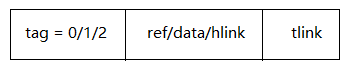

## 广义表

线性表、栈、队列、数组等数据结构都是线性结构，结构中的元素都是同一类型的数据元素。本节所讨论的广义表中元素的数据类型将允许表中元素自身又可以是表。广义表是线性表的推广，也有人称其为列表（lists）。

### 广义表的定义

广义表LS是由n≥0个表元素α<sub>1</sub> ,α<sub>2</sub> , … , α<sub>n</sub> 组成的有限序列，其中表元素α<sub>i</sub> (1≤i≤n) 或者是一个数据元素 (可称为单元素或原子)，或者是一个表(称为子表)。记作LS = (α<sub>1</sub> ,α<sub>2</sub> , … , α<sub>n</sub> )

其中LS是表名，表的长度为n。长度为0的广义表为空表。一般用大写字母表示表名，用小写字母表示数据元素。如果n≥1，则称α<sub>1</sub> 为广义表LS的表头(head)，称(α<sub>2</sub> , … , α<sub>n</sub> )为广义表LS的表尾(tail)。

广义表的定义是递归的，因为在表的描述中又用到了表。

广义表的例子：

- A = ( )	空表，它的长度为零。
- B = (e)     单元素表，长度为1。head (B) = e，tail (B) = ( )。
- C = (a , (b , c , d))      长度为2，两个表元素分别为单元素a和子表(b , c , d )。 head(C) = a ，  tail(C) = ((b ,  c , d))。
- D = (A , B , C)    长度为3，三个表元素都是子表。head (D) = A ，  tail (D) = (B , C)。
- E = (a , E)    长度为2，E是一个递归表，它对应于无限表E = (a , (a , (a ,… )))。  head (E) = a ， tail (E) = (E)。 

广义表中括号的重数即为广义表深度，空表的深度为1。例子中A的深度为1，B的深度为1，C的深度为2，D的深度为3，E的深度为无穷大。广义表和线性表一样，各元素在表中是有次序的。广义表可由其它表共享。如表A，B，C被D共享。广义表还可以是递归的，像表E这样表本身是自己的子表。

### 广义表的存储结构

通常，广义表是用链表结构存储的。例如对LS1=('a', 'b', 'c', 'd')，可用下图所示的链表表示。

表结点中有两个域：数据域和指针域。指针LS1称为指向表的外部指针，因为它不是定义在表结点内部的，定义在表结点内部的指针叫做内部指针。


然而，当广义表中的元素是子表时，其链表表示就不象上面LS1的那么简单了。例如，对LS2= (‘a’, (‘b’, ‘c’, (‘d’, ‘e’ , ‘f’) , ‘g’) , ‘h’ , (‘i’ , ‘j’))，表中有些表元素又是表。于是就可考虑在链表的数据域中存放一个子表。

其实现方法是在该数据域中放一个指向那个子表的指针。如图所示。


### 广义表结点类的定义

广义表采用3个域的结点结构表示。

第一个域是tag域，tag =0，表示此结点是专用表头结点；tag=1，表示是单元素结点；tag=2，表示是子表结点。

第二个域ref/data/hlink由其tag域确定，当tag=0时，ref中存放引用计数；当tag=1时，即为data域，此处假设存放字符型数据；当tag=2时，即为hlink域，用来存放指向子表表头的指针。

第三个域是tlink域，当tag=0时，该指针域存放指向该表表头元素的指针；当tag ≠ 0时，用来存放指向同一层下一个结点的指针。 



```c++
enum GenListNodeType {HEAD, ATOM, LIST};
template<class ElemType>struct GenListNode  {
    GenListNodeType tag;				
     // 标志域,HEAD(0):头结点, ATOM(1):原子结构, LIST(2):表结点
    GenListNode<ElemType> *tLink;
    union
    {
		int ref;	// tag=HEAD,头结点,存放引用数
		ElemType atom;	// tag=ATOM,存放原子结点的数据域
		GenListNode<ElemType> *hLink;
     }; 
  	// 由标志tg和指针next构造引用数法广义表结点
	GenListNode(GenListNodeType tg = HEAD, GenListNode<ElemType> *next = NULL);
};
```

采用这种结点结构对前面给出的5个广义表的表示如下图所示。


### 广义表类的定义

```c++
template<class ElemType> class GenList  {
protected:
// 广义表类的数据成员:
      GenListNode<ElemType> *head;	// 广义表头指针
// 辅助函数
      void ShowHelp(GenListNode<ElemType> *hd) const;	
	// 显示以hd为头结点的广义表
      int DepthHelp(const GenListNode<ElemType> *hd);	
	// 计算以hd为表头的广义表的深度
      void ClearHelp(GenListNode<ElemType> *hd);		
	// 释放以hd为表头的广义表结构
      void CopyHelp(const GenListNode<ElemType> *sHead, 
	 GenListNode<ElemType> *&dHead);	
	// 将以dHead为头结点的广义表复制成以sHead为头结点的
      static void CreateHelp(GenListNode<ElemType> *&first);
	// 创建以first为头结点的广义表
 public:
// 抽象数据类型方法声明及重载编译系统默认方法声明:
       GenList();	// 无参数的构造函数
       GenList(GenListNode<ElemType> *hd);	
       ~GenList();	// 析构函数
       GenListNode<ElemType> *First() const;
       GenListNode<ElemType> *Next(GenListNode<ElemType> *elemPtr) const;	                                                                               
        bool Empty() const;	// 判断广义表是否为空
        void Push(const ElemType &e);
        // 将原子元素e作为表头加入到广义表最前面
        void Push(GenList<ElemType> &subList);	
		// 将子表subList作为表头加入到广义表最前面
        int Depth();// 计算广义表深度
        GenList(const GenList<ElemType> &copy);// 复制构造函数
        GenList<ElemType> &operator =(const GenList<ElemType>&copy);// 赋值语句重载
        void Input(void);	// 输入广义表	
        void Show(void);	// 显示广义表	
};
```

### 部分成员函数的实现

```c++
template <class ElemType>GenList<ElemType>::GenList()
// 操作结果：构造一个空广义表
{
	head = new GenListNode<ElemType>(HEAD);
	head->ref = 1;		// 引用数
}

template <class ElemType>
GenList<ElemType>::GenList(GenListNode<ElemType> *hd)
// 操作结果：由头结点指针构造广义表
{
	head = hd;		// 头结点
}

template <class ElemType>
GenListNode<ElemType> *GenList<ElemType>::First() const
// 操作结果：返回广义表的第一个元素
{
	return head->tLink;
}

template <class ElemType>
GenListNode<ElemType> *GenList<ElemType>::
Next(GenListNode<ElemType> *elemPtr) const
// 操作结果：返回elemPtr指向的广义表元素的后继
{
	return elemPtr->tLink;
}

template <class ElemType>
bool GenList<ElemType>::Empty() const
// 操作结果：如广义表为空，则返回true，否则返回false
{
	return head->tLink == NULL;
}

template <class ElemType>
void GenList<ElemType>::Push(const ElemType &e)
// 操作结果：将原子元素e作为表头加入到广义表最前面
{
	GenListNode<ElemType>	*tmpPtr =
            new GenListNode<ElemType>(ATOM, head->tLink);
	tmpPtr->atom = e;     // 数据域
	head->tLink = tmpPtr;// 将tmpPtr插入在head与head->tLink之间 
}

template <class ElemType>
void GenList<ElemType>::Push(GenList<ElemType> &subList)
// 操作结果：将子表subList作为表头加入到广义表最前面
{
	GenListNode<ElemType> *tmpPtr =
            new GenListNode<ElemType>(LIST, head->tLink);
	tmpPtr->hLink = subList.head;	// 子表
	subList.head->ref++;		// subList引用数自加1
	head->tLink = tmpPtr;// 将tmpPtr插入在head与head->tLink之间 
}
```

### n元多项式的表示

在通常所使用的广义表中，多数表既非递归表，也非被其它表所共享。

如果用线性表表示n元多项式，会有两个问题：

- 一是对于变元数较少的项，也要按n个变元分配存储空间，将造成浪费；
- 二是对n值不同的多项式，存储线性表时结点大小也不同，存储管理也就不便。

为了避免上述问题，我们将用广义表表示n元多项式。

例如三元多项式：

P(x, y, z)=x<sup>10</sup>y<sup>3</sup>z<sup>2</sup>+2x<sup>8</sup>y<sup>3</sup>z<sup>2</sup>+3x<sup>8</sup>y<sup>2</sup>z<sup>2</sup>+x<sup>4</sup>y<sup>4</sup>z+6x<sup>3</sup>y<sup>4</sup>z+2yz

把P(x , y , z)重新写作：

P(x, y, z)=((x<sup>10</sup>+ 2x<sup>8</sup>)y<sup>3</sup>+3x<sup>8</sup> y<sup>2</sup>)z<sup>2</sup>+(( x<sup>4</sup>+6x<sup>3</sup>) y<sup>4</sup>+2y) z

P(x , y , z)可以看作是z的多项式，即Az2+Bz。A和B本身又是(x , y)的二元多项式，如A(x , y) = Cy3+Dy2，C和D又为x的一元多项式。继续这样分析，可知P中的每一个子多项式由一个变元和若干个系数、指数偶对组成，其中每个系数本身可以又是一个多项式。

上述三元多项式可以表示为下面的广义表P： P = ((A，2)，(B，1)) 

P的变元为z，其中：

- A = ((C，3)，(D，2))   B = ((E，4)，(2,1))    A、B的变元为y
- C = ((1，10)，(2，8))　　　D = ((3，8)) 
- E = ((1，4)，(6，3))　　C、D、E的变元为x

因此，每个n元多项式不论其中变元数目是多少，都可以采用类型为polynode的结点来表示。

每个结点有4个域，第1个域为tag，第二个域称为nodename，依据tag的不同取值，nodename亦不同,如下图所示。

第一种tag 为 var，表示该结点是链表的头结点，则nodename为vble域，存变元名，且exp = 0；

第二种tag 为 ptr，则系数本身又是一个多项式，nodename为hlink域，hlink中存放指向那个多项式子链表的指针，exp为变元的指数；

第三种是tag 为 num，nodename为coef，表示系数是一个实数，exp为变元的指数值。 


polynode类的定义

```c++
// var：表头结点，ptr：系数是子链表，num：系数是实数
enum triple { var, ptr, num };

// 多项式结点类定义
class polynode { 
	polynode * tlink; // 同一层下一结点指针
	int exp; 　 　 　 // 指数
	triple tag; // 标志，是var时为表头结点，是ptr时为子表结点，是num时为原子结点
	union 　 　 // 联合
	{ 
     	char vble; 　 　 　 　// 表头结点中存放该链表基于的变元名
	 	polynode * hlink; 　 // 子表结点中存放指向系数子链表的指针
	 	int coef; 　 　 　 　// 原子结点中存放实数型系数
	};
};
```

这里给出一个简单的多项式：q(x, y)=y<sup>3</sup>+3x<sup>2</sup>y<sup>2</sup>+1.5y+x<sup>3</sup>-4

其链表表示如图所示。


设表头指针q指示的是一个表头结点，它标明以它打头的一层链表是基于变元y的，其tlink指示了多项式链表的第一项。
对基于y的链表中第二个结点的hlink所指示的链表，表头结点中tag=var，该链表是基于变量x的，tlink指向的结点的tag为num。

下图给出了本小节所举例子P(x , y , z)的链表表示。由于tag在该链表中是很明了的，因此在图中省略了tag域，这样该链表表示更清晰。

