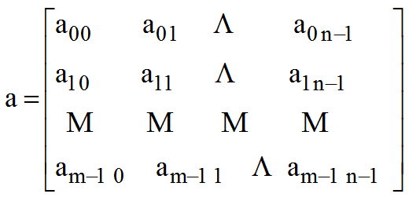
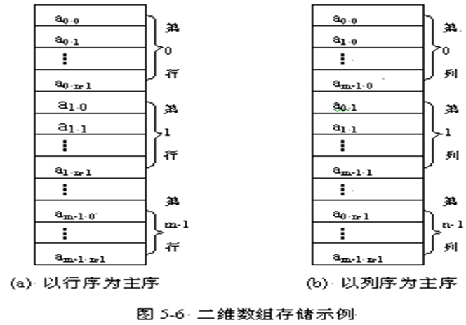
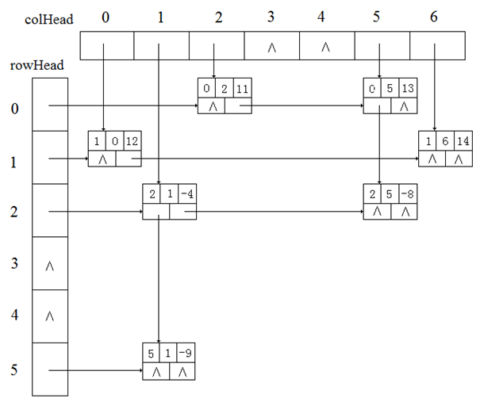

## 数组

数组是读者已经很熟悉的一种数据结构，几乎所有的程序设计语言都把数组类型设定为固有类型。事实上，在前几章中，已经使用了C++的一维数组来存放线性表。在本节中介绍数组的定义以及相应的存储结构，并讨论了稀疏的矩阵的定义和实现。

通常，一维数组A(array)是n (n≥0)个相同数据类型的数据元素a<sub>0</sub>, a<sub>1</sub>, ... , a<sub>n-1</sub>构成的有限线性序列。其中n叫做数组长度或数组大小，若n＝0就是空数组。当每一个数组元素a<sub>i</sub>（0≤i≤n-1）本身又是一个一维数组时，则A就是一个二维数组。类似地，我们可以构成一个多维数组,一个m(m≥2)维数组中的每一个数组元素是一个m-1维的数组。

可见在一个m(m≥2)维数组中，每一个数组元素受m个线性关系的约束，如果一个元素在每一维中的序号分别为i1、i2、…、im，则称该元素的下标为：i<sub>1</sub>、i<sub>2</sub>、…、i<sub>m</sub>。如果一个数组名为a，则a<sub>i1i2…im</sub>表示下标为i1、i2、…、im的数组元素。

## 数组的顺序存储结构

采用顺序存储结构存储数组的元素，就是按某种顺序将数组元素依次存放在内存中的一片连续的存储单元中。
数组的每个元素的数据类型都相同，因而占有相同的存储空间。对于一维数组，相邻元素的起始地址之差为一常数。

例如，下图是一维数组a[5]的5个元素顺序存储的示意图。


每个元素占3个存储单元，数组第1个元素a[0]的起始地址为loc(0) = p，则该数组的任一数组元素a[i]的起始地址loc(i)可由以下的递推公式计算：


实际上即有：loc (i) = p+i*3       (i = 0，1，2，3，4) 

现在来讨论二维数组的顺序存储结构。由于计算机的存储单元是一维的结构，所以，n（n≥2）维数组的顺序存储实际上还是按一维数组的方式实现的。

用一组连续存储单元存放二维数组就是将它的下标映射到其相应的一维数组的存储位置，这里就有个次序约定问题。

可有两种存储方式：一种是以行序为主序的存储方式。如，C，C++，PASCAL等语言都采用这种存储方式。

另一种是以列序为主序的存储方式，例如FORTRAN语言就采用这种存储方式。

对于二维数组a\[m][n]，用aij来表示数组元素a\[i][j]，则二维数组a可以表示为： 



下图显示了以行序为主序的存储方式，图5-6(b)显示了以列序为主序的存储方式。



假设二维数组a\[m][n]的首地址为p，即a\[0][0]的起始地址为p，每个元素占L个存储单元，以行序为主序存储方式来存储数组a，计算数组元素a\[i][j]的起始地址loc(i，j)。因为对于一维数组a中的第k个元素的起始地址是：loc(k) = p+k*L

因此只要计算出a\[i][j]是数组的第几个元素就可计算出loc(i, j)。

若设其为k，则有`k = i*n+j`，所以：`loc(i, j) = p+ (i*n+j ) *L`

对于以列序为主序存储任一数组元素存储地址的推导类同。

在三维数组a\[m1]\[m2][m3]中，总共有`m1*m2*m3`个数组元素，每一个数组元素a\[i]\[j]\[k](0≤i≤m1－1，0≤j≤m2－1，0≤k≤m3－1)同时处于三个向量之中。数组元素a\[i]\[j][k]在数组中的位置应由下标的三元组\[i]\[j][k]唯一确定。如果要想把三维数组a\[m1]\[m2][m3]用一个一维数组来表示，也需要先确定各数组元素的排列顺序。

一种方式是下标从左到右优先顺序，即下标变动得最快的是第三维。在这种情况下，对于某一个固定的下标i来说，将有m2*m3个数组元素。对于任一数组元素a\[i]\[j][k]来说，每变动一个i，行下标j和列下标k将重新变动。

设a\[0]\[0][0]的起始地址为p，每一个数组元素占L个单元，则a\[i]\[j][k]的起始地址为

```
loc(i,j,k)= p+(loc(i,0,0)- loc(0,0,0) + j*m3+k) *L
= p+(loc(i-1,0,0)- loc(0,0,0) + m2m3 +j m3+k) *L
= p+(loc(i-2,0,0)- loc(0,0,0) + 2m2m3 +j* m3+k) *L
= …
= p+(loc(0,0,0)- loc(0,0,0) + im2m3 +j* m3+k) *L
= p+(im2m3 +j* m3+k) *L
```

推而广之，对于n维数组a\[m1]\[m2] … [mn]来说，若设它的头一个数组元素a\[0][0] … [0]的起始地址为p，每一个数组元素占L个单元，那么，任意一个数组元素a\[i1][i2] … [in]的存储地址为 


另一种方式是下标从右到左优先的顺序，即下标变动得最快的是第一维，相关推导留给读者去完成。 

## 数组类的定义及其实现

在此，从抽象数据类型的观点出发给出数组上更多的操作，同时将避免C++数组操作的不足。在数组类中将实现以下功能：

- 可以通过数组的整体复制来建立数组
- 把一个数组赋值给另一个数组
- 重载函数运算符
- 重载赋值运算符
- 重载加法运算符


### 数组类的定义

```c++
template<class ElemType>
class Array {
protected:
	ElemType *arrVal;	// 数组元素的存储空间 
	int dim;			// 数组维数
	int *bounds;		// 数组各维长度
	int *constants;		// 数组映象函数常量
 	int Locate(int sub0, va_list &va) const
public:
	Array(int d, ...);		// 构造数组
	~Array();				// 析构函数
	Array(const Array<ElemType> &copy);	// 复制构造函数
	ElemType &operator()(int sub0, ...);// 重载函数运算符
	Array<ElemType> &operator =(const Array<ElemType> &arr
	Array<ElemType> &operator +(const Array<ElemType> &arr); 
};
```

### 数组类中函数成员的实现

(1) 构造函数

操作结果：构造一个d维数组

```c++
template <class ElemType>Array<ElemType>::Array(int d, ...){
	if (d < 1)				
		throw Error("维数不能小于1!");// 抛出异常
	dim = d;				// 数组维数为d
	bounds = new int[dim];	// 申请数组各维长度存储空间
	va_list va;				// 变长参数变量
	int elemTotal =1;		// 元素总数
	va_start(va, d);		// 初始化变量va,用于存储变长参数信息
	for (int i = 0; i < dim; i++)	{
		bounds[i] = va_arg(va, int);// 取出变长参数作为各维长度
		elemTotal = elemTotal * bounds[i];	// 统计数组总元素个数
	}
	va_end(va); 
	arrVal = new ElemType[elemTotal];	// 申请数组元素空间
	constants = new int[dim];		// 申请数组映象函数常量空间
	constants[dim - 1] = 1;
	for (int i = dim - 2; i >= 0; --i)		// 计算数组映象函数常量
	constants[i] = bounds[i + 1] * constants[i + 1]; 
}
```

## 稀疏矩阵

在求解科学和工程计算问题时常常会接触到“矩阵”这类对象。

矩阵本身就是二维数组。对于一个矩阵，如果零元素较多，还是采用上一节所述的存储方式来存储的话，就会使得大量的存储空间存放同一个值零，从而造成事实上的存储空间的浪费。

本节，将讨论这种矩阵如何进行压缩存储，以及基本操作的实现。

像这种零元素非常多的矩阵称为稀疏矩阵。显然，关于“稀疏”的定义是无法精确给出的。因为稀疏矩阵是非零元素很少的矩阵，我们只要存储非零元素就行了。

整个稀疏矩阵的存储结构既可以采用顺序结构存储，也可以采用链式结构存储。 

### 非零元素的三元组定义

对于稀疏矩阵中的非零元素可以用一个三元组&lt;row，col，value>表示, 这个三元组分别表示非零元素的行号、列号和元素值。其定义如下:

```c++
template<class ElemType>
struct Triple
{
	// 数据成员:
	int row, col;	// 非零元素的行下标与列下标
	ElemType value;	// 非零元素的值
	// 构造函数:
	Triple(){};		// 无参数的构造函数
	Triple(int r, int c, ElemType v);	// 有参数的构造函数
};

template<class ElemType>
Triple<ElemType>::Triple(int r, int c, ElemType v)
{
		row = r;		// 初始化行号
		col = c;		// 初始化列号
		value = v;		// 初始化非零元素值
}
```

### 三元组顺序表

可以用一个三元组<row,col,item>惟一确定一个矩阵元素。

所有三元组构成了一个三元组表，该三元组表是一个线性表。可以采用顺序存储结构存储的三元组表称为三元组顺序表。在三元组顺序表中，矩阵非零元素的三元组按照其在矩阵中的位置，以行优先的顺序依次存放，并给出行数、列数和非零元素个数。

如图所给出的稀疏矩阵M，如图所示的稀疏矩阵M的三元组顺序表。


### 三元组顺序表类的定义

所有三元组构成了一个三元组表，该三元组表是一个线性表。可以采用顺序存储结构存储的三元组表称为三元组顺序表。在三元组顺序表中，矩阵非零元素的三元组按照其在矩阵中的位置，以行优先的顺序依次存放，并给出行数、列数和非零元素个数。

```c++
template<class ElemType>
class TriSparseMatrix{
protected:
	// 稀疏矩阵三元组顺序表的数据成员:
	Triple<ElemType> *triElems;	// 存储稀疏矩阵的三元组表
	int maxSize;		// 非零元素最大个数
	int rows, cols, num;// 稀疏矩阵的行数,列数及非零元个数
 
public:
		// 稀疏矩阵三元组顺序表的函数成员： 
		TriSparseMatrix(int rs = DEFAULT_SIZE, int cs = DEFAULT_SIZE, int size = DEFAULT_SIZE);
		// 构造一个rs行cs列非零元素最大个数为size的空稀疏矩阵
		~TriSparseMatrix();			// 析构函数
		int GetRows() const;		// 返回稀疏矩阵行数
		int GetCols() const;		// 返回稀疏矩阵列数
		int GetNum() const;			// 返回稀疏矩阵非零元个数
		Status SetElem(int r, int c, const ElemType &v);// 设置指定位置的元素值
		Status GetElem(int r, int c, ElemType &v);	// 求指定位置的元素值
		TriSparseMatrix(const TriSparseMatrix<ElemType> &copy);	// 复制构造函数
		TriSparseMatrix<ElemType> &operator =(const TriSparseMatrix<ElemType>
		&copy); 		// 赋值运算符重载
		void SimpleTranspose(const TriSparseMatrix<ElemType> &source, 
			TriSparseMatrix<ElemType> &dest);
		// 将稀疏矩阵source转置成稀疏矩阵dest的简单算法
		void FastTranspose(const TriSparseMatrix<ElemType> &source, 
			TriSparseMatrix<ElemType> &dest);
		// 将稀疏矩阵source转置成稀疏矩阵dest的快速算法
};

public:
	TriSparseMatrix(int rs = DEFAULT_SIZE, int cs = DEFAULT_SIZE, int size = DEFAULT_SIZE);
		// 构造一个rs行cs列非零元素最大个数为size的空稀疏矩阵
	~TriSparseMatrix();				// 析构函数
    	int GetRows() const;		// 返回稀疏矩阵行数
   	int GetCols() const;			// 返回稀疏矩阵列数
    	int GetNum() const;			// 返回稀疏矩阵非零元个数
	Status SetElem(int r, int c, const ElemType &v);
		// 设置指定位置的元素值
	Status GetElem(int r, int c, ElemType &v);// 求指定位置的元素值
	TriSparseMatrix(const TriSparseMatrix<ElemType> &copy);
		// 复制构造函数
		TriSparseMatrix<ElemType> &operator =(const
		TriSparseMatrix<ElemType>	&copy);
 		// 赋值运算符重载
	void SimpleTranspose(const TriSparseMatrix<ElemType>
		&source, TriSparseMatrix<ElemType> &dest);
		// 将稀疏矩阵source转置成稀疏矩阵dest的简单算法
	void FastTranspose(const TriSparseMatrix<ElemType> &source, 
		TriSparseMatrix<ElemType> &dest);
		// 将稀疏矩阵source转置成稀疏矩阵dest的快速算法
};
```

现在讨论如何从a得到b的转置算法。


一个简单的方法就是把三元组顺序表a中各三元组的row与col的内容互换，然后再按照新的row中的行号从小到大重新排放。

该转置算法实际上就是按照M的列序来进行转置，即把矩阵M的第0列的所有元素找出来，并转置，把结果存到矩阵N的第0行；再把矩阵M的第1列的所有元素找出来，并转置，把结果存到矩阵N的第1行；依次执行之，直到所有元素转换完毕为止。

为了找到M的某一列中所有的非零元素，需要对M的a.smarray从第0行起整个扫描一遍，共需扫描a.cols遍。由于a.smarray是以行序为主序来存放非零元素的，由此得到的恰是b.smarray应有的顺序。

```c++
template<class ElemType>  
void TriSparseMatrix<ElemType>::
SimpleTranspose(TriSparseMatrix<ElemType> &b)
{
	b.rows = cols;  b.cols = rows;  b.num = num; b.maxSize = maxSize;
	delete []b.triElems;
	b.triElems = new Triple<ElemType>[b.maxSize]; 
	if (b.num > 0)	{
	   int i = 0;	// 稀疏矩阵b的下一个三元组的存放位置
	   for (int col = 0; col < cols; col++)	
		for (int j = 0; j < num; j++)	// 查找原矩阵中第col列的三元组
			if (triElems[j].col == col)	{
				b.triElems[i].row = triElems[j].col;
				b.triElems[i].col = triElems[j].row;
				b.triElems[i].value = triElems[j].value;
				i++;
			}
	}
}
```

再简要介绍另一种矩阵转置算法。

按照a.smarray中三元组的次序进行转置，并将转置后的三元组置b中恰当的位置。

如果能预先确定矩阵M中每一列（即N中每一行）的头一个非零元在b.smarray中应有的位置，那么在对a.smarray中的三元组依次作转置时，便可直接放到b.smarray中恰当的位置上去。

为了确定这些位置，在转置前，应先求得M的每一列中非零元的个数，进而就可求得M的每一列的头一个非零元在b.smarray中应有的位置。

```c++
template<class ElemType>
void TriSparseMatrix<ElemType>::
FastTranspose(TriSparseMatrix<ElemType> &b){
	b.rows = cols;b.cols = rows;	b.num = num;	b.maxSize = maxSize;
	delete []b.triElems;
	b.triElems = new Triple<ElemType>[b.maxSize];
 	int *cNum = new int[cols + 1]; // 存放原矩阵中每一列的非零元个数
	int *cPos = new int[cols + 1];
	// 存放原矩阵中每一列的第一个非零元在b中的存储位置
	int col, i;
	if (b.num > 0)	{
		for (col = 0; col < cols; col++) cNum[col] = 0;	// 初始化cNum
		for (i = 0; i < a.num; i++)
		    ++cNum[triElems[i].col];// 统计原矩阵中每一列的非零元个数
		cPos[0] = 0;	// 第一列的第一个非零元在b存储的起始位置
		for (col = 1; col < cols; col++)
			// 循环求每一列的第一个非零元在b存储的起始位置
		cPos[col] = cPos[col - 1] + cNum[col - 1];
		for (i = 0; i < num; i++){	// 循环遍历原矩阵中的三元组
		    int j = cPos[triElems[i].col];	
		        // j用于表示b当前列的下一个非零元三元组的存储位置
		    b.triElems[j].row = triElems[i].col; 
		    b.triElems[j].col = triElems[i].row; 
		    b.triElems[j].value = triElems[i].value; 
		    ++cPos[triElems[i].col];	
			// 计算b当前列的下一个非零元三元组的存储新位置
		}
	}
	delete []cNum;	
	delete []cPos;	
}
```

### 稀疏矩阵的实现

- Matrix.h

```c
#include <stdio.h>   
#include <stdlib.h>

#define OK 1   
#define ERROR 0   
#define TRUE 1   
#define FALSE 0  
#define ROWS 6
#define COLS 7  
#define MAXSIZE 100   

typedef int Status;
typedef int ElemType;
typedef struct{		//三元组结构   
	int row;		//行号  
	int col;		//列号
	ElemType value;//非零元素值   
}Triples;
typedef struct{
	Triples data[MAXSIZE + 1];//非零元三元组表，data[0]不用   
	int rows, cols, nums;//矩阵的行数、列数和非零元素个数   
}TSMatrix;

//新建一个三元组表示的稀疏矩阵   
TSMatrix NewMatrix(int m, int n);
//向使用三元组表示的稀疏矩阵M中插入数据
Status InsertElem(TSMatrix *M, int row, int col, ElemType value);
//矩阵转置，将使用三元组表示的稀疏矩阵M转置，并存入N中
Status sMatrixTranspose(const TSMatrix *M, TSMatrix *N);
//快速转置，将使用三元组表示的稀疏矩阵M转置，并存入N中
Status sMatrixFastTranspose(const TSMatrix *M, TSMatrix *N);
//矩阵打印，将使用三元组表示的稀疏矩阵M打印到屏幕
void sMatrixPrint(const TSMatrix *M);
//矩阵乘法
void mmult(Triples a[], Triples b[], Triples d[]);
```

- Matrix.cpp

```c
#include "Matrix.h"

TSMatrix NewMatrix(int m, int n){
	//新建一个三元组表示的稀疏矩阵   
	TSMatrix M;
	M.rows = m;
	M.cols = n;
	M.nums = 0;
	return M;
}
Status InsertElem(TSMatrix *M, int row, int col, ElemType value){
	//在三元组表示的稀疏矩阵M，第 row 行，第 col 列位置插入元素value   
	//插入成功，返回0，否则返回-1   
	int i, t, p;
	if (M->nums >= MAXSIZE){//当前三元组表已满   
		printf("\nError:There is no space in the matrix;\n");
		return 0;
	}
	//数组越界
	if (row>M->rows || col>M->cols || row<1 || col<1){
		printf("\nError:Insert position is beyond the arrange.\n");
		return -1;
	}
	p = 1;//标志新元素应该插入的位置   
	if (M->nums == 0){//插入前矩阵M没有非零元素   
		M->data[p].row = row;
		M->data[p].col = col;
		M->data[p].value = value;
		M->nums++;
		return 0;
	}
	for (t = 1; t <= M->nums; t++)//寻找合适的插入位置  
	{
		//行比当前行大，p++
		if (row > M->data[t].row)
			p++;
		//行相等但是列比当前列大,p++
		if ((row == M->data[t].row) && (col > M->data[t].col))
			p++;
	}
	//插入前，该位置已有数据，则更新数值
	if (row == M->data[t - 1].row && col == M->data[t - 1].col){
		M->data[t - 1].value = value;
		return 0;
	}
	for (i = M->nums; i >= p; i--){//移动p之后的元素   
		M->data[i + 1].row = M->data[i].row;
		M->data[i + 1].col = M->data[i].col;
		M->data[i + 1].value = M->data[i].value;
	}
	//插入新元素   
	M->data[p].row = row;
	M->data[p].col = col;
	M->data[p].value = value;
	M->nums++;
	return 0;
}


Status sMatrixTranspose(const TSMatrix *M, TSMatrix *N){
	//采用三元组表存储表示，求稀疏矩阵M的转置矩阵T   
	int col, p, q;
	N->rows = M->cols;
	N->cols = M->rows;
	N->nums = M->nums;
	if (N->nums){
		q = 1;
		for (col = 1; col <= M->rows; col++)
		for (p = 1; p <= M->nums; p++)
		if (M->data[p].col == col){
			N->data[q].row = M->data[p].col;
			N->data[q].col = M->data[p].row;
			N->data[q].value = M->data[p].value;
			q++;
		}
	}
	return OK;
}

Status sMatrixFastTranspose(const TSMatrix *M, TSMatrix *N)
{
	//矩阵N的成员初始化
	N->rows = M->cols;
	N->cols = M->rows;
	N->nums = M->nums;
	if (N->nums)	//如果矩阵中有非零元素
	{
		int col;		//辅助数组的下标
		int num[COLS + 1] = { 0 }, cpot[COLS + 2] = { 0 };
		int t;
		for (t = 1; t <= M->cols; t++)
			num[M->data[t].col]++;		//求M中每一列中非零元素个数
		cpot[1] = 1;	//第一行的第一个非零元素的位置肯定在1
		for (col = 2; col <= M->nums; col++)
			//第col行的第一个非零元素的位置，
			//等于它前一行的第一个非零元素的位置，加上该行非零元素的个数
			cpot[col] = cpot[col - 1] + num[col - 1];
		int p, q;
		for (p = 1; p <= M->nums; p++)
		{
			col = M->data[p].col;
			q = cpot[col];
			N->data[q].row = M->data[p].col;
			N->data[q].col = M->data[p].row;
			N->data[q].value = M->data[p].value;
			cpot[col]++;
		}
	}
	return 0;
}

void sMatrixPrint(const TSMatrix *M){
	//打印稀疏矩阵所有元素   
	int i, j, p = 1;
	printf("\nsize:%d × %d\n", M->rows, M->cols);
	if (!M->nums){//0矩阵   
		printf("%d\n", 0.0);
		return;
	}
	for (i = 1; i <= M->rows; i++){
		for (j = 1; j <= M->cols; j++){
			if (i == M->data[p].row && j == M->data[p].col){
				printf("%d\t", M->data[p].value);
				p++;
			}
			else{
				printf("%d\t", 0.0);
			}
		}
		printf("\n");
	}
	printf("\n");
}
```

- main.cpp

```c
#include "Matrix.h"
int main()
{
	//创建矩阵
	TSMatrix M = NewMatrix(6, 7);
	TSMatrix N;
	//向矩阵中插入数据
	InsertElem(&M, 1, 2, 11);
	InsertElem(&M, 1, 3, 21);
	InsertElem(&M, 2, 4, 2);
	InsertElem(&M, 3, 1, 92);
	InsertElem(&M, 3, 6, 85);
	InsertElem(&M, 4, 3, 12);
	InsertElem(&M, 5, 2, 26);
	InsertElem(&M, 6, 5, 10);
	//打印矩阵
	printf("\nM:");
	sMatrixPrint(&M);
	//打印使用方案a转置的矩阵
	sMatrixTranspose(&M, &N);
	printf("\nN(Transpose of M)――a:");
	sMatrixPrint(&N);
	//打印使用方案b转置的矩阵
	sMatrixFastTranspose(&M, &N);
	printf("\nN(Transpose of M)――b:");
	sMatrixPrint(&N);
	return 0;
}
```

## 十字链表

当矩阵非零元的位置或个数经常变动时，三元组顺序表就不适合于作稀疏矩阵的存储结构。像作两个矩阵A与B的加法，把结果保存到A中，将会引起非零元的的变化，并导致非零元的插入和删除。此时，采用链式存储结构更好些。

稀疏矩阵的十字链表，由行链表和列链表组成，每一个矩阵元素既处于行链表中，又处于列链表中。这里的行链表是一个不带表头结点的单链表，列链表亦是一个不带表头结点的单链表。

### 十字链表中非零元素结点类

```c++
#include "triple.h"	// 三元组类
// 十字链表非零元素结点类
template<class ElemType>
struct CrossNode   {
// 数据成员:
	Triple<ElemType> triElem;	// 三元组
	CrossNode<ElemType> *right, *down;// 行表与列表的后继指针域 
// 构造函数:
	CrossNode();	
	CrossNode(const Triple<ElemType> &e,
           CrossNode<ElemType> *rLink = NULL,
	       CrossNode<ElemType> *dLink = NULL);	
};
```

在十字链表中，每行有一个不带表头的单链表，每列也有一个不带表头的单链表。




### 十字链表类的定义

```c++
template<class ElemType>  class CrossList  {
protected:
	CrossNode<ElemType> **rowHead, **colHead;// 行列链表头数组
	int rows, cols, num;	// 稀疏矩阵的行数,列数及非零元个数
public:
  	// 构造一个rs行cs列的空稀疏矩阵
	CrossList(int rs = DEFAULT_SIZE, int cs = DEFAULT_SIZE);
	~CrossList();	// 析构函数
	void Clear();	// 清空稀疏矩阵
	int GetRows() const { return rows; };	// 返回稀疏矩阵行数
    int GetCols() const { return cols; };	// 返回稀疏矩阵列数
    int GetNum() const { return num; };		// 返回稀疏矩阵非零元个数
	Status SetElem(int r, int c, const ElemType &v);
    // 设置指定位置的元素值
	Status GetElem(int r, int c, ElemType &v);// 取指定位置的元素值
	CrossList(const CrossList<ElemType> &b);	// 复制构造函数
	CrossList<ElemType> &operator =(const CrossList<ElemType> &b); 
	// 重载赋值运算符 
	CrossList<ElemType> operator +(const CrossList<ElemType> &b); 
	// 重载加法运算符 
};
```

 