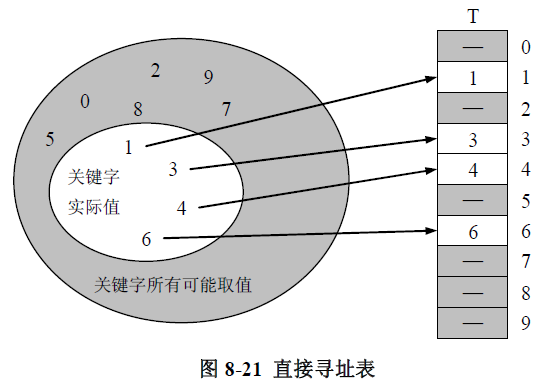
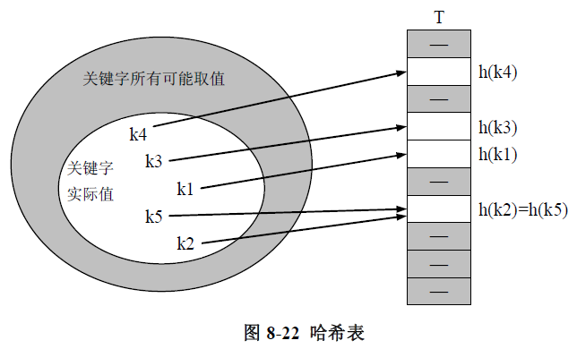
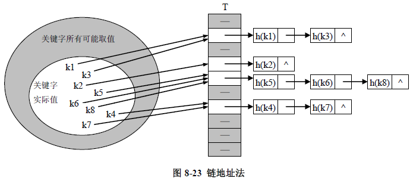
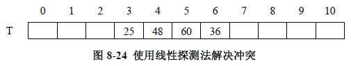

实现查找表的另一种有效数据结构是哈希表。虽然在哈希表里查找一个元素所需要的时间最坏的情况下可能和线性表一样，但是哈希表的平均查找效率是很高的。在一些合理的假定下，在哈希表中查找一个元素的期望时间为O(1)。

## 哈希表

哈希表是通常的数组概念的推广。在一个普通的数组中，最有效的查找一个元素的方法是直接寻址，时间复杂度是O(1)。直接寻址的基本思想是：如果存储空间允许,我们可以为每个关键字分配一个位置,每个元素的存储地址就是关键字对应的数组下标。在这种情况下应用直接寻找技术是很有效的。

图8-21说明了直接寻址方法。图8-21中数组T[0..m-1]代表了直接寻址查找表，在数组中每个分量与关键字取值的所有可能一一对应，数组中位置T[k]对应于关键字k。如果在查找表中关键字k没有出现，则相应的位置T[k]为空，如图中阴影部分所示。

然而使用直接寻址的问题是：当查找表中关键字取值的范围较小时直接寻址是一种非常好的方法，但是，如果关键字的可能取值范围U非常大,则要在一台典型的计算机上分配足够大的空闲内存来存放一个大小为|U|的表T也许是不切实际, 甚至是不可能的。此外, 实际要存储的关键字集合K相对U来说可能很小，则分配给T的大部分空间都要浪费掉。

当存放在查找表中的关键字集合K 比所有可能的关键字域U小很多时，哈希表要求比直接寻址表更少的存贮空间。具体地，存储空间要求下降到Θ(|K|)，这时在哈希表中查找一个元素仅需O(1)时间。在这里需要注意的是，这个是哈希表的平均执行时间，但对直接寻址而言是它在最坏情况下的执行时间。



在直接寻址方式下，一个元素关键字k 被存放在位置k。在哈希方式下，这个元素处于位置h(k)；就是说，我们根据关键字K用哈希函数h 计算出位置。函数h 将关键字域U映射到哈希表T[0..m - 1]的位置上:

h : U → {0, 1, ..., m - 1}

我们可以说，一个具有关键字k的元素是被哈希到位置h(k)上；我们也可以说，h(k) 是关键字k的散列（哈希）值。图8-22给出了形象的说明。采用哈希函数的关键作用是减少需要被处理的数组大小。和直接寻址相比，我们需要处理的数组大小为m而不是|K|，由此，储存空间的开销也相应减小。



这里存在一个问题：两个关键字可能哈希到相同的位置，我们称这种情况为冲突。此时这两个关键字称为同义词，例如图8-22中k2与k5即为同义词。目前，已经有一些有效的技术可以用来解决冲突问题。

当然，理想的情况是希望完全地避免冲突。要试图做到这一点我们可以选择一个适当的哈希函数h。选择h的主导思想是使h(k)的出现是“随机”的，从而避免冲突或至少使冲突的次数减到最小（当然, 哈希函数 h 必须是确定的，因为给一个输入 k 应该总指向同样输出 h(k)） 。然而，由于|U| > m，因此至少有两个关键字有相同的哈希值；因此完全地避免冲突是不可能的。因而，一方面我们可以使随机哈希函数尽量“随机”使冲突的次数减到最小，另一方面我们仍然需要解决可能出现冲突的办法。

在后面的两个小节中，我们介绍一些常见的哈希函数和解决冲突的方法。

## 哈希函数

许多哈希函数都假设关键字的值域为自然数集合N={0, 1, 2, …}。因此，如果关键字不是自然数，我们可以找到一种方法把他们转化为自然数。例如，一个字符串在合适的基数计数法中就可以被转化为一个整数表示。例如，字符串"nt"首先可以用两个十进制整数110和116表示，因为在ASCII字符集中, n=110且t=116。那么，在以128为基数的计数法中, 字符串"nt"被表示成(112*128)+116=14452。通常情况下，在某一特定的应用中，构造一些方法把每个关键字转化成一个大的自然数是很简单的。在下面的讨论中，我们假定关键字都是自然数。

构造哈希函数的方法很多，然而要构造一个好的哈希函数却需要相当的知识和技巧。一个好的哈希函数应该（近似）满足简单一致分布的假设：即每个关键字等可能地散列到任一个地址中去。下面我们介绍几种常见的哈希函数构造方法

### 除留余数法

在除留余数法中，为了构造哈希函数，我们通过取k除以m的余数来将关键字k映射到哈希表的m个不同地址的某一个中去。即，哈希函数为：

h(k) = k mod m

例如，如果哈希表的大小m=12并且关键字k=100，那么h(k)=4。因为它仅仅需要一个简单的除法操作，所以除留余数法的计算速度是相当快的。

当使用除留余数法时，我们通常要注意m的选择。如果m选择不当，将会产生大量冲突。例如，对于关键字集合{200, 205, 210, 215, … 690, 695, 700}，若选取m=100，则每个关键字的散列值至少和其他4个关键字的散列值产生冲突；而如果选取m=101，则不会产生冲突。

并且，m也不应该为2的整数次幂，因为如果m=2<sup>p</sup>，那么h(k)就是k的最低p位所代表的数字。除非我们事先知道关键字的分布使得k的最低p位的各种排列形式出现的可能性相同，否则在设计哈希函数时应当使得散列值依赖于k的每一位。我们通常把一个不太靠近2的整数次幂的素数作为m的值。

### 乘法散列

在乘法散列法中，为了构造哈希函数，我们需要两步操作：第一，我们将关键字k乘以一个常量A，它的取值范围为0<A<1，并且提出kA的小数部分；接下来，我们将这个值乘以m，并且取结果的底。简言之，哈希函数是：

$$h(k) = m * ( kA - \lfloor kA \rfloor )$$

乘法散列法的一个优势是对m的值没有什么特别的要求。对某个m，一般指定它的值是2的幂(m=2p，其中p是整数)，因为这样我们很容易就能在电脑中实现哈希函数的计算。

尽管这个方法可以和任何的常量A一起工作，但是它和一些特定的值会工作的更好。最好的选择是依赖于被散列计算的数据的特性。Knuth认为

$$ A ≈ \frac {\sqrt{5}-1} {2} = 0.618033...$$

可能是较为理想的值。

## 冲突解决

解决冲突的方法主要有链地址法和开放地址法。

### 链地址法

在链地址法中，我们把哈希到同一位置的所有元素都放在一个链接表中，如图8-23所示 。位置j中有一个指针，它指向由所有哈希到j的元素构成的链表的头，如果不存在这样的元素，则j中为Null。



在采用链地址法来解决冲突后，哈希表T 上的添加、查找和删除操作就相对容易实现了。如果假设元素x 被插入前在表T中是不存在的，则插入操作在最坏情况下的运行时间为Ο(1) 。如果需要判断x是否已经存在，则可以在插入之前执行一次查找操作。查找操作的最坏情况运行时间与x所在链表的长度成正比。如果链表是单链的，则要在表T[h(key[x])]中去找x，从而通过调整x的前趋的next指针来删除x。在这种情况下，删除和查找的运行时间基本相同。

下面我们来具体分析一下，在采用链地址法时，各操作，尤其是查找操作的执行时间（若查找操作的执行时间为Ts，则其他操作的时间为Ο(Ts)）。

给定一个能存放n个元素的具有m个位置的哈希表T，定义T的装载因子α为n/m，即一个链中平均所存储的元素个数。我们的分析以α来表示（注意，α可以小于、等于或大于1）。

链地址法在最坏情况下性能很差：所有的n个关键字都哈希到同一个位置上，产生出一个长度为n的链表。这时，最坏情况下查找的时间为Θ(n)，再加上计算哈希函数的时间，这不比用一个链表来存储所有元素好。

哈希方法的平均性能要依赖于所选的哈希函数。这里，假定任何元素哈希到m个位置的每一个的可能性是相同的，且与其他元素被哈希到什么位置是独立的。我们称此假设为简单一致哈希。在简单一致哈希的假设下，任何关键字k等可能地被哈希到m个位置的任一个之中。因而，一次不成功查找的平均时间就是对m个表中的某一个从头查找至尾的平均时间。这样一个表的平均长度即为装载因子α=n/m的大小。所以，一次不成功的查找平均要检查α个元素，总的时间（包括计算h(k)的时间）为Θ(1 + α)。同样，在简单一致哈希的假设下，我们也可以证明①，对用链地址法解决冲突的哈希表，平均情况下一次成功的查找也需要Θ(1 + α)时间。

上面的分析说明：如果哈希表的总地址数m至少与表中的元素数n成比例，我们有n = O(m)，从而α = n/m = O(m)/m = O(1)。因而，查找操作需要常数的时间。既然插入操作在最坏情况下需要O(1)时间，则所有的操作在平均情况下都可在O(1)时间内完成。

### 开放地址法

解决冲突的另外一种方法是开放地址法。

在开放地址法中，所有的元素都存储在哈希表中，即哈希表中的每一个位置要么存储了某个元素，要么是Null。当采用这种方法时，要查找一个元素，我们需要通过一系列的探测才能找到或者判断元素不存在。因为在开放地址法中所有元素均存储在表中，因此装填因子α总是不大于1。

#### (1) 线性探测

采用开放地址法解决冲突的最简单的一种形式是线性探测。假设h’(k)是一个哈希函数，那么线性探测法使用的哈希函数为：

h(k, i) = (h’(k)+i) mod m i=0, 1, 2, … m-1

具体地说，在执行插入操作时：首先计算h(k, 0)，若T[h(k, 0)]未被占用，则直接插入；否则尝试插入到T[h(k, 1)]。要是T[h(k, 1)]也被占用了，就继续尝试T[h(k, 2)]。如此进行下去直到找到一个未被占用的存储单元。相应地，在执行查找操作时，首次对T[h(k, 0)]的查找失败并不意味着在T中不包含k，实际上我们未能还需要依次扫描T[h(k, 1)]、T[h(k, 2)]...，直到发现k（查找成功）或到达一个空单元（查找失败）。

例如，假设哈希表的长度m=11，哈希函数h’(k)=k mod 11。若依次插入关键字25、48、60、36，其结果如图8-24所示。



由于h (25, 0)=3，h(48, 0)=4，h(60,0)=5，因此关键字25、48、60分别占据T[3]、T[4]和T[5]的单元。如果再插入36，由于h (36, 0)=3，而T[3]被25占据，所以继续计算h (36, 1)=4，仍然冲突，因此继续计算h (36, 2)=5，还是冲突，再次计算h (36, 3)=6，此时不再冲突，最终将36放入T[6]。

从上述例子可以看出，线性探测处理冲突容易产生元素“聚集”的现象，即在处理同义词的冲突时又导致了非同义词的冲突。线性探测的优点是只要哈希表不满，就一定能找到一个不冲突的哈希地址，然而，其缺点是当装填因子α较大时，元素聚集现象非常严重，这对执行元素查找操作极为不利。二次探测和双散列是克服这一缺点的有效方法。

#### (2) 二次探测

二次探测使用的哈希函数如下：

h(k, i) = (h’(k)+i<sup>2</sup>) mod  m  i=0, 1, 2, … m-1

其中h’是一个辅助的哈希函数。采用二次探测可以很好的解决元素的聚集问题。这里充分利用了二次函数的特点，随着冲突次数的增加，其探测步长将快速增加，而不是像线性探测那样采用固定的步长1。因此，一旦产生冲突，这一方法可以使带插入的元素迅速远离发生聚集的区域。

然而，这一方法也有不足。首先，尽管这一方法可以有效回避元素聚集的现象，但是还是会出现二次聚集的情况——元素虽然不会连续的聚集成片，但是会在多个间断的位置多次反弹。

其次，如果m选择不当，可能会造成出现虽然哈希表不满，但是由于循环反弹以至于无法插入的情况。

### (3) 双散列

双散列也是一种有效解决元素聚集问题的方法。双哈希使用如下形式的哈希函数：

$$h(k, i) = (h_1(k)+ih_2(k))\quad mod\quad m\quad i=0, 1, 2, … m-1$$

其中h1(k)和h2(k)均是辅助哈希函数。在这里需要注意的是，对于任何k，h2(k)都不能为0，否则h(k, 0)= h(k, 1)= h(k, 2)=...，无法起到解决冲突的目的。

对于以上三种开放地址法，它们的平均查找性能也使用装填因子来表示。同样可以证明①，在简单一致哈希的假设下，一个具有装填因子为α=n/m<1的开放地址哈希表，在一次不成功的查找中最多需要比较的元素个数的期望值不超过1/(1-α)。

## hashnode.h

```C++
#pragma once

template<class T>
class hashnode
{
public:
	int key;//索引
	T  t;  //代表数据
	int cn;//代表查找次数
};
```

## Hash.h

```C++
#pragma once
#include "hashnode.h"

template<class T>
class Hash
{
public:
	hashnode<T> *p;//p->存储哈希表
	int n;//长度
public:
	 int   myhash(int key );
	 void  init(T * pt, int nt);
	 bool  isin(int key,T t);
	 hashnode<T> *  find(int key);
	Hash();
	~Hash();
};
```

## Hash.cpp

```C++
#include "Hash.h"

template<class T>
Hash<T>::Hash()
{
	this->n = 10;
	this->p = new hashnode<T>[this->n];
}

template<class T>
Hash<T>::~Hash()
{
	delete[] p;
}

template<class T>
int  Hash<T>::myhash(int key)
{
	return key % n;
}

template<class T>
void Hash<T>::init(T *pt,int  nt)
{
	for (int i = 0; i < 10;i++)
	{
		p[i].key = i;
		p[i].t = pt[i];
		p[i].cn = 0;
	}
}

template<class T>
bool  Hash<T>::isin(int key,T t)
{
	int res = myhash(key);
	if (p[res].t==t)
	{
		return true;
	}
	else
	{
		return false;
	}
}

template<class T>
hashnode<T> *   Hash<T>::find(int key)
{
	int res = myhash(key);
	return  p + res;
}
```

## main.c

```C++
#include<iostream>
#include "Hash.h"
#include "Hash.cpp"
#include "hashnode.h"
using namespace std;

void main()
{
	
	Hash<int> myhash;
	int a[10] = { 10, 11, 22, 33, 44, 55, 56, 67, 78, 99 };
	myhash.init(a, 10);
	cout << myhash.isin(43,43) << endl;
	hashnode<int > *p = myhash.find(8);
	cout << p->key << endl;
	cout << p->t << endl;

	cin.get();
}
```