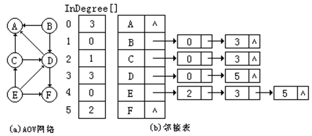

## 活动网络

通常我们把计划、施工过程、生产流程、程序流程等都当成一个工程。除了很小的工程外，一般都把工程分为若干个叫做“活动”的子工程。完成了这些活动，整个工程就完成了。

在本节中将介绍两种活动网络：用顶点表示活动的网络(AOV网络)和用边表示活动的网络(AOE网络)。 

## 用顶点表示活动的网络 

一般地，可以用有向图表示一个工程。在这种有向图中，用顶点表示活动，用弧&lt;i、j>表示活动i必须在活动j开始之前完成。这种有向图叫做用顶点表示活动的网络(Activity 0n Vertex)，记作AOV网络。

计算机专业学生的学习就是一个工程，每一门课程的学习就是整个工程中的一个活动。右图给出了若干门必修的课程，及其先修关系。 

在AOV网络中不能出现有向回路，即有向环。如果在AOV网络中出现了有向环，则意味着某项活动的开始要以自己的完成作为先决条件，显然这是不可能的事情。因此，对给定的AOV网络，必须先判断它是否存在有向环。

检测AOV网络中是否存在有向环的一种方法是对AOV网络构造它的拓扑有序序列。即将AOV网络中各个顶点排列成一个线性有序的序列，使得AOV网络中所有的前驱和后继关系都能得到满足。这种构造AOV网络全部顶点的拓扑有序序列的运算就叫做拓扑排序。 

例如，对学生课程先修关系图进行拓扑排序，得到的拓扑有序序列为：
C1 , C2 , C3 , C4 , C5 , C6 , C8 , C9 , C7 或  C1 , C8 , C9 , C2 , C5 , C3 , C4 , C7 , C6

从上述例子可以看出，一个AOV网络的拓扑有序序列并不是唯一的。进行拓扑排序的方法是：

（1）在AOV网络中选一个没有直接前驱的顶点v；并输出之；

（2）从图中删去该顶点，同时删去所有从顶点v发出的弧；

（3）重复以上步骤（1）和（2）,直到没有直接前驱的顶点全部输出。如果图中所有顶点已全部输出，则拓扑有序序列形成，拓扑排序完成；否则说明图中还剩下一些顶点，它们都有直接前驱，再也找不到没有前驱的顶点了，这时AOV网络中必定存在有向环。

在拓扑排序算法中，AOV网络可以用邻接表存储。为了方便查找入度为0的顶点，在邻接表中增设了一个顶点入度数组InDegree[]，以记录各个顶点的入度。

入度数组InDegree[]的初始化由图的构造函数完成，在输入弧数据之前，先令InDegree[i]＝0(i＝0，1，…，n-1)。以后每输入一条弧<i、j>，在建立一个弧结点，并将它插入到相应弧链表中的同时，顶点j的入度数增加1。下图给出AOV网络的邻接表表示的例子。

## 用边表示活动的网络 

在一个带权有向无环图中，用弧表示一个工程中的各项活动(Activity)，用弧上的权值表示相应活动的持续时间(Duration)，用顶点表示事件(Event)，则这样的有向图叫做用边表示活动的网络，简称AOE网络。

 

AOE网络在某些工程估算方面是非常有用的。例如，人们通过AOE网络可以了解到：

(1) 完成整个工程至少需要多少时间？

(2) 为缩短完成工程所需的时间, 应当加快哪些活动进度？或者说哪些活动是影响整个工程进度的关键所在?

由于整个工程只有一个工程开始事件和工程完成事件，所以在AOE网络中也只有一个入度为0的顶点（称为源点）用于表示这个开始事件；只有一个出度为0的顶点（称为汇点）用于表示这个完成事件。

在AOE网络中有些活动是必须按先后顺序进行的，例如活动a1和a4；而有些活动是可以并行进行的，例如活动a4和a5。因此，从源点到汇点的路径可能不止一条，这些路径的长度（即相应路径上所有活动的持续时间之和）可能是不同的，但只有当各条路径上的所有活动都完成了，整个工程才算完成。

因此，整个工程完成所需的最短时间取决于从源点到汇点的最长路径长度。这条路径长度最长的路径就叫做关键路径（Critical Path），关键路径上的所有活动都是关键活动（即不按期完成就会影响整个工程完成的活动）。 

例如，前图（a）所示的AOE网络，其关键路径有两条，它们分别是：（A、B、E、G），（A、D、E、G），关键活动包括：a1、a2 、a4、a8和a9。 

在AOE网络中要找出关键路径，就必须先找出关键活动。为了求关键活动，在此，先定义几个有关的量：

（1）事件Vi 的最早可能发生时间：从源点V0 到顶点Vi 的最长路径长度，用Ve[i]表示。Ve[i]决定了以顶点Vi为弧尾的弧所代表的活动可以开始的最早时间。

（2）事件Vi的最迟允许发生时间：在保证整个工程不推迟完成的前提下，顶点Vi 所对应的事件的最迟允许发生时间，用Vl[i]表示。

（3）活动ak 的最早可能开始时间 e[k]：设活动ak 对应的弧为<Vi,Vj>，则e[k]是从源点V0到顶点Vi 的最长路径长度。因此, e[k] = Ve[i]。

（4）活动ak 的最迟允许开始时间 l[k]：l[k]是在保证整个工程不推迟完成的前提下，活动ak的最迟允许开始时间。显然，$l[k] = Vl[j] - dur(<i, j>)$ 。其中，$dur(<i, j>)$ 是完成 ak 所需的时间。

（5）活动ak 的时间余量：活动ak 的最迟允许开始时间和最早可能开始时间之差（l[k]-e[k]）。显然，时间余量为零的活动ak（l[k]==e[k]）是关键活动。

为找出关键活动，需要求各个活动的e[k]与l[k]，以判别是否l[k]==e[k]。而为了求得e[k]与l[k]，需要先求得各个顶点Vi 的Ve[i]和Vl[i]。 