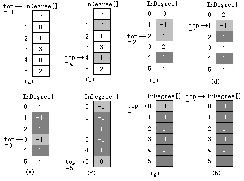
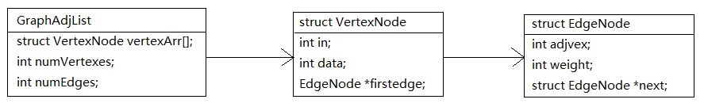

## 活动网络

通常我们把计划、施工过程、生产流程、程序流程等都当成一个工程。除了很小的工程外，一般都把工程分为若干个叫做“活动”的子工程。完成了这些活动，整个工程就完成了。

在本节中将介绍两种活动网络：用顶点表示活动的网络(AOV网络)和用边表示活动的网络(AOE网络)。 

## 用顶点表示活动的网络 

一般地，可以用有向图表示一个工程。在这种有向图中，用顶点表示活动，用弧<i,j>表示活动i必须在活动j开始之前完成。这种有向图叫做用顶点表示活动的网络(Activity 0n Vertex)，记作AOV网络。

计算机专业学生的学习就是一个工程，每一门课程的学习就是整个工程中的一个活动。右图给出了若干门必修的课程，及其先修关系。 


在AOV网络中不能出现有向回路，即有向环。如果在AOV网络中出现了有向环，则意味着某项活动的开始要以自己的完成作为先决条件，显然这是不可能的事情。因此，对给定的AOV网络，必须先判断它是否存在有向环。

检测AOV网络中是否存在有向环的一种方法是对AOV网络构造它的拓扑有序序列。即将AOV网络中各个顶点排列成一个线性有序的序列，使得AOV网络中所有的前驱和后继关系都能得到满足。这种构造AOV网络全部顶点的拓扑有序序列的运算就叫做拓扑排序。 

所谓拓扑排序，其实就是对一个有向图构造拓扑序列的过程。

例如，对学生课程先修关系图进行拓扑排序，得到的拓扑有序序列为：

```
C1 , C2 , C3 , C4 , C5 , C6 , C8 , C9 , C7
或  
C1 , C8 , C9 , C2 , C5 , C3 , C4 , C7 , C6
```

从上述例子可以看出，一个AOV网络的拓扑有序序列并不是唯一的。进行拓扑排序的方法是：

（1）在AOV网络中选一个没有直接前驱的顶点v；并输出之；

（2）从图中删去该顶点，同时删去所有从顶点v发出的弧；

（3）重复以上步骤（1）和（2）,直到没有直接前驱的顶点全部输出。如果图中所有顶点已全部输出，则拓扑有序序列形成，拓扑排序完成；否则说明图中还剩下一些顶点，它们都有直接前驱，再也找不到没有前驱的顶点了，这时AOV网络中必定存在有向环。


最后得到的拓扑有序序列为：E、C、B、D、F、A。它满足了图中给出的所有前驱和后继关系。在拓扑排序中对于本来没有这种关系的顶点，如 B 和 E 也人为地排出了先后关系。

在拓扑排序算法中，AOV网络可以用邻接表存储。为了方便查找入度为0的顶点，在邻接表中增设了一个顶点入度数组InDegree[]，以记录各个顶点的入度。

入度数组InDegree[]的初始化由图的构造函数完成，在输入弧数据之前，先令InDegree[i]＝0(i＝0，1，…，n-1)。以后每输入一条弧&lt;i,j>，再建立一个弧结点，并将它插入到相应弧链表中的同时，顶点j的入度数增加1。下图给出AOV网络的邻接表表示的例子。


作相应修改后图邻接表的类定义

```c++
class Graph {
friend class <int,char> VertexNode;
friend class <int> ArcNode;
private
    VertexNode <int, char> * VertexesTable;
    int * InDegree; //入度数组，记录每一个顶点的入度   
	int CurrentNumVertexes; //当前的顶点数    
   	int CurrentNumArcs; //当前的边（或弧）数
    int GetVertexPos( const char &v );// 取顶点v在数组中的位置
public:
    Graph(char v[ ] , int num = MaxVertexes ) ;
    void TopologicalOrder();//拓扑排序
};
```

修改后的构造函数

```c++
Graph ( vertexType v[ ] , int num = MaxVertexes ) :
CurrentNumVertexes(0), CurrentNumArcs(0){
    int e, t, h; 
    vertexType tail, head; 
    arcType w;
    VertexesTable = new VertexNode<int, char>[MaxVertexes];
    InDegree = new int [MaxVertexes];// 创建入度表
    for ( int i = 0; i < num; i++){  // 输入各顶点信息
      	InsertVertex (v[i]); 
      	InDegree [i]=0; 
    }    
	cin >> e;                    //输入边的条数
    for ( i = 0; i < e; i++) {   //逐条输入边
       cin >> tail >> head >> w; //输入一条边
       if((t = GetVertexPos ( tail ))==-1){
         	cout<<"输入的顶点(tail)不存在"; 
       }else if((h = GetVertexPos ( head ))==-1){
         	cout<<"输入的顶点(head)不存在";
       }else{
         	InsertArc ( k, j, weight ); //插入一条边
         	InDegree[j]++;              //顶点j的入度加一
       }
    }     
}
```

在拓扑排序算法中，还需要使用一个存放入度为零的顶点的堆栈，供选择和输出入度为零的顶点。在拓扑排序过程中，一旦一个顶点的直接前驱全部输出，就将该顶点加入堆栈中。

### 拓扑排序算法可以描述如下

（1）建立入度为零的顶点栈；		
（2）当入度为零的顶点栈为空时算法转步骤（6），否则继续步骤（3）；		
（3）入度为零的顶点栈中栈顶元素v出栈，并输出之顶点v；		
（4）从AOV网络中删去顶点v和所有从顶点v发出的弧&lt;v,j>，并将顶点j的入度减一；		
（5）如果顶点j入度减至0，则将该顶点进入入度为零的顶点栈；转步骤（2）；		
（6）如果输出顶点个数少于AOV网络的顶点个数，则输出网络中存在有向环的信息；算法结束。

在算法实现时，为了建立入度为零的顶点栈，可以不另外分配存储空间，直接利用顶点的入度数组InDegree[]中入度为零的元素，建立入度为零的顶点的静态链栈。



### 拓扑排序算法的程序描述

```c++
void Graph :: TopologicalSort ( ) {
    int top = -1;     //入度为零的顶点栈初始化
    int n = 0, j;     //n为输出的顶点数，初始值为0
    ArcNode<int> * p; //弧的搜索指针
    for ( i = 0; i < n; i++ )    //入度为零的顶点进栈
        if (InDegree[i] == 0 ){ 
          	InDegree[i] = top;  
          	top = i; 
        }
    while (top!= -1) {           //继续拓扑排序
       	j = top; 
      	top = InDegree [top]; 
       	n++; //  输出的顶点数加一
       	cout << VertexesTable[j].data << endl;       
      	p = VertexesTable[j].firstarc; 
       	while (p) {            	      //扫描以顶点j为弧尾的所有弧
         	int k = p->adjvex;        //取弧头顶点为k
         	if (--InDegree[k] == 0){  //顶点k的入度减一
            	count[k] = top;  
              	top = k; 
            }
         	p = p->nextarc; // 取以顶点j为弧尾的下一条弧
        }
    }
    if ( n < CurrentVertexesNum )
       cout << "AOV网络中有回路(有向环)" << endl;
}
```

### 拓扑排序的算法实现

邻接表结构



```c++
typedef struct EdgeNode // 边表结点
{
	int adjvex;    // 邻接点域，存储该顶点对应的下标
	int weight;	   // 用于存储权值，对于非网图可以不需要
	struct EdgeNode *next; // 链域，指向下一个邻接点
}EdgeNode;

typedef struct VertexNode // 顶点表结点
{
	int in;	// 顶点入度
	int data; // 顶点域，存储顶点信息
	EdgeNode *firstedge; // 边表头指针
}VertexNode, AdjList[MAXVEX];

typedef struct
{
	AdjList adjList; 
	int numVertexes,numEdges; // 图中当前顶点数和边数
}graphAdjList,*GraphAdjList;
```

拓扑排序

```c++
Status TopologicalSort(GraphAdjList GL)
{    
	EdgeNode *e;    
	int i,k,gettop;   
	int top=0;   // 用于栈指针下标
	int count=0; // 用于统计输出顶点的个数
	int *stack;	 // 建栈将入度为0的顶点入栈 
	stack=(int *)malloc(GL->numVertexes * sizeof(int) );    

	for(i = 0; i<GL->numVertexes; i++)                
		if(0 == GL->adjList[i].in) // 将入度为0的顶点入栈      
			stack[++top]=i;    
	while(top!=0)    
	{        
		gettop=stack[top--];        
		printf("%d -> ",GL->adjList[gettop].data);        
		count++;        // 输出i号顶点，并计数     
		for(e = GL->adjList[gettop].firstedge; e; e = e->next)        
		{            
			k=e->adjvex;            
			if( !(--GL->adjList[k].in) ) // 将i号顶点的邻接点的入度减1，如果减1后为0，则入栈            
				stack[++top]=k;        
		}
	}   
	printf("\n");   
	if(count < GL->numVertexes)        
		return ERROR;    
	else       
		return OK;
}
```

## 用边表示活动的网络 

在一个带权有向无环图中，用弧表示一个工程中的各项活动(Activity)，用弧上的权值表示相应活动的持续时间(Duration)，用顶点表示事件(Event)，则这样的有向图叫做用边表示活动的网络，简称AOE网络。

如图所示，所示是一个有7个事件和10个活动的AOE网络。其中，事件A发生表示整个工程的开始，事件G发生表示整个工程的结束。其他每一个事件的发生表示以该事件相应的顶点为弧头的弧所代表的活动都已完成，以该事件相应的顶点为弧尾的弧所代表的活动可以开始。例如，事件B发生表示活动a1已经完成，活动a4和a5可以开始。与活动相对应的弧上的权值可以用来表示完成该活动所需的时间。例如，完成活动a1需要3天时间，完成活动a2需要6天时间等等。

 

AOE网络在某些工程估算方面是非常有用的。例如，人们通过AOE网络可以了解到：

（1）完成整个工程至少需要多少时间？

（2）为缩短完成工程所需的时间, 应当加快哪些活动进度？或者说哪些活动是影响整个工程进度的关键所在?

由于整个工程只有一个工程开始事件和工程完成事件，所以在AOE网络中也只有一个入度为0的顶点（称为源点）用于表示这个开始事件；只有一个出度为0的顶点（称为汇点）用于表示这个完成事件。

在AOE网络中有些活动是必须按先后顺序进行的，例如活动a1和a4；而有些活动是可以并行进行的，例如活动a4和a5。因此，从源点到汇点的路径可能不止一条，这些路径的长度（即相应路径上所有活动的持续时间之和）可能是不同的，但只有当各条路径上的所有活动都完成了，整个工程才算完成。

因此，整个工程完成所需的最短时间取决于从源点到汇点的最长路径长度。这条路径长度最长的路径就叫做关键路径（Critical Path），关键路径上的所有活动都是关键活动（即不按期完成就会影响整个工程完成的活动）。 

例如，前图（a）所示的AOE网络，其关键路径有两条，它们分别是：（A、B、E、G），（A、D、E、G），关键活动包括：a1、a2 、a4、a8和a9。 

在AOE网络中要找出关键路径，就必须先找出关键活动。为了求关键活动，在此，先定义几个有关的量：

（1）事件Vi 的最早可能发生时间：从源点V0 到顶点Vi 的最长路径长度，用Ve[i]表示。Ve[i]决定了以顶点Vi为弧尾的弧所代表的活动可以开始的最早时间。

（2）事件Vi的最迟允许发生时间：在保证整个工程不推迟完成的前提下，顶点Vi 所对应的事件的最迟允许发生时间，用Vl[i]表示。

（3）活动 ak 的最早可能开始时间 e[k]：设活动ak 对应的弧为<Vi,Vj>，则e[k]是从源点V0到顶点Vi 的最长路径长度。因此, e[k] = Ve[i]。

（4）活动 ak 的最迟允许开始时间 l[k]：l[k]是在保证整个工程不推迟完成的前提下，活动ak的最迟允许开始时间。显然，l[k] = Vl[j] - dur(<i,j>) 。其中，dur(<i,j>) 是完成 ak 所需的时间。

（5）活动 ak 的时间余量：活动 ak 的最迟允许开始时间和最早可能开始时间之差（l[k]-e[k]）。显然，时间余量为零的活动ak（l[k]==e[k]）是关键活动。

为找出关键活动，需要求各个活动的e[k]与l[k]，以判别是否l[k]==e[k]。而为了求得e[k]与l[k]，需要先求得各个顶点Vi 的Ve[i]和Vl[i]。 

求Ve[i]和Vl[i]可以分两步进行：

（1）第一步：求Ve[i]的递推公式

从Ve[0] = 0开始，向前递推

Ve[j] = Max{ Ve[i] + dur(&lt;i,j>) | &lt;Vi,Vj> ∈ T }, j = 1, 2, ..., n-1;

其中, T是所有以顶点Vj为弧头的弧&lt;Vi,Vj>的集合。

（2）第二步：求Vl[i]的递推公式

从Vl[n-1] = Ve[n-1]开始，反向递推

Vl[i] = Min{ Vl[j] - dur(&lt;i,j>) | &lt;Vi,Vj> ∈ T }, i =0, 1, 2, ..., n-2;

其中, T是所有以顶点Vi为弧尾的弧&lt;Vi,Vj>的集合。

当求出了AOE网络中每个顶点Vi的Ve[i]和Vl[i]，就可以再计算每一个活动ak的最早可能开始时间e[k]和最晚允许开始时间l[k]。

设活动ak (k = 1, 2, …, e)对应带权有向边&lt;Vi,Vj>，它的持续时间用dur (&lt;Vi, Vj>) 表示，则有：

- e[k] = Ve[i]
- l[k] = Vl[j] - dur(&lt;Vi,Vj>)；k = 1, 2, …, e

然后再通过判断是否e[k] == l[k]，就可找出关键活动，从而求得关键路径。

计算关键路径的算法步骤如下：

1. 输入n个顶点和e条带权的有向边，建立邻接表结构
2. 从源点V0出发，令Ve[0]=0，按拓扑有序的顺序计算每个顶点的Ve[j]（j=1，2，…，n-1）。若拓扑排序中遍历的顶点数小于n，则说明网络中存在有向环，不能继续求关键路径
3. 从汇点Vn-1出发，令Vl[n-1]=Ve[n-1]，按逆拓扑有序顺序求各顶点的Vl[i]（i=0，1，…，n-2）
4. 根据各顶点Vi的Ve[i]和Vl[i]值，求各条弧ak的e[k]和l[k]
5. 输出关键活动ak（e[k]==l[k]即为关键活动）

例如，对前图（a）所示的AOE网络的计算结果如下图所示。由此可求得关键活动为：a1、a2、a4、a8和a9。因此，关键路径有两条，它们分别是：（A、B、E、G），（A、D、E、G）。


在计算关键路径时，可以借用上一节的拓扑排序算法，在进行拓扑排序时计算各顶点Vi的Ve[i]；

由于逆拓扑有序序列是拓扑有序序列的逆序。所以可以在算法中增设一个栈，在拓扑排序时，可以把拓扑有序序列中每一个顶点依次入栈，在拓扑排序完成后（计算完Ve[]），栈中的顶点再依次出栈并计算其Vl[]。

### 求关键路径算法的C++实现

```c++
void graph :: CriticalPath ( ) {
    int i, j, p, k, e, l;
    int * Ve = new int[CurrentVertexesNum];
    int * Vl = new int[CurrentVertexesNum];
    ArcNode<int> *p ;
    for ( i = 0; i < CurrentVertexesNum; i++ ) Ve[i] = 0;
    for ( i = 0; i < CurrentVertexesNum; i++ ) {
      p = VertexesTable[i].firstarc;      
      while ( p != NULL ) {
        j = p->adjvex;
        if ( Ve[i] + p->weight > Ve[j] )
          Ve[j] = Ve[i] + p->weight; 
        p = p->nextarc;
      }
    }
    for ( i = 0; i < n; i++ ) Vl[i] = Ve[n-1];    
	for ( i = n-2; i; i-- ) {
        p = VertexesTable[i].firstarc;
        while ( p != NULL ) {
          j = p->adjvex;
          if ( Vl[j] - p->weight < Vl[i])
            Vl[i] = Vl[j] - p->weight;
          p = p->nextarc;  
         }
    }    
	for ( i = 0; i < n; i++ ) {
       p = VertexesTable[i].firstarc;
       while ( p != NULL ) {
         j = p->adjvex;	
         e = Ve[i];  
         l = Vl[j] - p->weight;
         if ( l == e ) 
          cout<< "<" << VertexesTable[i].data << ","
              << VertexesTable[j].data << ">"
              << "是关键活动" << endl;
         p = p->nextarc;        
       }
    }
}
```