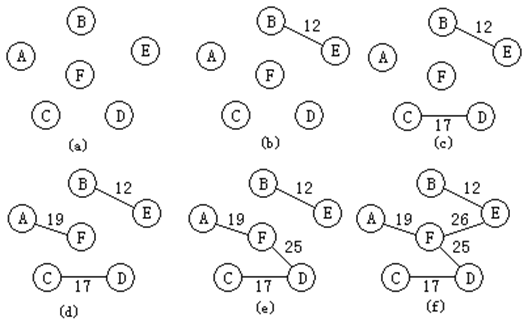
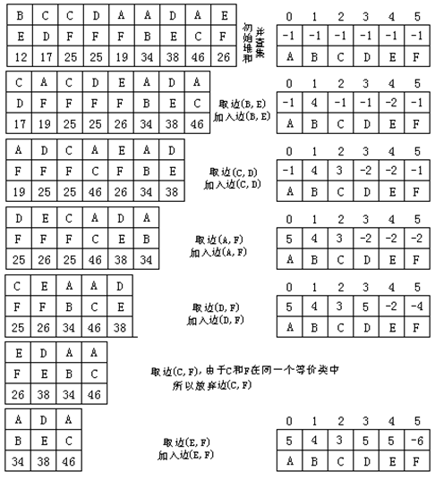

## 克鲁斯卡尔(Kruskal)算法

克鲁斯卡尔(Kruskal)算法的基本思想是：设一个有n个顶点的连通网络G＝{V，E}，最初先构造一个包括全部n个顶点和0条边的森林F＝{T0、T1、…、Tn-1}，以后每一步向F中加入一条边（v、u），该边应当是所依附的两个顶点v和u分别在森林F的两棵不同的树上的所有边中具有最小权值的边。由于这条边的加入，使F中的某两棵树合并为一棵，树的棵数减一。如此，经过n-1步，最终得到一棵有n-1条边且各边权值总和达到最小的生成树——最小生成树。

对于前图(a)所示的连通网络，下图中(a)~(f)给出了按克鲁斯卡尔算法生成最小生成树的过程。 

在克鲁斯卡尔算法中，利用最小堆来存放连通网络中的边，堆中每个元素代表连通网络中的一条边，它有三个域组成：adjvex1、adjvex2和weight，其中adjvex1和adjvex2存储该边所依附的两个顶点的序号，weight存储边上的权值；在利用并查集存放所有连通分量，同一个连通分量的顶点组成并查集的一个子集（等价类）。

克鲁斯卡尔算法步骤如下：

（1）初始化，在并查集中，连通网络的每一个顶点独立成一个等价类，连通网络的所有的边建立最小堆，最小生成树T中没有任何边，T中边的条数计数器i为0

（2）如果T中边的条数计数器i等于顶点数减1，则算法结束；否则继续步骤（3）

（3）选取堆顶元素代表的边（v，u），同时调整堆

（4）利用并查集的运算检查依附于边（v，u）的两个顶点v和u是否在同一个连通分量(即并查集的同一个子集合)上，如果是则转步骤（2）；否则继续步骤（5）

（5）将边（v，u）加入到最小生成树T中，同时将这两个顶点所在的连通分量合并成一个连通分量(即并查集中的相应两个子集合并成一个子集)，继续步骤（2）

下图给出了对于前图（a）所示的连通网络，按克鲁斯卡尔算法构造最小生成树时最小堆和并查集的变化过程。在初始建堆时，边的输入顺序为：(A、B)，（A、C），（A、F），（B、E），（C、D），（C、F），（D、E），（D、F），（E，F）。 

