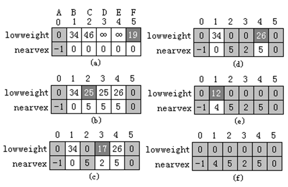
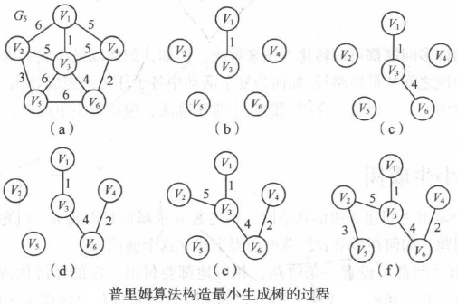

## 普里姆(Prim)算法

普里姆(Prim)算法的基本思想是：假设连通网络为N＝(V，E)；TE为N的最小生成树上边的集合，开始时TE=∅，U为算法在构造最小生成树过程中已得到的顶点集，开始时U={u<sub>0</sub>}（u<sub>0</sub> ∈ V）。算法从N中的某一顶点u<sub>0</sub>出发，选择与u<sub>0</sub>关联的具有最小权值的边(u<sub>0</sub>、v<sub>i</sub>)，将顶点v<sub>i</sub>加入到生成树的顶点集合U中，(u<sub>0</sub>，v<sub>i</sub>)加入到集合TE中，以后每一步从一个顶点在U中，而另一个顶点在V-U中的各条边当中选择权值最小的边(u、v)（u ∈ U，v ∈ V-U），把顶点v加入到集合U中，边(v、u)加入到集合TE中。如此重复，直到网络中的所有顶点都加入到生成树顶点集合U（U=V）中为止。此时，TE中刚好有n-1条边，则T=（V，TE）为N的最小生成树。

对于前图（a）所示的连通网络，下图(a)~(f)给出了按普里姆算法从顶点A开始构造最小生成树的过程。 


```c++
class MinSpanTree {        //生成树的类定义
public:
     MinSpanTree ( ) : CurrentNumArc (0)
       { arctable = new MSTArcNode[MaxNumArc ]; }
     int Insert ( MSTArcNode & e ); //将边e加到最小生成树中
protected:
     MSTArcNode  *arctable;      //存放边的数组
     int CurrentNumArc;           //当前边数
};
```

在利用普里姆算法构造最小生成树过程中，需要设置了一个辅助数组closearc[ ]，以记录从V-U中顶点到U中顶点具有最小权值的边。对每一个顶点v ∈ V-U，在辅助数组中有一个分量closearc[v]，它包括两个域：lowweight和nearvertex。其中，lowweight中存放顶点v到U中的各顶点的边上的当前最小权值(lowweight=0表示v ∈ U)；nearvertex记录顶点v到U中具有最小权值的那条边的另一个邻接顶点u（nearvertex=-1表示该顶点v为开始顶点）。在下面的普里姆算法描述中，连通网络采用邻接矩阵作为存储结构，并假设普里姆算法从顶点A（设顶点A的序号为0）出发（即u<sub>0</sub>=0）。 

普里姆算法步骤如下：

（1）初始化辅助数组closearc[]；

（2）重复下列步骤（3）和（4）n-1次

（3）在closearc[]中选择lowweight≠0 && lowweight最小的顶点v，即选中的权值最小的边为(closearc[v].nearvertex,i)。

（4）将closearc[v].lowweight改为0，表示顶点i已加入顶点集U中。并将边(closearc[v]. nearvertex、v)加入生成树T的边集合。

（5）对V-U中的每一个顶点j，如果依附于顶点j和刚加入U集合的新顶点v的边的权值Arcs\[v]\[j]小于原来依附于j和生成树顶点集合中顶点的边的最短距离closearc\[j].lowweight，则修改closearc\[j]，使其lowweight = Arcs\[v][j]}，nearvertex = v。

下图给出了对于前图（a）所示的连通网络，按普里姆算法构造最小生成树时辅助数组closearc[ ]的变化过程。



普里姆算法的C++描述

```c++
class MinSpanTree;
class CloseArcType {        //辅助数组closearc[ ]的元素类定义
friend class MinSpanTree;
private:
    float lowweight;   //边的代价（权值）
    int nearvertex;  //U中的顶点
};

void Graph<string, float> ::Prim ( MinSpanTree &T ) {
    int Num = NumberOfVertexes ( );  //取连通网络的顶点个数
    CloseArcType * closearc = new closearctype[Num];
    MSTArcNode e;    //定义最小生成树边结点辅助变量
    float min ;
    int v, i, j;
    for ( i = 1; i < Num; i++ ) { //初始化辅助数组closearc[ ]
        closearc[i].lowweight = Arcs[0][i];
        closearc[i].nearvertex = 0;
    }
	closearc[0].lowweight = 0;   //顶点0加到生成树顶点集合
    closearc[0].nearvertex = -1;  
    for ( i = 1; i < Num; i++ ) { //循环n-1次, 加入n-1条边
       min = MAXNUM; v = 0;
       for ( int j = 0; j < Num; j++ )
         if (closearc[j].lowweight != 0 && closearc[j].lowweight < min )
            { v = j;  min = closearc[j].lowweight; }
       //选取两个邻接顶点分别在U-V和U且具有最小权值的边
       if ( v ) {    //v==0表示再也找不到所求的边
        e.adjvex1 = closearc[v].nearvertex; e.adjvex2 = v;
        e.weight = closearc[v].lowweight;           
        T.Insert (e);     //把选出的边加入到生成树中
        closearc[v].lowweight = 0; //把顶点v加入U中
       for ( j = 1; j < Num; j++ )
         if (closearc[j].lowweight !=0 && Arcs[v][j]<closearc[j].lowweight ) {
 			   // 对U-V中的每一个顶点考察是否要修改它在辅助数组中的值
               closearc[j].lowweight = Arcs[v][j];
               closearc[j].nearvertex = v;
            }
      }
}
```
## prim算法


可以看出，prim算法不断增加U中的顶点，可称为“加点法”。



算法步骤


算法描述

```c
//辅助数组的定义，用来记录从顶点集U到V-U的权值最小的边
struct{
	VerTexType adjvex;						//最小边在U中的那个顶点
	ArcType lowcost;						//最小边上的权值
}closedge[MVNum];
```

```c
void MiniSpanTree_Prim(AMGraph G, VerTexType u){ 
    //无向网G以邻接矩阵形式存储，从顶点u出发构造G的最小生成树T，输出T的各条边  
	int k , j , i;
	VerTexType u0 , v0;
    k =LocateVex(G, u);           				//k为顶点u的下标 
    for(j = 0; j < G.vexnum; ++j){     			//对V-U的每一个顶点vi，初始化closedge[i] 
		if(j != k){  
			closedge[j].adjvex = u;
			closedge[j].lowcost = G.arcs[k][j];	//{adjvex, lowcost}
		}
	}
	closedge[k].lowcost = 0;        			//初始，U = {u}
	for(i = 1; i < G.vexnum; ++i){     			//选择其余n-1个顶点，生成n-1条边(n= G.vexnum) 
		k = Min(G);  
		//求出T的下一个结点：第k个顶点，closedge[k]中存有当前最小边 
		u0 = closedge[k].adjvex;     			//u0为最小边的一个顶点，u0∈U 
		v0 = G.vexs[k];            				//v0为最小边的另一个顶点，v0∈V-U 
		cout << "边  " <<u0 << "--->" << v0 << endl;//输出当前的最小边(u0, v0) 
		closedge[k].lowcost = 0;   		//第k个顶点并入U集 
		for(j = 0; j < G.vexnum; ++j) 
			if(G.arcs[k][j] < closedge[j].lowcost){	//新顶点并入U后重新选择最小边 
				closedge[j].adjvex = G.vexs[k];
				closedge[j].lowcost = G.arcs[k][j];
			}
	}
}
```