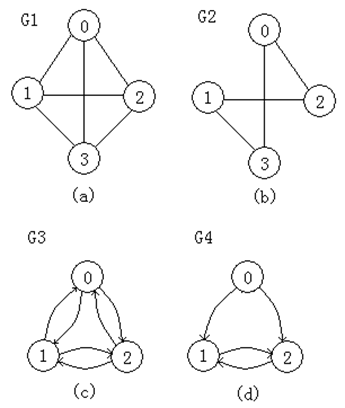
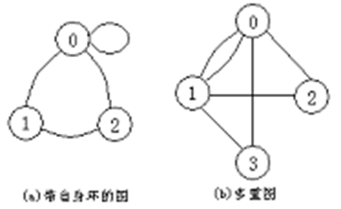

## 图Graph

图（Graph）是一种较树更为复杂的非线性数据结构。在树形结构中，数据元素之间的关系是层次型的，树中除叶子以外的每一个数据元素可以和它下一层的多个数据元素存在关系；但除根元素以外的每一个数据元素只能且必须和它上一层中的一个数据元素存在关系。而在图形结构中，数据元素之间的关系是任意的，图中每一个数据元素可以和任何其它数据元素相关联。

## 图的基本概念

图是由数据元素的集合及数据元素间的关系集合组成的一种数据结构：

Graph＝（V,E)，其中 ：V= { x | x ∈ 某个数据对象} 是数据元素的集合，在图中，数据元素一般被称为顶点(vertex)；E = {(v、w) | v，w ∈ V } 或 E = {&lt;v、w> | v, w ∈ V && Path (v、w)}是数据元素之间关系的集合，也叫做边(edge)集合；Path (v、w)表示从顶点v到顶点w的一条单向通路，它是有方向的。

### 无向图和有向图

在图中如果顶点对(v、w)是无序的，则称此图为无向图(undirected graph)，顶点对(v、w)称为与顶点v和顶点w相关联的一条边。由于这条边没有方向，所以(v、w)与(w、v)是同一条边；

在图中如果顶点对&lt;v、w>是有序的，则称此图为有向图(directed graph)，顶点对&lt;v、w>称为从顶点v到顶点w的一条有向边（又称为弧），其中v称为有向边&lt;v、w>的始点（弧尾）；w称为有向边&lt;v、w>的终点（弧头）。显然&lt;v、w>与&lt;w、v>是两条不同的弧。

### 无向图和有向图的示例

上图所示的4个图，其中G1和G2是无向图，G3和G4是有向图。在图G3和G4中，为了表示有向边，边的方向用箭头画出，箭头从有向边的始点指向有向边的终点；在无向图中用线段表示边。

### 一些限制

第一、图中不能有从顶点自身到自身的边(即自身环)，就是说不应有形如(x，x)或&lt;x，x>的边。如图(a)所示的带自身环的图不讨论。

第二、两个顶点v和w之间相关联的边不能多于一条。如图(b)所示的多重图也不讨论。

## 图的术语 

1．完全图(complete graph)：在有n个顶点的无向图中，若有 n(n-1)/2 条边，则称此无向图为完全无向图。在有n个顶点的有向图中，若有 n(n-1) 条边，则称此图为完全有向图。在完全图中边（弧）数目达到最大。

2．权(weight)：在某些图的应用中，边（弧）上具有与它相关的系数，称之为权。这些权可以表示从一个顶点到另一个顶点的距离、花费的代价、所需的时间、次数等。这种带权图也被称为网络(network)。

3．邻接点(adjacent vertex)：如果(v，w)是无向图G中的一条边，则称v与w互为邻接顶点，且边(v，w)称为依附于顶点v和w。如果&lt;v、w>是有向图G 中的一条弧，则称顶点v邻接到顶点w（也称v是w的前驱），顶点w邻接自顶点v（也称w是v的后继），弧&lt;v，w>与顶点v与w相关联。

4．子图(subgraph)：设有两个图G＝(V，E)和G´＝(V´，E´)。若V´∈ V且E´ ∈ 3E，则称图G´是图G的子图。下图(a)和(b)给出无向图G1的两个子图，图(c)和(d)给出有向图G3的两个子图。

5．顶点的度(degree)：在无向图中，一个顶点v的度是依附于顶点v的边的条数，记作TD(v)。在有向图中，以顶点v为始点的有向边的条数称为顶点v的出度，记作OD(v)；以顶点v为终点的有向边的条数称为顶点v的入度，记作ID(v)。有向图中顶点v的度等于该顶点的入度与出度之和：TD(v)＝ID(v) + OD(v)。

6．路径(path)：在图G＝(V，E)中，若从顶点vi出发，沿一些边（或弧）经过一些顶点vp₁、vp₂、…、vpk，到达顶点vj，则顶点序列(vi、vp₁、vp₂、…、 vpk、vj )被称为从顶点vi到顶点vj的路径。

7．路径长度(path length)：对于不带权的图，路径长度是指此路径上边的数目。对于带权图，路径长度是指路径上各边的权之和。

8．简单路径与回路(cycle)：对于一路径（v₁、v₂、…、vm），若路径上各顶点均不相同，则称这路径为简单路径。若路径上第一个顶点v₁和最后一个顶点vm相同，则称这样的路径为回路或环。

9．连通图与连通分量：在无向图中，若从顶点vi到顶点vj有路径，则称顶点vi与vj是连通的。如果无向图中任意两个顶点都是连通的，则称此无向图是连通图。非连通图的极大连通子图（包括所有连通的顶点和这些顶点依附的所有的边）叫做连通分量。

如下图（a）所示是一个非连通图，图（b）所示是相应的三个连通分量。

10．强连通图与强连通分量(strongly connected digraph)：在有向图中，若对于顶点vi和vj，存在一条从vi到vj和从vj到vi的路径，则称顶点vi和顶点vj是强连通。如果有向图中任意两个顶点都是强连通的，则称此有向图为强连通图。非强连通图的极大强连通子图叫做强连通分量。

11．生成树(spanning tree)：一个连通图的生成树是它的极小连通子图，它包含图中全部 n 个顶点和仅使这 n 个顶点连通的 n-1 条边。如果一个有向图只有一个入度为零的顶点，且其它顶点的入度均为1，则称这个有向图为有向树。一个有向图的生成森林由若干棵有向树组成，生成森林含有图中所有的顶点，且只有足以构成若干棵互不相交的有向树的弧。

## 图的遍历与连通性 

对于给定的图，沿着一些边（或弧）访问图中所有的顶点，且使每个顶点仅被访问一次，这个过程叫做图的遍历。 

图的遍历通常有两种方法：深度优先遍历(Depth First Traversal)和广度优先遍历(Breadth First Traversal)。这两种方法对无向图和有向图都是适用的，但在下面的讨论中将主要介绍对无向图的遍历。 

## 连通分量

对于连通图，从任一顶点出发，只需一次调用深度优先搜索算法或广度优先搜索算法就可以访问到图中的所有顶点；对于非连通图时，从图中某一顶点出发，一次调用深度优先搜索算法或广度优先搜索算法不可能访问到图中的所有顶点，只能访问到该顶点所在的极大连通子图(即连通分量)的所有顶点。非连通图有n个连通分量，就要n次调用DFS或BFS才能访问图中的所有顶点。若从图的每一个连通分量中的一个顶点出发进行搜索，就可以求得图的所有连通分量。所谓连通分量是指非连通图中极大连通子图。 

在实际的遍历算法中，需要对图的每一个顶点进行检测：若顶点已被访问过，则该顶点一定是落在图中已求得的连通分量上；若顶点还未被访问，则从该顶点出发遍历图，可求得图的另一个连通分量。如图给出了一个非连通的无向图及其连通分量的示例。对此图进行深度优先遍历或广度优先遍历，将调用DFS或BFS过程三次：第一次从顶点A出发，第二次从顶点F出发，第三次从顶点I出发，最后得到原图的三个连通分量。

对于非连通图的每一个连通分量，其中的所有顶点和用某种遍历方式所经过的边的集合，构成了一棵生成树，这是一个极小连通子图。所有连通分量的生成树组成了非连通图的生成森林。

