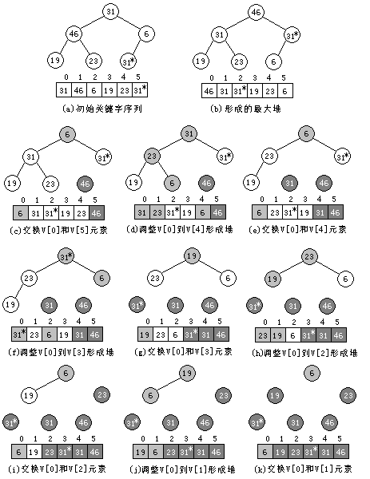
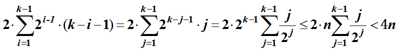

## 堆排序

堆排序的算法基本思想是：

（1）对排序表中的数据元素，利用堆的调整算法形成初始堆。		
（2）输出堆顶元素。		
（3）对剩余元素重新调整形成堆。		
（4）重复执行第（2)、(3)步，直到所有数据元素被输出。 



建立最大堆的调整算法

```c++
template <class Type>
void MinHeap<Type> :: FilterDown ( const int start, const int EndOfHeap) {
	//向下调整使从start开始到EndOfHeap为止的子表成为最大堆
    int i = start,   j = 2*i+1;        // j为i的左孩子
    Type temp = heapArr[i];
 	while ( j <= EndOfHeap ) {
         if ( j < EndOfHeap && table.Arr[j].getkey() < table.Arr[j+1].getkey()) 
     			j++;    //在两个孩子中选关键字较小者
         if ( temp.getkey() >= table.Arr[j].getkey())
         		break;
         else { 
               	table.Arr[i] = table.Arr[j];  
           		i = j;   
           		j = 2*j+1; 
         }
    }
    table.Arr[i] = temp;
}
```

堆排序算法的C++描述如下：

```c++
template <class Type> void HeapSort (sortlist <Type> &table ) {
    for ( int i = (table.CurrentSize-2 ) / 2; i >= 0; i-- )
       FilterDown ( i, table.CurrentSize-1 );  //初始建堆
    for ( i = table.CurrentSize-1; i >= 1; i--) { 
      	Swap(table.Arr[0],table.Arr[i]);
       	FilterDown ( 0, i-1 );      //重建最大堆
    } 
}
```

堆排序算法的时间复杂性可用关键字的比较次数来测度。

若设堆中有n个结点，且2^(k-1) ≤ n < 2^k，则对应的完全二叉树有k层。

在第一个形成初始堆的for循环中对每一个非叶结点调用了一次堆调整算法FilterDown()，一个数据元素每下调一层需要进行2次关键字的比较，最多下调到最底层，因此该循环所用的计算时间为：



其中，i是层序号，2i-1是第i层的最大结点数，(k-i-1)是第i层结点下调到最底层（第k层）所需的调整次数。


在第二个for循环中，调用了n-1次FilterDown( )算法，每次调用总是将位于根上的数据元素最多下调到当前堆的最底层。所以该循环的计算时间为O(nlog₂n)。

因此，堆排序的时间复杂性为O(nlog₂n)。该算法的空间复杂性为O(1)。堆排序是一种不稳定的排序方法。 
