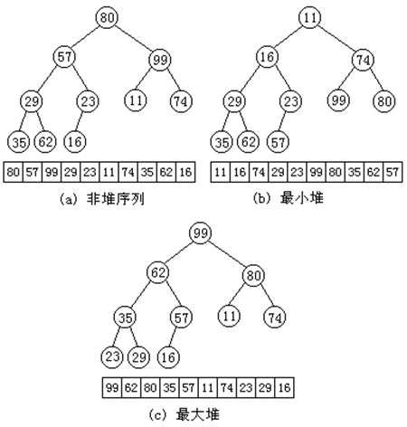
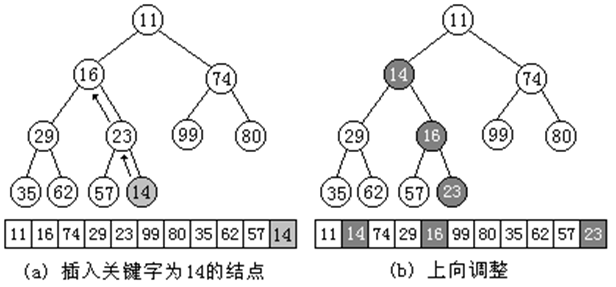
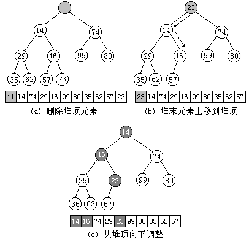

## 1. 堆的定义

设有n个数据元素的关键字为（k<sub>0</sub>、k<sub>1</sub>、…、k<sub>n-1</sub>），如果它们满足以下的关系：k<sub>i</sub><= k<sub>2i+1</sub>且k<sub>i</sub><= k<sub>2i+2</sub>（或k<sub>i</sub>>= k<sub>2i+1</sub>且k<sub>i</sub>>= k<sub>2i+2</sub>）（i=0、1、…、⌊(n-2)/2⌋）则称之为堆(Heap)。

如果将此数据元素序列用一维数组存储，并将此数组对应一棵完全二叉树，则堆的含义可以理解为：在完全二叉树中任何非终端结点的关键字均不大于（或不小于）其左、右孩子结点的关键字。

下图(b)、(c)分别给出了最小堆和最大堆的例子，前者任一非终端结点的关键字均小于或等于它的左、右孩子的关键字，此时位于堆顶(即完全二叉树的根结点位置)的结点的关键字是整个序列中最小的，所以称它为最小堆；后者任一非终端结点的关键字均大于或等于它的左、右孩子的关键字，此时位于堆顶的结点的关键字是整个序列中最大的，所以称它为最大堆。

 

### 1.1 最小堆的类定义

```c++
template <class Type> class MinHeap {
public:
	MinHeap( int maxSize ); // 构造函数，建立空堆
	MinHeap( Type a[], int n ); // 构造函数

	~MinHeap() // 析构函数
	{
		delete[] heapArr;
	} 

	int Insert( const Type &d ); // 在堆中插入元素d

	Type DeleteTop(); // 删除堆顶元素

	Type GetTop() const // 取堆顶元素值
	{
		return heapArr[0];
	}

	int IsEmpty() const // 判断堆是否为空
	{
		return heapCurrentSize == 0;
	}

	int IsFull() const // 判断堆是否为满。满堆返回1，否则返回0
	{
		return heapCurrentSize == heapMaxSize;
	}

	int SizeofHeap() const // 取堆的当前元素数目
	{
		return heapCurrentSize;
	}

	void SetEmpty() // 置堆为一个空堆
	{
		heapCurrentSize = 0;
	}

private:
	Type	*heapArr;     // 存放堆中数据元素的数组
	int	heapCurrentSize;  // 堆中当前数据元素数目
	int	heapMaxSize;      // 堆中数据元素的最大数目
	void FilterDown( int p ); // 向下调整使以结点p为根的子树成堆
	void FilterUp( int p );   // 向上调整使结点p所在的子树成为堆
}
```

### 1.2 堆的构造

```c++
template <class Type>
MinHeap <Type>::MinHeap( int maxSize ) // 建立空堆
{
	if ( maxSize <= 0 )
	{
		cerr << "堆的大小不能小于1" << endl;
		exit(1);
	}
	heapMaxSize	= maxSize;                 // 确定堆的最大空间
	heapArr		= new Type [heapMaxSize];  // 创建堆空间
	heapCurrentSize = 0;                   // 初始化
}

template <class Type>
MinHeap <Type> ::MinHeap( Type a[], int n )    // 根据数组a[]中的数据,建立堆
{
	if ( n <= 0 )
	{
		cerr << "堆的大小不能小于1" << endl;      
      	exit(1);
	}
	heapMaxSize	= n;                      // 确定堆的最大空间
	heapArr		= new Type [heapMaxSize]; // 创建堆空间
	heapArr		= a;          
  	heapCurrentSize = n;      			  // 当前堆大小
	int i = (heapCurrentSize - 2) / 2;    // 找最后一个分支结点的序号
	while ( i >= 0 )                      // 自下而上逐步调整形成堆
	{
		FilterDown(i);                  // 从i开始到heapCurrentSize为止进行调整
		i--;
	}
}
```

调整算法FilterDown要求将以分支结点i为根的子树调整为最小堆，其基本思想是：从结点i开始向下调整，先比较结点i左孩子结点和右孩子结点的关键字大小，如果结点i左孩子结点的关键字小于右孩子结点的关键字，则沿结点i的左分支进行调整；否则沿结点i的右分支进行调整，在算法中用j指示关键字值较小的孩子结点。然后结点i和结点j进行关键字比较，若结点i的关键字大于结点j的关键字，则两结点对调位置，相当于把关键字小的结点上浮。再令i＝j，j＝2*j+1，继续向下一层进行比较；若结点i的关键字不大于结点j的关键字或结点i没有孩子时调整结束。 


```c++
template <class Type>
void MinHeap<Type> :: FilterDown(const int start)
{
	int i = start, j;
  	j = 2 * i + 1; // j为i的左孩子
  	Type temp = heapArr[i];
	while (j <= heapCurrentSize-1)
	{
		if ( j < heapCurrentSize-1 && heapArr[j].key > heapArr[j + 1].key )
			j++;  // 在左右孩子中选关键字较小者
		if ( temp.key <= heapArr[j].key )
			break;
		else { 
          	heapArr[i] = heapArr[j];           
          	i = j;
          	j = 2 * j + 1;
        }
	}
	heapArr[i] = temp;
}
```

注意：这里的“堆”是指一种的特殊的二叉树，不要和java和C++等编程语言里的“堆”混淆，后者指的是程序员用new能得到的计算机内存的可用部分。

## 2. 在堆中插入元素

在堆的类定义中成员函数Insert( )用于在堆中插入一个数据元素，在此规定数据元素总是插在已经建成的最小堆后面，如下图所示在堆中插入关键字为14的数据元素。显然在堆中插入元素后可能破坏堆的性质，所以还需要调用FilterUp( )函数，进行自下而上调整使之所在的子树成为堆。 



成员函数Insert( )的C++描述

```c++
template <class Type>
int MinHeap<Type> ::Insert( const Type &d ) // 在堆中插入新元素d
{
	if (IsFull()) // 堆满
	{
		cout << "堆已满" << endl;  
      	return 0;
	}
	heapArr[heapCurrentSize] = d;          //在堆尾插入数据元素d
	FilterUp(heapCurrentSize);             //向上调整为堆
	heapCurrentSize++;                     //堆元素数目加1
	return 1;
}
```

下面给出函数FilterUp( )的C++描述

```c++
template <class Type>
void MinHeap<Type> ::FilterUp( int p )
{
	int j = p, i; 
  	i = (j - 1) / 2; // i是j的双亲
  	Type temp = heapArr[j];
	while (j > 0)
	{
		if ( heapArr[i].key <= temp.key )
			break;
		else { 
          	heapArr[j] = heapArr[i];               
          	j = i;  
          	i = (j - 1) / 2; 
        }
	}
	heapArr[j] = temp;
}
```

## 3. 在堆中删除元素

在堆的类定义中成员函数DeleteTop( )用于删除堆顶数据元素。在从堆中删除堆顶元素后，一般把堆的最后一个元素移到堆顶，并将堆的当前元素个数heapCurrentSize减1，最后需要调用FilterDown()函数从堆顶向下进行调整。如图所示给出了在堆中删除堆顶元素的过程。



成员函数DeleteTop( )的C++描述

```c++
template <class Type> 
Type MinHeap <Type> ::DeleteTop () {
    if (IsEmpty())
    { 
      	cout << "堆已空" << endl; 
        return NULL; 
    }
    Type temp = heapArr[0];                   //取堆顶元素
    heapArr[0] = heapArr[heapCurrentSize-1];  //堆末元素上移到堆顶  
    heapCurrentSize--;        //堆的当前元素数目减1
    FilterDown(0);            //从堆顶开始自顶向下调整为堆
    return temp;
}
```
## 4. 最小堆的实现代码

```c++
#ifndef HEAP_H
#define HEAP_H
#include "Assistance.h"
template<class ElemType> class MinHeap{
private:
	ElemType *heapArr;
	int CurrentSize;
	int MaxSize;
	void FilterDown(int Start);
	void FilterUp(int End);
public :
	MinHeap(int maxSize);
	MinHeap(ElemType a[],int maxsize,int n);
	~MinHeap(){delete []heapArr;}
	Status Insert(const ElemType &e);
	Status DeleteTop(ElemType & e);
	Status GetTop(ElemType & e)const;
	bool IsEmpty()const{return CurrentSize == 0;}
	bool IsFull()const{return CurrentSize == MaxSize;}
	int SizeOfHeap()const{return CurrentSize;}
	void SetEmpty(){CurrentSize=0;}
	void Traverse(void (*Visit)(const ElemType &)) const;
};
template<class ElemType>
MinHeap<ElemType>::MinHeap(int maxSize)
{
    if (maxSize <= 0)		{
	    cerr << "堆的大小不能小于1" << endl;
        exit(1);
    }
	MaxSize = maxSize;
	heapArr = new ElemType[MaxSize];
	CurrentSize = 0;
}

template<class ElemType>
MinHeap<ElemType>::MinHeap(ElemType a[],int maxSize,int n)
{
	if(n <= 0)	{
	    cerr << "堆的大小不能小于1" << endl;
        exit(1);
    }
	MaxSize = maxSize;
	heapArr = new ElemType [MaxSize];
	for (int i = 0; i < n; i++)
        heapArr[i] = a[i];
	CurrentSize = n;
	int i = (CurrentSize - 2) / 2;
	while(i >= 0)	{
        FilterDown(i);
		i--;
		Traverse(Write<ElemType>);
		cout << endl;
	}
}

template<class ElemType>
void MinHeap<ElemType>::FilterDown(const int Start)
{
	int i = Start,j;
	ElemType temp = heapArr[i];
	j = 2 * i + 1;
	while(j <= CurrentSize - 1)		{
		if(j < CurrentSize - 1 && heapArr[j] > heapArr[j+1])
			j++;
		if(temp <= heapArr[j]) break;
		else {
			heapArr[i] = heapArr[j];
			i = j;
            j = 2*j+1;
		}
	}
	heapArr[i] = temp;
}

template<class ElemType>
void MinHeap<ElemType>::FilterUp(int End)
{
	int j = End,i;
	ElemType temp = heapArr[j];
	i = (j - 1) / 2;
	while(j > 0)	{
		if (heapArr[i] <= temp) break;
		else {
			heapArr[j] = heapArr[i];
			j = i;
			i = (j - 1) / 2;
		}
		heapArr[j] = temp;
	}
}

template<class ElemType>
Status MinHeap<ElemType>::Insert(const ElemType &e)
{
	if (IsFull())
		return OVER_FLOW;
	heapArr[CurrentSize] = e;
	FilterUp(CurrentSize);
	CurrentSize++;
	return SUCCESS;
}
	
template<class ElemType>
Status MinHeap<ElemType>::DeleteTop(ElemType &e)
{
	if(IsEmpty())
    	return UNDER_FLOW;
	e = heapArr[0];
	heapArr[0] = heapArr[CurrentSize-1];
	CurrentSize--;
	FilterDown(0);
	return SUCCESS;
}

template<class ElemType>
Status MinHeap<ElemType>::GetTop(ElemType &e) const
{
	if(IsEmpty())
    	return UNDER_FLOW;
	e = heapArr[0];
	return SUCCESS;
}

template<class ElemType>
void MinHeap<ElemType>::Traverse(void (*Visit)(const ElemType &)) const
{
	for(int i = 0; i < CurrentSize; i++)
		(*Visit)(heapArr[i]);
}
#endif
```