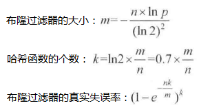
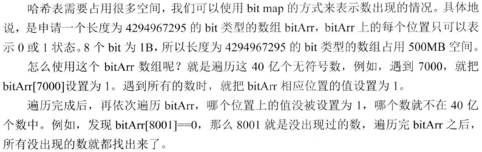
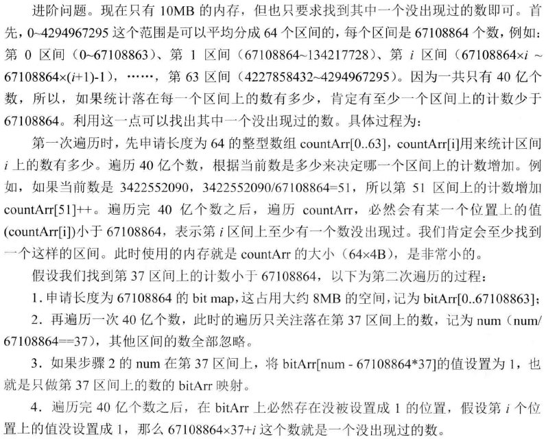

## 布隆过滤器

- m为bit类型的数组bitMap的大小
- k为哈希函数的个数
- n为输入对象的个数
- p为布隆过滤器的失误率

## 只用2GB内存在20亿个整数中找到出现次数最多的数

方法1：用哈希表对每一个出现的数做词频统计，哈希表的key是某一个整数，value是这个数出现的次数。缺点是内存可能不够用。

方法2：把包含20亿个数的大文件用哈希函数分成16个小文件，然后用哈希表来统计其中每种数出现的次数，这样我们就得到了16个小文件中各自出现次数最多的数，还有各自的统计次数。

把一个大的集合通过哈希函数分配到多台机器中，或者分配到多个文件里，这种技巧是处理大数据面试题时最常用的技巧之一。

## 40亿个非负整数中找到没出现的数

## 找到100亿个URL中重复的URL以及搜索词汇的 top k问题

- 100亿个URL的大文件，每个URL占用64B
- 百度一天的用户搜索词汇是海量的（百亿数据量），设计一种求出每天最热 top 100 词汇的可行办法

## 一致性哈希算法的基本原理

