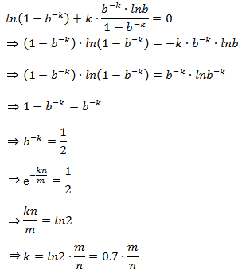

## 布隆过滤器 (Bloom Filter) 详解

布隆过滤器 (Bloom Filter)是由Burton Howard Bloom于1970年提出，它是一种space efficient的概率型数据结构，用于判断一个元素是否在集合中。在垃圾邮件过滤的黑白名单方法、爬虫(Crawler)的网址判重模块中等等经常被用到。哈希表也能用于判断元素是否在集合中，但是布隆过滤器只需要哈希表的1/8或1/4的空间复杂度就能完成同样的问题。布隆过滤器可以插入元素，但不可以删除已有元素。其中的元素越多，false positive rate(误报率)越大，但是false negative (漏报)是不可能的。

本文将详解布隆过滤器的相关算法和参数设计，在此之前希望大家可以先通过谷歌黑板报的[数学之美系列二十一 － 布隆过滤器（Bloom Filter）](http://www.google.com.hk/ggblog/googlechinablog/2007/07/bloom-filter_7469.html)来得到些基础知识。

### 1. 算法描述

一个empty bloom filter是一个有m bits的bit array，每一个bit位都初始化为0。并且定义有k个不同的hash function，每个都以uniform random distribution将元素hash到m个不同位置中的一个。在下面的介绍中n为元素数，m为布隆过滤器或哈希表的slot数，k为布隆过滤器重hash function数。

为了add一个元素，用k个hash function将它hash得到bloom filter中k个bit位，将这k个bit位置1。

为了query一个元素，即判断它是否在集合中，用k个hash function将它hash得到k个bit位。若这k bits全为1，则此元素在集合中；若其中任一位不为1，则此元素比不在集合中（因为如果在，则在add时已经把对应的k个bits位置为1）。

不允许remove元素，因为那样的话会把相应的k个bits位置为0，而其中很有可能有其他元素对应的位。因此remove会引入false negative，这是绝对不被允许的。

当k很大时，设计k个独立的hash function是不现实并且困难的。对于一个输出范围很大的hash function（例如MD5产生的128 bits数），如果不同bit位的相关性很小，则可把此输出分割为k份。或者可将k个不同的初始值（例如0,1,2, … ,k-1）结合元素，feed给一个hash function从而产生k个不同的数。

当add的元素过多时，即n/m过大时（n是元素数，m是bloom filter的bits数），会导致false positive过高，此时就需要重新组建filter，但这种情况相对少见。

### 2. 时间和空间上的优势

当可以承受一些误报时，布隆过滤器比其它表示集合的数据结构有着很大的空间优势。例如self-balance BST, tries, hash table或者array, chain，它们中大多数至少都要存储元素本身，对于小整数需要少量的bits，对于字符串则需要任意多的bits（tries是个例外，因为对于有相同prefixes的元素可以共享存储空间）；而chain结构还需要为存储指针付出额外的代价。对于一个有1%误报率和一个最优k值的布隆过滤器来说，无论元素的类型及大小，每个元素只需要9.6 bits来存储。这个优点一部分继承自array的紧凑性，一部分来源于它的概率性。如果你认为1%的误报率太高，那么对每个元素每增加4.8 bits，我们就可将误报率降低为原来的1/10。add和query的时间复杂度都为O(k)，与集合中元素的多少无关，这是其他数据结构都不能完成的。

如果可能元素范围不是很大，并且大多数都在集合中，则使用确定性的bit array远远胜过使用布隆过滤器。因为bit array对于每个可能的元素空间上只需要1 bit，add和query的时间复杂度只有O(1)。注意到这样一个哈希表（bit array）只有在忽略collision并且只存储元素是否在其中的二进制信息时，才会获得空间和时间上的优势，而在此情况下，它就有效地称为了k=1的布隆过滤器。

而当考虑到collision时，对于有m个slot的bit array或者其他哈希表（即k=1的布隆过滤器），如果想要保证1%的误判率，则这个bit array只能存储m/100个元素，因而有大量的空间被浪费，同时也会使得空间复杂度急剧上升，这显然不是space efficient的。解决的方法很简单，使用k>1的布隆过滤器，即k个hash function将每个元素改为对应于k个bits，因为误判度会降低很多，并且如果参数k和m选取得好，一半的m可被置为为1，这充分说明了布隆过滤器的space efficient性。

### 3. 举例说明

以垃圾邮件过滤中黑白名单为例：现有1亿个email的黑名单，每个都拥有8 bytes的指纹信息，则可能的元素范围为   ，对于bit array来说是根本不可能的范围，而且元素的数量（即email列表）为  ，相比于元素范围过于稀疏，而且还没有考虑到哈希表中的collision问题。

若采用哈希表，由于大多数采用open addressing来解决collision，而此时的search时间复杂度为 ：

即若哈希表半满(n/m = 1/2)，则每次search需要probe 2次，因此在保证效率的情况下哈希表的存储效率最好不超过50%。此时每个元素占8 bytes，总空间为：

若采用Perfect hashing（这里可以采用Perfect hashing是因为主要操作是search/query，而并不是add和remove），虽然保证worst-case也只有一次probe，但是空间利用率更低，一般情况下为50%，worst-case时有不到一半的概率为25%。

若采用布隆过滤器，取k=8。因为n为1亿，所以总共需要  被置位为1，又因为在保证误判率低且k和m选取合适时，空间利用率为50%（后面会解释），所以总空间为：

所需空间比上述哈希结构小得多，并且误判率在万分之一以下。

### 4. 误判概率的证明和计算

假设布隆过滤器中的hash function满足simple uniform hashing假设：每个元素都等概率地hash到m个slot中的任何一个，与其它元素被hash到哪个slot无关。若m为bit数，则对某一特定bit位在一个元素由某特定hash function插入时没有被置位为1的概率为：

则k个hash function中没有一个对其置位的概率为：

如果插入了n个元素，但都未将其置位的概率为：

则此位被置位的概率为：

现在考虑query阶段，若对应某个待query元素的k bits全部置位为1，则可判定其在集合中。因此将某元素误判的概率为：

由于，并且当m很大时趋近于0，所以

从上式中可以看出，当m增大或n减小时，都会使得误判率减小，这也符合直觉。

现在计算对于给定的m和n，k为何值时可以使得误判率最低。设误判率为k的函数为：

设  ， 则简化为

，两边取对数

  , 两边对k求导

下面求最值

因此，即当  时误判率最低，此时误判率为：

可以看出若要使得误判率≤1/2，则：

这说明了若想保持某固定误判率不变，布隆过滤器的bit数m与被add的元素数n应该是线性同步增加的。

### 5. 设计和应用布隆过滤器的方法

应用时首先要先由用户决定要add的元素数n和希望的误差率P。这也是一个设计完整的布隆过滤器需要用户输入的仅有的两个参数，之后的所有参数将由系统计算，并由此建立布隆过滤器。

系统首先要计算需要的内存大小m bits:

再由m，n得到hash function的个数：

至此系统所需的参数已经备齐，接下来add n个元素至布隆过滤器中，再进行query。

根据公式，当k最优时：

因此可验证当P=1%时，存储每个元素需要9.6 bits：

而每当想将误判率降低为原来的1/10，则存储每个元素需要增加4.8 bits：

这里需要特别注意的是，9.6 bits/element不仅包含了被置为1的k位，还把包含了没有被置为1的一些位数。此时的

才是每个元素对应的为1的bit位数。

 从而使得P(error)最小时，我们注意到：

 中的   ，即 

此概率为某bit位在插入n个元素后未被置位的概率。因此，想保持错误率低，布隆过滤器的空间使用率需为50%。
