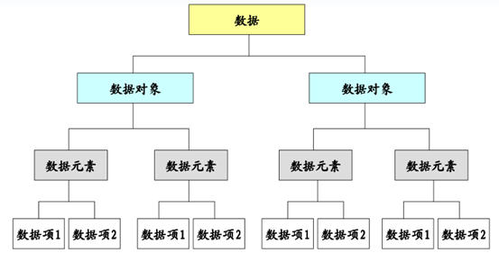
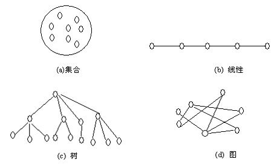

## 数据结构

人们在使用计算机解决客观世界中存在的具体问题时，通常过程如下：首先通过对客观世界的认知形成印象和概念从而得到了信息，在此基础上建立概念模型，它必须能够如实地反映客观世界中的事物以及事物间的联系；根据概念模型将实际问题转化为计算机能够理解的形式，然后设计程序；用户通过人机交互界面与系统交流，使系统执行相应操作，最后解决实际的问题。

数据结构主要与在上述过程中从建立概念模型到实现模型转化并为后续程序设计提供基础的内容相关。它是用来反映一个概念模型的内部构成，即一个概念模型由那些成分数据构成，以什么方式构成，呈现什么结构。数据结构主要是研究程序设计问题中计算机的操作对象以及它们之间的关系和操作的学科。

## 什么是数据结构

计算机的操作对象的关系十分复杂，操作形式不再是单纯的数值计算，而更多地是对这些具有一定关系的数据进行组织管理，我们将此称为非数值性处理。

要使计算机能够更有效地进行这些非数值性处理，就必须弄清楚这些操作对象的特点，在计算机中的表示方式以及各个操作的具体实现手段。这些就是《数据结构》这门课程研究的主要内容。

## 基本概念



### 数据（data）

信息的载体，数、字符、图形、图象、声音以及所有能输入到计算机中并被计算机程序识别和处理的符号的集合。

数据（data）是描述客观事物的数值、字符以及能输入机器且能被处理的各种符号集合。数据的含义非常广泛，除了通常的数值数据、字符、字符串是数据以外，声音、图像等一切可以输入计算机并能被处理的都是数据。例如除了表示人的姓名、身高、体重等的字符、数字是数据，人的照片、指纹、三维模型、语音指令等也都是数据。

### 数据元素（data element）

数据的基本单位。

数据元素（data element）是数据的基本单位，是数据集合的个体，在计算机程序中通常作为一个整体来进行处理。例如一条描述一位学生的完整信息的数据记录就是一个数据元素；空间中一点的三维坐标也可以是一个数据元素。数据元素通常由若干个数据项组成，例如描述学生相关信息的姓名、性别、学号等都是数据项；三维坐标中的每一维坐标值也是数据项。数据项具有原子性，是不可分割的最小单位。

### 数据项（data item）

数据项：一个数据元素可以由若干个数据项组成。

数据项是数据不可分割的最小单位。

### 数据对象

数据的子集。自然数集合 ={0, 1, 2, …}是“数”的数据对象；所有的字符是数据，字母集合AS={A, B, …Z, a, b, …, Z}是该数据的数据对象。

数据对象（data object）是性质相同的数据元素的集合，是数据的子集。例如一个学校的所有学生的集合就是数据对象，空间中所有点的集合也是数据对象。

### 数据结构(data structure)

数据以及数据元素之间的相互关系。

数据结构分为两大类：线性结构和非线性结构。这两类结构通常又可分为下列四类基本结构 

- 集合，结构中的数据元素之间就是“同属于一个集合” 
- 线性结构，结构中的数据元素之间存在的是一种线性关系，即一对一的关系
- 树形结构，结构中的元素存在着一对多的关系
- 图形结构或网状结构，结构中的元素之间存在着多对多的关系 

数据结构（data structure）是指相互之间存在一种或多种特定关系的数据元素的集合。是组织并存储数据以便能够有效使用的一种专门格式，它用来反映一个数据的内部构成，即一个数据由那些成分数据构成，以什么方式构成，呈什么结构。

由于信息可以存在于逻辑思维领域，也可以存在于计算机世界，因此作为信息载体的数据同样存在于两个世界中。表示一组数据元素及其相互关系的数据结构同样也有两种不同的表现形式，一种是数据结构的逻辑层面，即数据的逻辑结构；一种是存在于计算机世界的物理层面，即数据的存储结构。

数据的逻辑结构按照数据元素之间相互关系的特性来分，可以分为以下四种结构：集合、线性结构、树形结构和图状结构。本书中讨论的数据结构主要有线性表、栈、队列、树和图，其中线性表、栈、队列属于线性结构，树和图属于非线性结构。

数据的逻辑结构可以采用两种方法来描述：二元组、图形。

数据的存储结构主要包括数据元素本身的存储以及数据元素之间关系表示。通过数据元素的定义可以看出，我们可以很容易的使用Java中的一个类来实现它，数据元素的数据项就是类的成员变量。

数据元素之间的关系在计算机中主要有两种不同的表示方法：顺序映像和非顺序映像，并由此得到两种不同的存储结构：顺序存储结构和链式存储结构。顺序存储结构的特点是：数据元素的存储对应于一块连续的存储空间，数据元素之间的前驱和后续关系通过数据元素在存储器中的相对位置来反映。链式存储结构的特点是：数据元素的存储对应的是不连续的存储空间，每个存储节点对应一个需要存储的数据元素。元素之间的逻辑关系通过存储节点之间的链接关系反映出来。

## 四种不同结构的关系图 

数据结构分为两大类：线性结构和非线性结构。这两类结构通常又可分为下列四类基本结构

- 集合，结构中的数据元素之间就是“同属于一个集合” 
- 线性结构，结构中的数据元素之间存在的是一种线性关系，即一对一的关系；
- 树形结构，结构中的元素存在着一对多的关系
- 图形结构或网状结构，结构中的元素之间存在着多对多的关系



数据的**逻辑结构**属于用户视图，是用户所看到的数据结构，是面向问题的。它描述的是数据元素之间的逻辑关系。

数据的**物理结构**，又称**存储结构**，是数据的逻辑结构在计算机中的物理存储方式，它属于具体实现的视图，是面向计算机的。

物理结构亦称存储结构，是数据的逻辑结构在计算机存储器内的表示（或映像）。它依赖于计算机。

存储结构可分为4大类：顺序、链式、索引、散列。

顺序存储结构：借助元素在存储器中的相对位置来表示数据元素间的逻辑关系。

链式存储结构：借助指示元素存储地址的指针表示数据元素间的逻辑关系。

数据的逻辑结构和物理结构是密切相关的两个方面。一般来说，算法设计是基于数据的逻辑结构，而算法实现则基于数据的物理结构。

## 数据结构研究的内容

- 数据成员以及它们相互之间的逻辑关系，也称为数据的逻辑结构，简称为数据结构；
- 数据成员及其关系在计算机存储器内的存储表示，也称为数据的物理结构，简称为存储结构；
- 施加于该数据结构上的操作。

## 算法的时间复杂度

算法的时间复杂度与具体的机器以及运行环境无关，它与所求解的问题的规模有关，可以说，它是问题规模的函数。

一般来说，问题的规模可以从问题的描述中找到。一个算法是由控制结构（顺序、分支和循环）和基本操作构成的，则算法的时间复杂度与这两者有关。

为了能比较解同一问题的不同算法，通常的做法是，从算法中选取一种对于所研究的问题来说是基本运算的操作，即基本操作，以该基本操作重复执行的次数作为算法的时间量度。

算法的时间效率分析通常采用O(f(n))表示法，读作“大O的f(n)” 。

其定义可叙述为T(n)=O(f(n))当且仅当存在正常数c和n0，使得对所有的n，当n≥n0时，都满足T(n)≤cf(n)。换句话说，O(f(n))给出了函数T(n)的上界。

T(n)=O(f(n))表示：随问题规模n的增大，算法执行时间的增长率和f(n)的增长率相同，称作算法的渐近时间复杂度（asymptotic time complexity）,简称时间复杂度。或者说两者具有相同的数量级。

例 1-4  设a和b是两个已经赋了值的数组，对如下求解了两个NxN矩阵相乘的算法求其时间复杂度。

```c++
for  (i=0; i<n; i++){
  	for (j=0; j<n; j++){
    	C[i,j]=0;// 基本操作语句1
      	for (k=0; k<n; k++){
          	C[i][j]=C[i][j]+a[i][k]*b[k][j]；// 基本操作 语句2
        }
    }
}
```

解:  设基本操作语句的总执行次数为T(n)，因为(基本)操作语句“c\[i]\[j]=0”的执行次数为n²。`c[i][j]=C[i][j]+a[i][k]*b[k][j]`的执行次数为n3，因此T(n)=n²+n³。而T(n)=n²+n³≤cn³，选择c≥2，则T(n)≤cn³=O(n³)。所以该算法的时间复杂度为O(n3) 因为算法的时间复杂度

当算法的时间复杂度T(n)和问题的规模n无关时：`T(n)≤c*1`，此时算法的时间复杂度T(n)=O(1)，称为常量级；

当算法的时间复杂度T(n)与问题规模n为线性关系时，`T(n)≤c*n` ，此时算法的时间复杂度T(n)=O(n)，称为线性级；

当算法的时间复杂度T(n)和问题的规模n为平方关系时，`T(n)≤c*n²`，此时算法的时间复杂度T(n)=O(n²)，称为平方级。

## 算法的空间复杂度

可以用空间复杂度（Space Complexity）作为算法所需存储空间的量度，记作：S(n) = O(f(n))

它表示随着问题规模n的增大，算法执行时所需存储空间的增长率和f(n)的增长率相同，称为算法的渐进空间复杂度（asymptotic  Space  Complexity），简称空间复杂度。

这里所说的存储空间是指解题过程所需要的辅助空间。例如在排序算法中，为移动数据元素所需的临时工作单元、在递归算法中所需的递归工作栈等。
