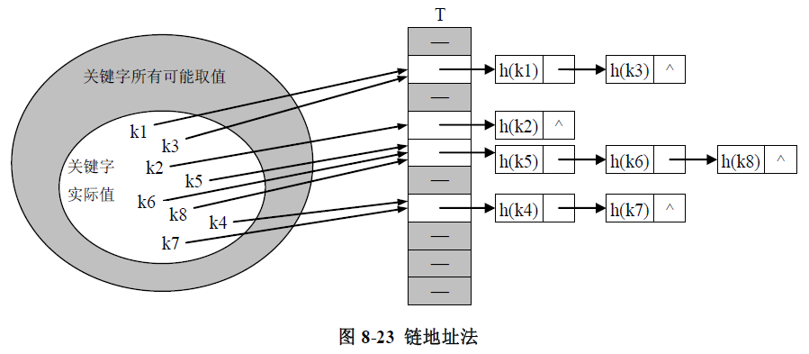

哈希表是一种数据结构，它可以提供快速的插入操作和查找操作。

哈希表的缺点：基于数组，数组创建后难于扩展。不能有序遍历

数组 + 链表

# 哈希化

直接寻址

把关键字转换成数组下标（哈希函数）h(k)

关键字转换成自然数

- 除留余数发
- 乘法散列

# 冲突（碰撞）

## **开放地址法**

### **线性探测**

h(k,i) = (h(k)+i) mod m  i = 0,1,2...m-1

```java
// hash.java
// demonstrates hash table with linear probing
// to run this program: C:>java HashTableApp
import java.io.*;
////////////////////////////////////////////////////////////////
class DataItem
   {                                // (could have more data)
   private int iData;               // data item (key)
//--------------------------------------------------------------
   public DataItem(int ii)          // constructor
      { iData = ii; }
//--------------------------------------------------------------
   public int getKey()
      { return iData; }
//--------------------------------------------------------------
   }  // end class DataItem
////////////////////////////////////////////////////////////////
class HashTable
   {
   private DataItem[] hashArray;    // array holds hash table
   private int arraySize;
   private DataItem nonItem;        // for deleted items
// -------------------------------------------------------------
   public HashTable(int size)       // constructor
      {
      arraySize = size;
      hashArray = new DataItem[arraySize];
      nonItem = new DataItem(-1);   // deleted item key is -1
      }
// -------------------------------------------------------------
   public void displayTable()
      {
      System.out.print("Table: ");
      for(int j=0; j<arraySize; j++)
         {
         if(hashArray[j] != null)
            System.out.print(hashArray[j].getKey() + " ");
         else
            System.out.print("** ");
         }
      System.out.println("");
      }
// -------------------------------------------------------------
   public int hashFunc(int key)
      {
      return key % arraySize;       // hash function
      }
// -------------------------------------------------------------
   public void insert(DataItem item) // insert a DataItem
   // (assumes table not full)
      {
      int key = item.getKey();      // extract key
      int hashVal = hashFunc(key);  // hash the key
                                    // until empty cell or -1,
      while(hashArray[hashVal] != null &&
                      hashArray[hashVal].getKey() != -1)
         {
         ++hashVal;                 // go to next cell
         hashVal %= arraySize;      // wraparound if necessary
         }
      hashArray[hashVal] = item;    // insert item
      }  // end insert()
// -------------------------------------------------------------
   public DataItem delete(int key)  // delete a DataItem
      {
      int hashVal = hashFunc(key);  // hash the key

      while(hashArray[hashVal] != null)  // until empty cell,
         {                               // found the key?
         if(hashArray[hashVal].getKey() == key)
            {
            DataItem temp = hashArray[hashVal]; // save item
            hashArray[hashVal] = nonItem;       // delete item
            return temp;                        // return item
            }
         ++hashVal;                 // go to next cell
         hashVal %= arraySize;      // wraparound if necessary
         }
      return null;                  // can't find item
      }  // end delete()
// -------------------------------------------------------------
   public DataItem find(int key)    // find item with key
      {
      int hashVal = hashFunc(key);  // hash the key

      while(hashArray[hashVal] != null)  // until empty cell,
         {                               // found the key?
         if(hashArray[hashVal].getKey() == key)
            return hashArray[hashVal];   // yes, return item
         ++hashVal;                 // go to next cell
         hashVal %= arraySize;      // wraparound if necessary
         }
      return null;                  // can't find item
      }
// -------------------------------------------------------------
   }  // end class HashTable
////////////////////////////////////////////////////////////////
class HashTableApp
   {
   public static void main(String[] args) throws IOException
      {
      DataItem aDataItem;
      int aKey, size, n, keysPerCell;
                                    // get sizes
      System.out.print("Enter size of hash table: ");
      size = getInt();
      System.out.print("Enter initial number of items: ");
      n = getInt();
      keysPerCell = 10;
                                    // make table
      HashTable theHashTable = new HashTable(size);

      for(int j=0; j<n; j++)        // insert data
         {
         aKey = (int)(java.lang.Math.random() *
                                         keysPerCell * size);
         aDataItem = new DataItem(aKey);
         theHashTable.insert(aDataItem);
         }

      while(true)                   // interact with user
         {
         System.out.print("Enter first letter of ");
         System.out.print("show, insert, delete, or find: ");
         char choice = getChar();
         switch(choice)
            {
            case 's':
               theHashTable.displayTable();
               break;
            case 'i':
            System.out.print("Enter key value to insert: ");
               aKey = getInt();
               aDataItem = new DataItem(aKey);
               theHashTable.insert(aDataItem);
               break;
            case 'd':
               System.out.print("Enter key value to delete: ");
               aKey = getInt();
               theHashTable.delete(aKey);
               break;
            case 'f':
               System.out.print("Enter key value to find: ");
               aKey = getInt();
               aDataItem = theHashTable.find(aKey);
               if(aDataItem != null)
                  {
                  System.out.println("Found " + aKey);
                  }
               else
                  System.out.println("Could not find " + aKey);
               break;
            default:
               System.out.print("Invalid entry\n");
            }  // end switch
         }  // end while
      }  // end main()
//--------------------------------------------------------------
   public static String getString() throws IOException
      {
      InputStreamReader isr = new InputStreamReader(System.in);
      BufferedReader br = new BufferedReader(isr);
      String s = br.readLine();
      return s;
      }
//--------------------------------------------------------------
   public static char getChar() throws IOException
      {
      String s = getString();
      return s.charAt(0);
      }
//-------------------------------------------------------------
   public static int getInt() throws IOException
      {
      String s = getString();
      return Integer.parseInt(s);
      }
//--------------------------------------------------------------
   }  // end class HashTableApp
////////////////////////////////////////////////////////////////


```
**扩展数组**

### **二次探测**

h(k,i) = (h(k)+i^2) mod m  i = 0,1,2...m-1

### **双重散列/二次哈希**

h(k,i) = (h1(k)+ih2(k)) mod m  i = 0,1,2...m-1

```java
// hashDouble.java
// demonstrates hash table with double hashing
// to run this program: C:>java HashDoubleApp
import java.io.*;
////////////////////////////////////////////////////////////////
class DataItem
   {                                 // (could have more items)
   private int iData;                // data item (key)
//--------------------------------------------------------------
   public DataItem(int ii)           // constructor
      { iData = ii; }
//--------------------------------------------------------------
   public int getKey()
      { return iData; }
//--------------------------------------------------------------
   }  // end class DataItem
////////////////////////////////////////////////////////////////
class HashTable
   {
   private DataItem[] hashArray;     // array is the hash table
   private int arraySize;
   private DataItem nonItem;         // for deleted items
// -------------------------------------------------------------
   HashTable(int size)               // constructor
      {
      arraySize = size;
      hashArray = new DataItem[arraySize];
      nonItem = new DataItem(-1);
      }
// -------------------------------------------------------------
   public void displayTable()
      {
      System.out.print("Table: ");
      for(int j=0; j<arraySize; j++)
         {
         if(hashArray[j] != null)
            System.out.print(hashArray[j].getKey()+ " ");
         else
            System.out.print("** ");
         }
      System.out.println("");
      }
// -------------------------------------------------------------
   public int hashFunc1(int key)
      {
      return key % arraySize;
      }
// -------------------------------------------------------------
   public int hashFunc2(int key)
      {
      // non-zero, less than array size, different from hF1
      // array size must be relatively prime to 5, 4, 3, and 2
      return 5 - key % 5;
      }
// -------------------------------------------------------------
                                     // insert a DataItem
   public void insert(int key, DataItem item)
   // (assumes table not full)
      {
      int hashVal = hashFunc1(key);  // hash the key
      int stepSize = hashFunc2(key); // get step size
                                     // until empty cell or -1
      while(hashArray[hashVal] != null &&
                      hashArray[hashVal].getKey() != -1)
         {
         hashVal += stepSize;        // add the step
         hashVal %= arraySize;       // for wraparound
         }
      hashArray[hashVal] = item;     // insert item
      }  // end insert()
// -------------------------------------------------------------
   public DataItem delete(int key)   // delete a DataItem
      {
      int hashVal = hashFunc1(key);      // hash the key
      int stepSize = hashFunc2(key);     // get step size

      while(hashArray[hashVal] != null)  // until empty cell,
         {                               // is correct hashVal?
         if(hashArray[hashVal].getKey() == key)
            {
            DataItem temp = hashArray[hashVal]; // save item
            hashArray[hashVal] = nonItem;       // delete item
            return temp;                        // return item
            }
         hashVal += stepSize;            // add the step
         hashVal %= arraySize;           // for wraparound
         }
      return null;                   // can't find item
      }  // end delete()
// -------------------------------------------------------------
   public DataItem find(int key)     // find item with key
   // (assumes table not full)
      {
      int hashVal = hashFunc1(key);      // hash the key
      int stepSize = hashFunc2(key);     // get step size

      while(hashArray[hashVal] != null)  // until empty cell,
         {                               // is correct hashVal?
         if(hashArray[hashVal].getKey() == key)
            return hashArray[hashVal];   // yes, return item
         hashVal += stepSize;            // add the step
         hashVal %= arraySize;           // for wraparound
         }
      return null;                   // can't find item
      }
// -------------------------------------------------------------
   }  // end class HashTable
////////////////////////////////////////////////////////////////
class HashDoubleApp
   {
   public static void main(String[] args) throws IOException
      {
      int aKey;
      DataItem aDataItem;
      int size, n;
                                  // get sizes
      System.out.print("Enter size of hash table: ");
      size = getInt();
      System.out.print("Enter initial number of items: ");
      n = getInt();
                                  // make table
      HashTable theHashTable = new HashTable(size);

      for(int j=0; j<n; j++)      // insert data
         {
         aKey = (int)(java.lang.Math.random() * 2 * size);
         aDataItem = new DataItem(aKey);
         theHashTable.insert(aKey, aDataItem);
         }

      while(true)                 // interact with user
         {
         System.out.print("Enter first letter of ");
         System.out.print("show, insert, delete, or find: ");
         char choice = getChar();
         switch(choice)
            {
            case 's':
               theHashTable.displayTable();
               break;
            case 'i':
               System.out.print("Enter key value to insert: ");
               aKey = getInt();
               aDataItem = new DataItem(aKey);
               theHashTable.insert(aKey, aDataItem);
               break;
            case 'd':
               System.out.print("Enter key value to delete: ");
               aKey = getInt();
               theHashTable.delete(aKey);
               break;
            case 'f':
               System.out.print("Enter key value to find: ");
               aKey = getInt();
               aDataItem = theHashTable.find(aKey);
               if(aDataItem != null)
                  System.out.println("Found " + aKey);
               else
                  System.out.println("Could not find " + aKey);
               break;
            default:
               System.out.print("Invalid entry\n");
            }  // end switch
         }  // end while
      }  // end main()
//--------------------------------------------------------------
   public static String getString() throws IOException
      {
      InputStreamReader isr = new InputStreamReader(System.in);
      BufferedReader br = new BufferedReader(isr);
      String s = br.readLine();
      return s;
      }
//--------------------------------------------------------------
   public static char getChar() throws IOException
      {
      String s = getString();
      return s.charAt(0);
      }
//-------------------------------------------------------------
   public static int getInt() throws IOException
      {
      String s = getString();
      return Integer.parseInt(s);
      }
//--------------------------------------------------------------
   }  // end class HashDoubleApp
////////////////////////////////////////////////////////////////

```

## **链地址法**

数组 + 链表，桶结构，装载因子



```java
// hashChain.java
// demonstrates hash table with separate chaining
// to run this program: C:>java HashChainApp
import java.io.*;
////////////////////////////////////////////////////////////////
class Link
   {                                   // (could be other items)
   private int iData;                  // data item
   public Link next;                   // next link in list
// -------------------------------------------------------------
   public Link(int it)                 // constructor
      { iData= it; }
// -------------------------------------------------------------
   public int getKey()
      { return iData; }
// -------------------------------------------------------------
   public void displayLink()           // display this link
      { System.out.print(iData + " "); }
   }  // end class Link
////////////////////////////////////////////////////////////////
class SortedList
   {
   private Link first;               // ref to first list item
// -------------------------------------------------------------
   public void SortedList()          // constructor
      { first = null; }
// -------------------------------------------------------------
   public void insert(Link theLink)  // insert link, in order
      {
      int key = theLink.getKey();
      Link previous = null;          // start at first
      Link current = first;
                                     // until end of list,
      while( current != null && key > current.getKey() )
         {                           // or current > key,
         previous = current;
         current = current.next;     // go to next item
         }
      if(previous==null)             // if beginning of list,
         first = theLink;            //    first --> new link
      else                           // not at beginning,
         previous.next = theLink;    //    prev --> new link
      theLink.next = current;        // new link --> current
      }  // end insert()
// -------------------------------------------------------------
   public void delete(int key)       // delete link
      {                              // (assumes non-empty list)
      Link previous = null;          // start at first
      Link current = first;
                                     // until end of list,
      while( current != null && key != current.getKey() )
         {                           // or key == current,
         previous = current;
         current = current.next;     // go to next link
         }
                                     // disconnect link
      if(previous==null)             //   if beginning of list
         first = first.next;         //      delete first link
      else                           //   not at beginning
         previous.next = current.next; //    delete current link
      }  // end delete()
// -------------------------------------------------------------
   public Link find(int key)         // find link
      {
      Link current = first;          // start at first
                                     // until end of list,
      while(current != null &&  current.getKey() <= key)
         {                           // or key too small,
         if(current.getKey() == key)    // is this the link?
            return current;          // found it, return link
         current = current.next;     // go to next item
         }
      return null;                   // didn't find it
      }  // end find()
// -------------------------------------------------------------
   public void displayList()
      {
      System.out.print("List (first-->last): ");
      Link current = first;       // start at beginning of list
      while(current != null)      // until end of list,
         {
         current.displayLink();   // print data
         current = current.next;  // move to next link
         }
      System.out.println("");
      }
   }  // end class SortedList
////////////////////////////////////////////////////////////////
class HashTable
   {
   private SortedList[] hashArray;   // array of lists
   private int arraySize;
// -------------------------------------------------------------
   public HashTable(int size)        // constructor
      {
      arraySize = size;
      hashArray = new SortedList[arraySize];  // create array
      for(int j=0; j<arraySize; j++)          // fill array
         hashArray[j] = new SortedList();     // with lists
      }
// -------------------------------------------------------------
   public void displayTable()
      {
      for(int j=0; j<arraySize; j++) // for each cell,
         {
         System.out.print(j + ". "); // display cell number
         hashArray[j].displayList(); // display list
         }
      }
// -------------------------------------------------------------
   public int hashFunc(int key)      // hash function
      {
      return key % arraySize;
      }
// -------------------------------------------------------------
   public void insert(Link theLink)  // insert a link
      {
      int key = theLink.getKey();
      int hashVal = hashFunc(key);   // hash the key
      hashArray[hashVal].insert(theLink); // insert at hashVal
      }  // end insert()
// -------------------------------------------------------------
   public void delete(int key)       // delete a link
      {
      int hashVal = hashFunc(key);   // hash the key
      hashArray[hashVal].delete(key); // delete link
      }  // end delete()
// -------------------------------------------------------------
   public Link find(int key)         // find link
      {
      int hashVal = hashFunc(key);   // hash the key
      Link theLink = hashArray[hashVal].find(key);  // get link
      return theLink;                // return link
      }
// -------------------------------------------------------------
   }  // end class HashTable
////////////////////////////////////////////////////////////////
class HashChainApp
   {
   public static void main(String[] args) throws IOException
      {
      int aKey;
      Link aDataItem;
      int size, n, keysPerCell = 100;
                                     // get sizes
      System.out.print("Enter size of hash table: ");
      size = getInt();
      System.out.print("Enter initial number of items: ");
      n = getInt();
                                     // make table
      HashTable theHashTable = new HashTable(size);

      for(int j=0; j<n; j++)         // insert data
         {
         aKey = (int)(java.lang.Math.random() *
                                          keysPerCell * size);
         aDataItem = new Link(aKey);
         theHashTable.insert(aDataItem);
         }
      while(true)                    // interact with user
         {
         System.out.print("Enter first letter of ");
         System.out.print("show, insert, delete, or find: ");
         char choice = getChar();
         switch(choice)
            {
            case 's':
               theHashTable.displayTable();
               break;
            case 'i':
               System.out.print("Enter key value to insert: ");
               aKey = getInt();
               aDataItem = new Link(aKey);
               theHashTable.insert(aDataItem);
               break;
            case 'd':
               System.out.print("Enter key value to delete: ");
               aKey = getInt();
               theHashTable.delete(aKey);
               break;
            case 'f':
               System.out.print("Enter key value to find: ");
               aKey = getInt();
               aDataItem = theHashTable.find(aKey);
               if(aDataItem != null)
                  System.out.println("Found " + aKey);
               else
                  System.out.println("Could not find " + aKey);
               break;
            default:
               System.out.print("Invalid entry\n");
            }  // end switch
         }  // end while
      }  // end main()
//--------------------------------------------------------------
   public static String getString() throws IOException
      {
      InputStreamReader isr = new InputStreamReader(System.in);
      BufferedReader br = new BufferedReader(isr);
      String s = br.readLine();
      return s;
      }
//-------------------------------------------------------------
   public static char getChar() throws IOException
      {
      String s = getString();
      return s.charAt(0);
      }
//-------------------------------------------------------------
   public static int getInt() throws IOException
      {
      String s = getString();
      return Integer.parseInt(s);
      }
//--------------------------------------------------------------
   }  // end class HashChainApp
////////////////////////////////////////////////////////////////
```

# **哈希函数**

快速的计算

随机的关键字

使用质数作为取模的基数
