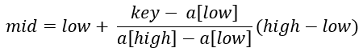

## 插值查找

把折半查找求mid的公式：mid = (low + high)/2 改为 mid = low + (high - low)/2，再对1/2进行改进如下：



插值查找是根据要查找的关键字key与查找表中最大最小记录的关键字比较后查找方法。

哈希查找最快，插值查找次之，二分查找再次之。用极少的比较次数即可定位到要查找的数据位置，适合于数据是均匀的，二分查找是取平均值，插值查找取比例，相比较二分查找可以大大节约比较次数

```c++
int Search(int *a, int key, int n)
{
	int low, high, mid;
	low = 0;
	high = n - 1;
	while (low <= high)
	{	//此处与二分查找不同,套用插值公式  
		mid = low + (high - low) * (key - a[low]) / (a[high] - a[low]); 
		if (a[mid] > key)//如果key比插值小,把高位调整为插值下标的下一位            
			high = mid - 1;
		else if (a[mid] < key)
			low = mid + 1;
		else
			return mid;
	}
	return -1;
}

int main()
{
	int a[] = { 1, 5, 17, 25, 33, 38, 46, 55, 69, 75, 99 };
	int key;
	int len = sizeof(a) / sizeof(*a);
	printf("请输入要查找的值:\n");
	scanf("%d", &key);
	int pos = Bin_Search(a, key, len);
	if (pos != -1)
		printf("在数组的第%d个位置找到:%d\n", pos + 1, key);
	else
		printf("未在数组中找到元素:%d\n", key);

	system("pause");
	return 0;
}
```