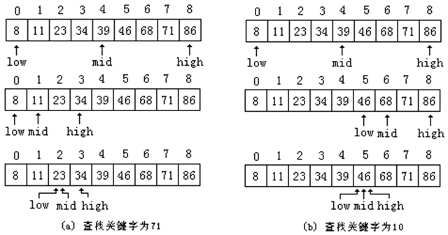

## 折半查找

对有序表通常可用折半查找的方法来进行查找。设有n个数据元素按其关键字从小到大的顺序存放在一个顺序表中（开始时，查找区间的下限low=0，上限hight=n-1），折半查找的算法思想为：

1. 如果查找区间长度小于1（low>hight），则表示查找失败，返回-1；否则继续以下步骤。
2. 求出查找区间中间位置的数据元素下标mid（mid=（low+hight）/2）；
3. 区间中间位置的数据元素的关键字Table[mid].getKey()与给定值x进行比较，比较的结果有三种可能：

（1）若Table[mid].getKey()＝x，则查找成功，报告成功信息并返回其下标mid；
（2）若Table[mid].getKey()<x，则说明如果数据表中存在要找的数据元素，该数据元素一定在mid的右侧，可把查找区间缩小到数据表的后半部分（low=mid+1），再继续进行折半查找（转步骤1）；
（3）若Table[mid].getKey()>x，则说明如果数据表中存在要找的数据元素，该数据元素一定在mid的左侧。可把查找区间缩小到数据表的前半部分（hight=mid-1），再继续进行折半查找（转步骤1）。

设有序表为{8，11，23，34，39 ， 46，68，71，86}，下图(a)给出了查找关键字为23的数据元素时的查找过程，找到所查数据元素一共做了3次关键字比较。图(b)给出了查找关键字为52的数据元素时的查找过程，直到确认查找失败也执行了3次关键字比较。



## 折半查找的递归算法

```c++
template <class ElemType, class KeyType>
int BinSerach(ElemType elem[], int low, int high, KeyType key)
{ 
	int mid;
	if (low > high){
      	mid = -1; // 查找失败
	}else{
      	mid = (low + high) / 2;	// 计算区间中间位置
      	if (key < elem[mid])	
			mid = BinSerach(elem, low, mid - 1, key); 
		else if (key > elem[mid])	
			mid = BinSerach(elem, mid + 1, high, key);
	}
	return mid;	                   
}
```

## 折半查找的迭代算法

```c++
template <class ElemType, class KeyType>
int BinSerach(ElemType elem[], int n, KeyType key)
{ 
	int low = 0, high = n-1;// 设置查找区间的左右边界
	int mid;
	while (low <= high)	{
		mid = (low + high) / 2;	    // 计算区间中间位置
		if (key == elem[mid])	
			return mid;             // 查找成功
		else if (key <= elem[mid])	
			high = mid - 1;  // 继续在左半区间进行查找
		else	
			low = mid + 1;  // 继续在右半区间进行查找
	}
	return -1;	                    // 查找失败
}
```