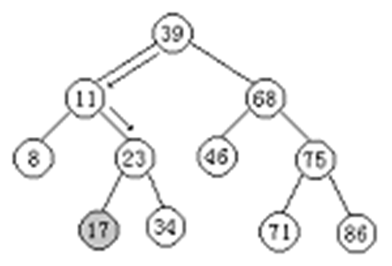
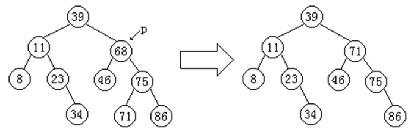
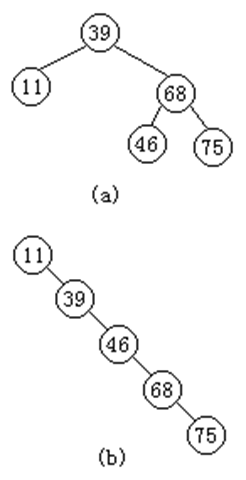

## 二叉排序树


二叉排序树又称为二叉查找树，其定义为：二叉排序树或者是一棵空树，或者是具有如下性质的二叉树：

- 若它的左子树非空，则左子树上所有结点的值均小于根结点；
- 若它的右子树非空，则右子树上所有结点的值均大于根结点；
- 左、右子树本身又各是一棵二叉排序树。

左小右大，中序遍历是有序的。

## 二叉排序树上的查找

二叉排序树的查找算法可以用递归和迭代两种方法实现。


```c++
template <class Type> 
BSTreeNode<Type> * BSTree<Type> ::
Find (const Type & k, BSTreeNode<Type> * p ) const{
//在p为根的二叉排序树上进行查找的递归算法
    if ( p == NULL ) return NULL;  //查找失败
    else if ( k < p→data )     //在左子树上递归查找
              return Find ( k, p→leftChild );
           else if ( x > ptr→data ) //在右子树上递归查找
                     return Find ( k, p→rightChild );
                   else return p;    //相等,查找成功
}

template <class Type> BSTreeNode<Type> * BSTree<Type> ::
Find(const Type & k, BSTreeNode<Type>* p)const {
//在p为根的二叉排序树上进行查找的迭代算法
    BSTreeNode<Type> * temp = p;
    if ( p != NULL ) {
        while ( temp != NULL ) {
         if ( temp→data == k ) return temp;  //查找成功
         if ( temp→data < k ) 
                temp = temp→rightChild; //查找右子树
            else temp = temp→leftChild;   //查找左子树   }
    }
    return temp;         //查找失败
}
```

### 二叉排序树的插入

为了向二叉排序树中插入一个新元素，必须先检查这个元素在二叉排序树中是否已经存在。因此，在插入之前，首先在二叉排序树中检查待插入的数据元素，如果查找成功，说明树中已经存在这个数据元素，则不再插入；如果查找不成功，说明树中不存在关键字等于给定值的数据元素，把新元素插到查找操作失败的地方。



在二叉排序树中插入一个新元素的算法描述

```c++
template <class Type> void BSTree<Type>::
Insert (const Type & x, BSTreeNode<Type> * & p) {
//在p为根的二叉排序树插入结点的递归算法
       if ( p == NULL )        //空二叉树
         p = new BSTreeNode<Type> (x); //创建数据元素x的结点
       else if ( x < p→data )                //在左子树插入
               Insert ( x, p→leftChild );
             else if ( x > ptr→data )         //在右子树插入
                     Insert ( x, p→rightChild );
                  else          //结点x已存在
                  { cout << "There has node x" << endl;  exit (1); }
}
```

利用二叉排序树的插入算法，建立二叉排序树示例。

关键字的输入序列{39、11、68、46、75、23、71、8、86、34}


对于同样一组数据元素，由于输入顺序不同，建立起来的二叉排序树的形态也不同。例如，有3个数据元素{39、11、68}，图中的二叉排序树(a)、(b)、(c)、(d)、(e)分别是由输入序列：{68、11、39}、{68、39、11}、{39、11、68}、{11、68、39}、{11、39、68}得到的。


### 二叉排序树的删除

在二叉排序树中删除一个数据元素时，必须将因删除元素而断开的二叉链表重新链接起来，同时确保不会失去二叉排序树的性质。

此外，为了保证在执行删除后二叉排序树的查找性能不至于降低，还需要做到重新链接后二叉排序树的高度不能增加。

在二叉排序树中删除一个数据元素的算法思想如下：如果被删除的数据元素是叶子，则只需将其双亲指向它的指针置空，再释放该数据元素的存储空间即可；

如果被删除的数据元素只有左子树而没有右子树，则可以拿它的左孩子顶替它的位置，再释放该数据元素的存储空间即可；

如果被删除的数据元素只有右子树而没有左子树，可以拿它的右孩子顶替它的位置，再释放该数据元素的存储空间即可；

如果被删除的数据元素左、右子树都存在，则有两种处理方法：

其一，可以在它的右子树中寻找关键字值最小的数据元素（中序遍历中第一个被访问的数据元素）x，用x的值代替被删除数据元素的值，再来删除数据元素x（x没有左子树）；

其二，可以在它的左子树中寻找关键字值最大的数据元素（中序遍历中最后一个被访问的数据元素）x，用x的值代替被删除数据元素的值，再来删除数据元素x（x没有右子树）。

二叉排序树中删除元素示例 



二叉排序树删除结点算法的C++实现如下

```c++
template <class Type> void BSTree<Type> ::
Delete (const Type &k, BSTree Node<Type> * &p) {
//在p为根的二叉排序树上删除关键字为k的结点
    BSTree Node<Type> * temp;
    if ( p != NULL )
       if ( k < p→data )
         Delete ( k, p→leftChild ); 
        else if ( k > p→data ) 
          Delete ( k, p→rightChild );
     else if ( p→leftChild != NULL && 
                       p→rightChild != NULL )
                     { temp = Min ( p→rightChild );
                       p→data = temp→data;
                       Delete ( p→data, temp );  }
                 else { temp = p;
                      if ( p→leftChild == NULL )
                           p = p→rightChild;
                        else if ( p→rightChild == NULL )
                           p = p→leftChild;
                      delete temp;  }
}  
```

在二叉排序树上的查找过程实际上是走了一条从根到所查结点的路径，所需的比较次数为该结点所在的层次数。因此，查找成功时，关键字的比较次数不超过树的高度。但是含有n个结点的二叉排序树不是唯一的，从而树的高度就不一定相同。 

显然，当二叉排序树是完全二叉树时，其平均查找性能最佳为$log_2n$，与有序表的折半查找相同。当二叉排序树退化为一棵单支树时，二叉排序树的平均查找性能最差为：（n+1）/2，与顺序表的平均查找长度相同。

