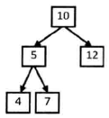
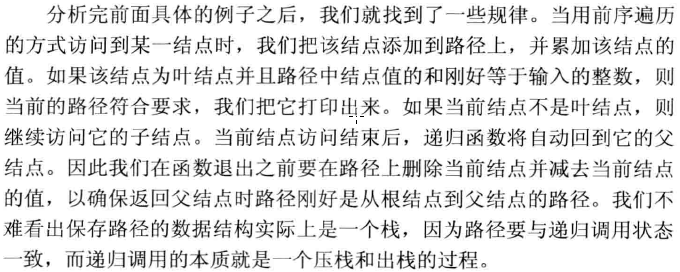

## 二叉树中和为某一值的路径

输入一棵二叉树和一个整数，打印出二叉树中结点值的和为输入整数的所有路径。






```c++
struct BinaryTreeNode 
{
    int                    m_nValue; 
    BinaryTreeNode*        m_pLeft;  
    BinaryTreeNode*        m_pRight; 
};

void FindPath(BinaryTreeNode* pRoot, int expectedSum)
{
    if(pRoot == NULL)
        return;

    std::vector<int> path;
    int currentSum = 0;
    FindPath(pRoot, expectedSum, path, currentSum);
}

void FindPath
(
    BinaryTreeNode*   pRoot,        
    int               expectedSum,  
    std::vector<int>& path,         
    int&              currentSum
)
{
    currentSum += pRoot->m_nValue;
    path.push_back(pRoot->m_nValue);

    // 如果是叶结点，并且路径上结点的和等于输入的值
    // 打印出这条路径
    bool isLeaf = pRoot->m_pLeft == NULL && pRoot->m_pRight == NULL;
    if(currentSum == expectedSum && isLeaf)
    {
        printf("A path is found: ");
        std::vector<int>::iterator iter = path.begin();
        for(; iter != path.end(); ++ iter)
            printf("%d\t", *iter);
        
        printf("\n");
    }

    // 如果不是叶结点，则遍历它的子结点
    if(pRoot->m_pLeft != NULL)
        FindPath(pRoot->m_pLeft, expectedSum, path, currentSum);
    if(pRoot->m_pRight != NULL)
        FindPath(pRoot->m_pRight, expectedSum, path, currentSum);

    // 在返回到父结点之前，在路径上删除当前结点，
    // 并在currentSum中减去当前结点的值
    currentSum -= pRoot->m_nValue;
    path.pop_back();
} 
```