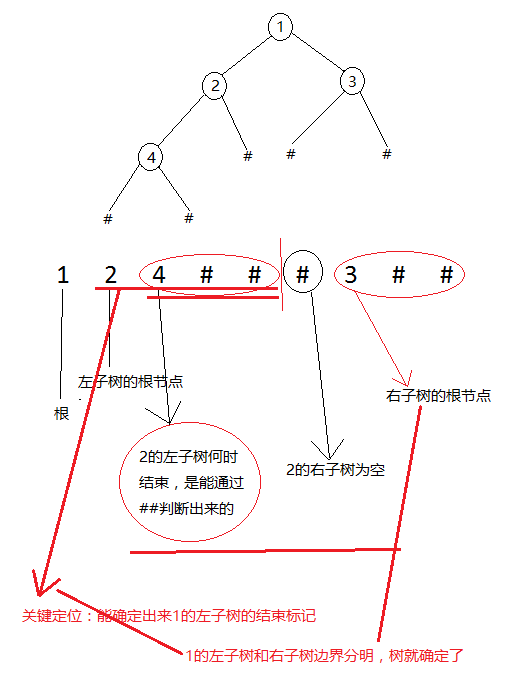
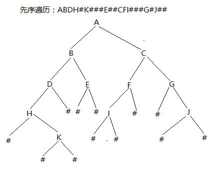

## 二叉树的创建

- 通过先序遍历和中序遍历可以确定一棵树
- 通过中序遍历和后序遍历也可以确定一棵树
- 通过先序遍历和后序遍历确定不了一个树

单独先序遍历：能求解根，但不能求解左子树什么时候结束、右子树什么时候开始。

## #号法创建树

### 什么是#号法创建树？

\#创建树，让树的每一个节点都变成度数为2的树

先序遍历：124###3##，可以唯一确定一棵树吗，为什么？



### #创建树实例

先序遍历：ABDH#K###E##CFI###G#J##，请画出树的形状



\#号法画出树关键点：要清楚的确定左子树什么结束，右子树什么时候开始。

### #号法编程实践

利用前序遍历来建树（结点值陆续从键盘输入，用DLR为宜）

```c++
#define  _CRT_SECURE_NO_WARNINGS 
#include <stdlib.h>
#include <string.h>
#include <stdio.h>

typedef struct BiTNode
{
	int		data;
	struct BiTNode *lchild, *rchild;
}BiTNode;

typedef struct BiTNode * BiTree;

void InOrder(BiTNode *T)
{
	if (T == NULL) return ;

	if (T->lchild != NULL) InOrder(T->lchild);

	printf("%c ", T->data);

	if (T->rchild != NULL) InOrder(T->rchild);
}

//创建树用先序
BiTNode *BiTree_Creat()
{
	BiTNode  *tmp = NULL;
	char  ch;
	scanf("%c", &ch);

	if (ch == '#')
	{
		return NULL;
	}
	else
	{
		tmp = (BiTNode *) malloc(sizeof(BiTNode)); //创建结点
		if (tmp == NULL)
		{
			return NULL;
		}
		tmp->data = ch;
		tmp->lchild = NULL;
		tmp->rchild = NULL; 
		//在创建结点的左子树
		tmp->lchild = BiTree_Creat();
		tmp->rchild = BiTree_Creat();
		return tmp;
	}
}

//释放树,选释放左子树,再释放右子树，再释放根结点
void BiTree_Free(BiTNode *T)
{
	if (T == NULL)
	{
		return ;
	}

	if (T->lchild != NULL)
	{
		BiTree_Free(T->lchild);
		T->lchild = NULL;
	}

	if (T->rchild != NULL)
	{
		BiTree_Free(T->rchild);
		T->rchild = NULL;
	}

	free(T);
}
void main()
{
	BiTNode  *T = NULL;
	printf("#号法创建树 请输入字符串 ( 124###3## ): ");
	T  = BiTree_Creat();
	InOrder(T);

	BiTree_Free(T);

	system("pause");
	return ;
}
```

```c++
Bintree createBTpre( )
{      
	Bintree T; 
	char ch;
	scanf(“%c”,&ch);
	if(ch==’#’) 
		T=NULL; 
    else
    {   T=( Bintree )malloc(sizeof(BinTNode));
        T->data=ch;
        T->lchild=createBTpre(); 
        T->rchild=createBTpre();
    }        
    return T;
}

//后序遍历销毁一个树
void  BiTree_Free(BiTNode* T)
{
	BiTNode *tmp = NULL;
	if (T!= NULL)
	{
		if (T->rchild != NULL) BiTree_Free(T->rchild);
		if (T->lchild != NULL) BiTree_Free(T->lchild);
		if (T != NULL)
		{
			free(T); 
			T = NULL;
		}
	}
}
```

## 根据先序和中序结果画树

1. 通过先序遍历找到根结点A，再通过A在中序遍历的位置找出左子树，右子树
2. 在A的左子树中，找左子树的根结点（在先序中找），转步骤1
3. 在A的右子树中，找右子树的根结点（在先序中找），转步骤1

先序遍历结果：ADEBCF，中序遍历结果：DEACFB

