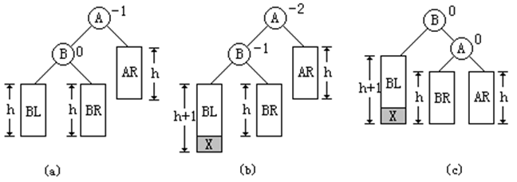
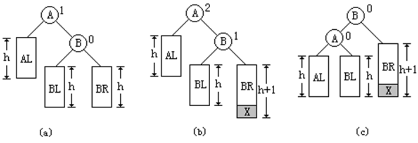

## 平衡二叉树 

一棵平衡二叉树或者是空树，或者是具有下列性质的二叉排序树：它的左子树和右子树都是平衡二叉树，且左子树和右子树的高度之差的绝对值不超过1。

结点右子树的高度减去左子树的高度所得的高度差，称为该结点的平衡因子。根据平衡二叉树的定义，任一结点的平衡因子只能取-1、0和1。如果一个结点的平衡因子的绝对值大于1，则这棵二叉排序树就失去了平衡，就不是平衡二叉树了。

 高度平衡的二叉排序树和高度平衡不二叉排序树示例 ：


一棵具有n个结点的平衡二叉树，其平均查找长度为O(log2n）。 

## 平衡旋转

假定向平衡树中插入一个新结点后破坏了它的平衡性，首先需要找到插入新结点后失去平衡的最小子树的根结点，然后对它进行相应的旋转，使之成为新的平衡子树。

设失去平衡的最小子树的根为A，则平衡调整可有以下四种情况： 

### LL平衡旋转

如果是因为在A的左孩子B的左子树上插入新结点，使A的平衡因子由-1变成-2，则需要进行LL平衡旋转。 



### RR平衡旋转

如果是因为在A的右孩子B的右子树上插入新结点，使A的平衡因子由1变成2，则需要进行RR平衡旋转。 



### LR平衡旋转

如果是因为在A的左孩子B的右子树上插入新结点，使A的平衡因子由-1变成-2，则需要进行LR平衡旋转。


### RL平衡旋转

如果是因为在A的右孩子B的左子树上插入新结点，使A的平衡因子由1变成2，则需要进行RL平衡旋转。


## 平衡二叉树的算法实现

### 二叉树的二叉链表结点结构定义

```c++
typedef  struct BiTNode
{
	int data;
	int bf; // 结点的平衡因子
	struct BiTNode *lchild, *rchild;
} BiTNode, *BiTree;
```

### 右旋

```c++
// 对以p为根的二叉排序树作右旋处理，
// 处理之后p指向新的树根结点，即旋转处理之前的左子树的根结点
void R_Rotate(BiTree *P)
{ 
	BiTree L;
	L=(*P)->lchild; // L指向P的左子树根结点 
	(*P)->lchild=L->rchild; // L的右子树挂接为P的左子树 
	L->rchild=(*P);
	*P=L; // P指向新的根结点 
}
```


### 左旋

```c++
// 对以P为根的二叉排序树作左旋处理，
// 处理之后P指向新的树根结点，即旋转处理之前的右子树的根结点0
void L_Rotate(BiTree *P)
{ 
	BiTree R;
	R=(*P)->rchild; // R指向P的右子树根结点 
	(*P)->rchild=R->lchild; // R的左子树挂接为P的右子树 
	R->lchild=(*P);
	*P=R; // P指向新的根结点 
}
```

### 左平衡旋转处理

```c++
#define LH +1 // 左高 
#define EH 0  // 等高 
#define RH -1 // 右高 

// 对以指针T所指结点为根的二叉树作左平衡旋转处理
// 本算法结束时，指针T指向新的根结点
void LeftBalance(BiTree *T)
{ 
	BiTree L,Lr;
	L=(*T)->lchild; // L指向T的左子树根结点 
	switch(L->bf)
	{ // 检查T的左子树的平衡度，并作相应平衡处理 
		 case LH: // 新结点插入在T的左孩子的左子树上，要作单右旋处理 
			(*T)->bf=L->bf=EH;
			R_Rotate(T);
			break;
		 case RH: // 新结点插入在T的左孩子的右子树上，要作双旋处理 
			Lr=L->rchild; // Lr指向T的左孩子的右子树根 
			switch(Lr->bf)
			{ // 修改T及其左孩子的平衡因子 
				case LH: (*T)->bf=RH;
						 L->bf=EH;
						 break;
				case EH: (*T)->bf=L->bf=EH;
						 break;
				case RH: (*T)->bf=EH;
						 L->bf=LH;
						 break;
			}
			Lr->bf=EH;
			L_Rotate(&(*T)->lchild); // 对T的左子树作左旋平衡处理 
			R_Rotate(T); // 对T作右旋平衡处理 
	}
}
```


### 右平衡旋转处理

```c++
// 对以指针T所指结点为根的二叉树作右平衡旋转处理， 
// 本算法结束时，指针T指向新的根结点 
void RightBalance(BiTree *T)
{ 
	BiTree R,Rl;
	R=(*T)->rchild; // R指向T的右子树根结点 
	switch(R->bf)
	{ // 检查T的右子树的平衡度，并作相应平衡处理 
	 case RH: // 新结点插入在T的右孩子的右子树上，要作单左旋处理 
			  (*T)->bf=R->bf=EH;
			  L_Rotate(T);
			  break;
	 case LH: // 新结点插入在T的右孩子的左子树上，要作双旋处理 
			  Rl=R->lchild; // Rl指向T的右孩子的左子树根 
			  switch(Rl->bf)
			  { // 修改T及其右孩子的平衡因子 
				case RH: (*T)->bf=LH;
						 R->bf=EH;
						 break;
				case EH: (*T)->bf=R->bf=EH;
						 break;
				case LH: (*T)->bf=EH;
						 R->bf=RH;
						 break;
			  }
			  Rl->bf=EH;
			  R_Rotate(&(*T)->rchild); // 对T的右子树作右旋平衡处理 
			  L_Rotate(T); // 对T作左旋平衡处理 
	}
}
```

插入

```c++
// 若在平衡的二叉排序树T中不存在和e有相同关键字的结点，则插入一个 
// 数据元素为e的新结点，并返回1，否则返回0。若因插入而使二叉排序树 
// 失去平衡，则作平衡旋转处理，布尔变量taller反映T长高与否。
Status InsertAVL(BiTree *T,int e,Status *taller)
{  
	if(!*T)
	{ // 插入新结点，树“长高”，置taller为TRUE 
		*T=(BiTree)malloc(sizeof(BiTNode));
		(*T)->data=e; 
      	(*T)->lchild=(*T)->rchild=NULL; 
		(*T)->bf=EH;
		*taller=TRUE;
	}
	else
	{
		if (e==(*T)->data)
		{ // 树中已存在和e有相同关键字的结点则不再插入 
			*taller=FALSE; return FALSE;
		}
		if (e<(*T)->data)
		{ // 应继续在T的左子树中进行搜索 
			if(!InsertAVL(&(*T)->lchild,e,taller)) // 未插入 
				return FALSE;
			if(*taller) // 已插入到T的左子树中且左子树“长高” 
				switch((*T)->bf) // 检查T的平衡度 
				{
					case LH: // 原本左子树比右子树高，需要作左平衡处理 
							LeftBalance(T);	*taller=FALSE; break;
					case EH: // 原本左、右子树等高，现因左子树增高而使树增高 
							(*T)->bf=LH; *taller=TRUE; break;
					case RH: // 原本右子树比左子树高，现左、右子树等高  
							(*T)->bf=EH; *taller=FALSE; break;
				}
		}
		else
		{ // 应继续在T的右子树中进行搜索 
			if(!InsertAVL(&(*T)->rchild,e,taller)) // 未插入 
				return FALSE;
			if(*taller) // 已插入到T的右子树且右子树“长高” 
				switch((*T)->bf) // 检查T的平衡度 
				{
					case LH: // 原本左子树比右子树高，现左、右子树等高 
							(*T)->bf=EH; *taller=FALSE;	break;
					case EH: // 原本左、右子树等高，现因右子树增高而使树增高
							(*T)->bf=RH; *taller=TRUE; break;
					case RH: // 原本右子树比左子树高，需要作右平衡处理 
							RightBalance(T); *taller=FALSE; break;
				}
		}
	}
	return TRUE;
}
```