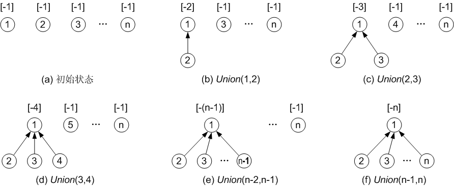
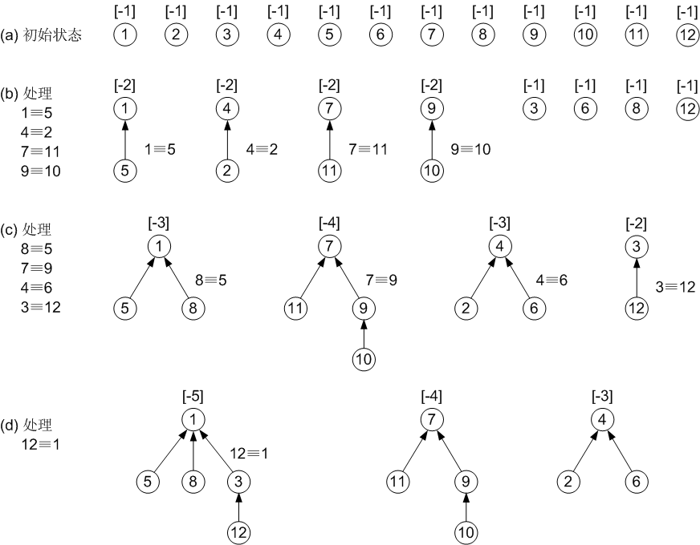

## 等价类和并查集

### 等价关系与等价类

1、在求解实际应用问题时常会遇到等价类的问题。

2、从数学上看，等价类是一个对象(或成员)的集合，在此集合中的所有对象应满足等价关系。

3、若用符号“≡”表示集合上的等价关系，那么对于该集合中的任意对象x, y, z，下列性质成立：

- 自反性：x ≡ x (即等于自身)。
- 对称性：若 x ≡ y, 则 y ≡ x。
- 传递性：若 x ≡ y且 y ≡ z, 则 x ≡ z。

4、因此，等价关系是集合上的一个自反、对称、传递的关系。

5、“相等”(=)就是一种等价关系，它满足上述的三个特性。

6、一个集合 S 中的所有对象可以通过等价关系划分为若干个互不相交的子集 S1, S2, S3, …，它们的并就是 S。这些子集即为等价类。

## 并查集

1、建立等价类的另一种解决方案是先把每一个对象看作是一个单元素集合，然后按一定顺序将属于同一等价类的元素所在的集合合并。

2、在此过程中将反复地使用一个搜索运算，确定一个元素在哪一个集合中。

3、能够完成这种功能的集合就是并查集。它支持以下三种操作：

- Union (Root1, Root2) //并操作；
- Find (x) //搜索操作；
- UFSets (s) //构造函数。

4、一般情形，并查集主要涉及两种数据类型：集合名类型和集合元素的类型。

5、对于并查集来说，每个集合用一棵树表示。

6、集合中每个元素的元素名分别存放在树的结点中，此外，树的每一个结点还有一个指向其双亲结点的指针。

7、为此，需要有两个映射： 

- 集合元素到存放该元素名的树结点间的对应；
- 集合名到表示该集合的树的根结点间的对应。

## 等价类与并查集

并查集主要用来解决判断两个元素是否同属一个集合，以及把两个集合合并成一个集合的问题。

“同属一个集合”关系是一个等价关系，因为它满足等价关系（equivalent relation）的三个条件（或称为性质）：

1)  自反性：如Ｘ≡Ｘ，则Ｘ≡Ｘ；（假设用“Ｘ≡Ｙ”表示“Ｘ与Ｙ等价”）
2)  对称性：如Ｘ≡Ｙ，则Ｙ≡Ｘ；
3)  传递性：如Ｘ≡Ｙ，且Ｙ≡Ｚ，则Ｘ≡Ｚ。

如果Ｘ≡Ｙ，则称Ｘ与Ｙ是一个等价对（equivalence）。

等价类（equivalent class）：设R是集合A上的等价关系，对任何a∈A，集合[a]R = { x | x∈A，且aRx }称为元素a形成的R等价类，其中，aRx表示a与x等价。所谓元素a的等价类，通俗地讲，就是所有跟a等价的元素构成的集合。

等价类应用：设初始时有一集合S = { 1, 2, 3, 4, 5, 6, 7, 8, 9, 10, 11, 12 }；依次读若干事先定义的等价对1≡5，4≡2，7≡11，9≡10，8≡5，7≡9，4≡6，3≡12，12≡1；现在需要根据这些等价对将集合S划分成若干个等价类。

在每次读入一个等价对后，把等价类合并起来。初始时，各个元素自成一个等价类（用{ }表示一个等价类）。在每读入一个等价对后，各等价类的变化依次为：

- 初始： { 1 }, { 2 }, { 3 }, { 4 }, { 5 }, { 6 }, { 7 }, { 8 }, { 9 }, { 10 }, { 11 }, { 12 }
- 1≡5：  { 1, 5 }, { 2 }, { 3 }, { 5 }, { 6 }, { 7 }, { 8 }, { 9 }, { 10 }, { 11 }, { 12 }
- 4≡2：  { 1, 5 }, { 2, 4 }, { 3 }, { 6 }, { 7 }, { 8 }, { 9 }, { 10 }, { 11 }, { 12 }
- 7≡11： { 1, 5 }, { 2, 4 }, { 3 }, { 6 }, { 7, 11 }, { 8 }, { 9 }, { 10 }, { 12 }
- 9≡10： { 1, 5 }, { 2, 4 }, { 3 }, { 6 }, { 7, 11 }, { 8 }, { 9, 10 }, { 12 }
- 8≡5：   { 1, 5, 8 }, { 2, 4 }, { 3 }, { 6 }, { 7, 11 }, { 9, 10 }, { 12 }
- 7≡9：   { 1, 5, 8 }, { 2, 4 }, { 3 }, { 6 }, { 7, 9, 10, 11 }, { 12 }
- 4≡6：   { 1, 5, 8 }, { 2, 4, 6 }, { 3 }, { 7, 9, 10, 11 }, { 12 }
- 3≡12：  { 1, 5, 8 }, { 2, 4, 6 }, { 3, 12 }, { 7, 9, 10, 11 }
- 12≡1：  { 1, 3, 5, 8, 12 }, { 2, 4, 6 }, { 7, 9, 10, 11 }

并查集（union-find set）这个数据结构可以方便快速地实现这个问题。并查集对这个问题的处理思想是：初始时把每一个对象看作是一个单元素集合；然后依次按顺序读入等价对后，将等价对中的两个元素所在的集合合并。在此过程中将重复地使用一个搜索（find）运算，确定一个元素在哪一个集合中。当读入一个等价对A≡B时，先检测A和B是否同属一个集合，如果是，则不用合并；如果不是，则用一个合并（union）运算把A、B所在的集合合并，使这两个集合中的任两个元素都是等价的（依据是等价的传递性）。因此，并查集在处理时主要有搜索和合并两个运算。

为了方便并查集的描述与实现，通常把先后加入到一个集合中的元素表示成一个树结构，并用根结点的序号来代表这个集合。因此定义一个parent[n]的数组，parent[i]中存放的就是结点i所在的树中结点i父亲结点的序号。例如，如果parent[4] = 5，就是说4号结点的父亲是5号结点。约定：如果结点i的父结点（即parent[i]）是负数的话，表示结点i就是它所在集合的根结点，因为集合中没有结点的序号是负的；并且用负的绝对值作为这个集合中所含结点个数。例如，如果parent[7] = -4，说明7号结点就是它所在集合的根结点，这个集合有4个元素。初始时，所有结点的parent[ ]值为-1，说明每个结点都是根结点（N个独立结点集合），只包含一个元素（就是自己）。

实现并查集数据结构主要有三个函数。代码如下：

```c
void UFset( )   //初始化
{
    for( int i=0; i<N; i++ )
        parent[i] = -1;
}

int Find( int x )   //查找并返回结点x所属集合的根结点
{
    int s;  //查找位置
    //一直查找到parent[s]为负数(此时的s即为根结点)为止
    for( s=x; parent[s]>=0; s=parent[s] );
    while( s!=x )   //优化方案―压缩路径，使后续的查找操作加速
    {
        int tmp = parent[x];
        parent[x] = s;
        x = tmp;
    }
    return s;
}

//R1和R2是两个元素，属于两个不同的集合，现在合并这两个集合
void Union( int R1, int R2 )
{
    //r1为R1的根结点，r2为R2的根结点
    int r1 = Find(R1),  r2 = Find(R2);
    int tmp = parent[r1] + parent[r2];  //两个集合结点个数之和(负数)
    
    //如果R2所在树结点个数 > R1所在树结点个数
    //注意parent[r1]和parent[r2]都是负数
    if( parent[r1] > parent[r2] ) //优化方案――加权法则
    {
        parent[r1] = r2;    //将根结点r1所在的树作为r2的子树(合并)
        parent[r2] = tmp;   //更新根结点r2的parent[ ]值
    }
    else
    {
        parent[r2] = r1;    //将根结点r2所在的树作为r1的子树(合并)
        parent[r1] = tmp;   //更新根结点r1的parent[ ]值
    }
}
```
接下来对Find函数和Union函数的实现过程作详细解释。

Find函数：在Find函数中如果仅仅靠一个循环来直接得到结点所属集合的根结点的话，通过多次的Union操作就会有很多结点在树的比较深层次中，再查找起来就会很费时。可以通过压缩路径来加快后续的查找速度：增加一个While循环，每次都把从结点x到集合根结点的路径上经过的结点直接设置为根结点的子女结点。虽然这增加了时间，但以后的查找会更快。如图所示，假设从结点x = 6开始压缩路径，则从结点6到根结点1的路径上有3个结点：6、10、8，压缩后，这3个结点都直接成为根结点的子女结点，如图(b)所示。


Union函数：两个集合并时，任一方可做为另一方的子孙。怎样来处理呢，现在一般采用加权合并，把两个集合中元素个数少的根结点做为元素个数多的根结点的子女结点。这样处理有什么优势呢？直观上看，可以减少树中的深层元素的个数，减少后续查找时间。

例如，假设从1开始到n，不断合并第i个结点与第i+1个结点，采用加权合并思路的过程如图所示（各子树根结点上方的数字为其parent[ ]值）。这样查找任一结点所属集合的时间复杂度几乎都是O(1)



不用加权规则可能会得到下图所示的结果。这就是典型的退化树（只有一个叶结点，且每个非叶结点只有一个子结点）现象，再查找起来就会很费时，例如查找结点n的根结点时复杂度为O(n)。


下图演示了用并查集实现前面的等价类应用例子时完整的查找和合并过程。



并查集通过一个一维数组来实现，其本质是维护一个森林。并查集也称为不相交集数据结构。

```c
int main(){
  	int f[1000] = {0}, n, m , k;
  
  	void init(){
      	for(int i=0; i<=n; i++){
          	f[i] = i;
      	}
  	}
  	
  	int getf(int v){
      	if(f[v] == v){
          	return v;
      	}else{
          	f[v] = getf(f[v]);
          	return f[v];
      	}
  	}
  
  	void merge(int v, int u){
      	int t1, t2;
      	t1 = getf(v);
      	t2 = getf(u);
      	if(t1 != t2){
          	f[t2] = t1;
      	}
  	}
}
```