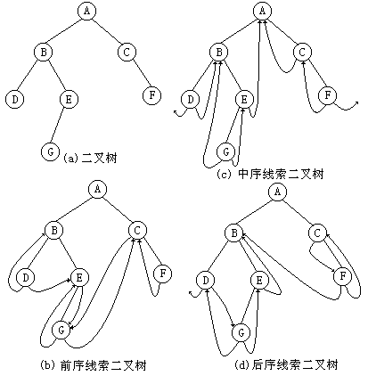
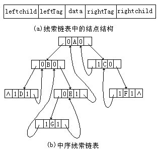

普通二叉树只能找到结点的左右孩子信息，而该结点的直接前驱和直接后继只能在遍历过程中获得。

若可将遍历后对应的有关前驱和后继预存起来，则从第一个结点开始就能很快“顺藤摸瓜”而遍历整个树了。

若结点有左子树，则lchild指向其左孩子；否则， lchild指向其直接前驱(即线索)；

若结点有右子树，则rchild指向其右孩子；否则， rchild指向其直接后继(即线索) 。

在线索化二叉树中，并不是每个结点都能直接找到其后继的，当标志为0时，则需要通过一定运算才能找到它的后继。

二叉线索树思想是干什么的?中序遍历这棵树 → 转换成链表访问

有关线索二叉树的几个术语


- 线索链表：用上面结点结构所构成的二叉链表
- 线索：指向结点前驱和后继的指针
- 线索二叉树：加上线索的二叉树
- 线索化：对二叉树以某种次序遍历使其变为线索二叉树的过程

## 线索二叉树的定义 

一棵具有n个结点的二叉树就会发现，当它采用二叉链表作存储结构时，二叉链表中的所有结点共有n+1个空指针域。因此，可以设法利用这些空指针域来存放结点的前驱结点和后继结点的指针信息。在此，可以作这样的规定：当某结点的左指针域为空时，令其指向依某种方式遍历时所得到的该结点的前驱结点，否则指向它的左孩子；当某结点的右指针域为空时，令其指向依某种方式遍历时所得到的该结点的后继结点，否则指向它的右孩子。



在每个结点中增设两个标志位leftTag和rightTag，令：

- 当leftTag = 0 时，leftChild为左孩子指针
- 当leftTag = 1 时，leftChild为前驱线索
- 当rightTag = 0 时，rightChild为右孩子指针
- 当rightTag = 1 时，rightChild为后继指针



## 线索二叉树的生成

线索化过程就是在遍历过程中修改空指针的过程：将空的lchild改为结点的直接前驱；将空的rchild改为结点的直接后继。

```c++
#define  _CRT_SECURE_NO_WARNINGS 
#include "string.h"
#include "stdio.h"    
#include "stdlib.h"   

// Link==0表示指向左右孩子指针
// Thread==1表示指向前驱或后继的线索
#define Thread 1
#define Link	0

typedef  struct BiThrNode	// 二叉线索存储结点结构
{
	char		data;	// 结点数据
	struct BiThrNode *lchild, *rchild;	// 左右孩子指针
	int			LTag;
	int			RTag;		// 左右标志
} BiThrNode, *BiThrTree;

char Nil='#'; // 字符型以空格符为空

// 按前序输入二叉线索树中结点的值,构造二叉线索树T
BiThrNode* CreateBiThrTree()
{ 
	BiThrNode *tmp = NULL;
	char ch;
	scanf("%c",&ch);

	if (ch == '#')
	{
		return NULL;
	}	
	else
	{
		tmp = (BiThrNode *)malloc(sizeof(BiThrNode));
		if (tmp == NULL)
		{
			return NULL;
		}
		memset(tmp, 0, sizeof(BiThrNode));
		tmp->data = ch;

		tmp->lchild = CreateBiThrTree(); // 递归构造左子树
		tmp->rchild = CreateBiThrTree();
	}
	return tmp;
}

BiThrNode  *pre; // 全局变量,始终指向刚刚访问过的结点
// 中序遍历进行中序线索化
void InThreading(BiThrNode *p)
{ 
	if(p)
	{
		InThreading(p->lchild); // 递归左子树线索化 
		if(p->lchild == NULL)	// 没有左孩子 
		{
			p->LTag = Thread; 	 p->lchild = pre;	//前驱线索 左孩子指针指向前驱 
		}
		if(pre->rchild == NULL) // 前驱没有右孩子 
		{
			pre->RTag = Thread;  pre->rchild = p;	// 后继线索 前驱右孩子指针指向后继(当前结点p) 
		}
		pre = p;				// 保持pre指向p的前驱 
		InThreading(p->rchild); // 递归右子树线索化 
	}
}

// 中序遍历二叉树T,并将其中序线索化,Thrt指向头结点
BiThrNode* InOrderThreading(BiThrTree T)
{
	BiThrNode *Thrt = NULL;

	Thrt = (BiThrNode *)malloc(sizeof(BiThrNode)); //建头结点 
	if (Thrt == NULL)
	{
		return NULL;
	}
	memset(Thrt, 0, sizeof(BiThrNode));

	Thrt->LTag = Link;  //左孩子为孩子指针
	Thrt->RTag = Thread; //右孩子为线索化的指针
	Thrt->rchild = Thrt; // 右指针回指 */  //步骤2和4
	if(T == NULL) // 若二叉树空,则左指针回指 
	{
		Thrt->lchild  = Thrt; //步骤1和3
	}
	else
	{
		Thrt->lchild = T;	//步骤1 
		pre = Thrt ;
		InThreading(T);		// 中序遍历进行中序线索化 
		pre->rchild = Thrt;	//步骤4
		pre->RTag = Thread;	// 最后一个结点线索化 
		Thrt->rchild = pre;	//步骤2
	}
	return Thrt;
}

// 中序遍历二叉线索树T(头结点)的非递归算法
int InOrderTraverse_Thr(BiThrNode* T)
{ 
	BiThrNode* p;
	p = T->lchild; // p指向根结点
	while (p != T)
	{ 
		// 空树或遍历结束时,p==T
		while (p->LTag == Link)
			p = p->lchild;
		printf("%c ", p->data);

		//如果中序遍历的最后一个结点的 右孩子 == T 说明到最后一个结点 ,遍历结束..
		while (p->RTag==Thread && p->rchild!=T)
		{
			p = p->rchild;
			printf("%c ", p->data);
		}
		p = p->rchild;
	}
	return 0;
}

// 中序遍历二叉线索树T(头结点)的非递归算法
int InOrderTraverse_Thr2(BiThrNode* T)
{ 
	BiThrNode* p;
	p = T->rchild; // p指向根结点
	while (p != T)
	{ 
		// 空树或遍历结束时,p==T
		while (p->RTag == Link)
			p = p->rchild;
		printf("%c ", p->data);

		//如果中序遍历的最后一个结点的 右孩子 == T 说明到最后一个结点 ,遍历结束..
		while (p->LTag==Thread && p->lchild!=T)
		{
			p = p->lchild;
			printf("%c ", p->data);
		}
		p = p->lchild;
	}
	return 0;
}

int main()
{
	BiThrTree T, H;
	printf("请按前序输入二叉树(如:'ABDH##I##EJ###CF##G##')\n");
	T = CreateBiThrTree(); // 按前序产生二叉树 
	H = InOrderThreading(T); // 中序遍历,并中序线索化二叉树 
	printf("中序遍历(输出)二叉线索树:\n");
	InOrderTraverse_Thr(H); // 中序遍历(输出)二叉线索树 

	printf("\n逆序访问:");
	InOrderTraverse_Thr2(H);

	printf("\n");

	system("pause");
	return 0;
}
```

## 线索化的第二种方法

第一种方法在遍历的过程中需要修改结点属性，第二种方法是在中序遍历的过程中，把每一结点都存到一个链表中，这样就可以通过链表访问整个树。