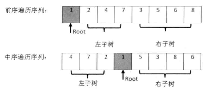

## 重建二叉树


```c++
struct BinaryTreeNode 
{
    int                    m_nValue; 
    BinaryTreeNode*        m_pLeft;  
    BinaryTreeNode*        m_pRight; 
};
```

前序遍历可以确定根结点，中序遍历可以确定左右子树，而左右子树的构建可以递归实现



```c++
BinaryTreeNode* Construct(int* preorder, int* inorder, int length)
{
    if(preorder == NULL || inorder == NULL || length <= 0)
        return NULL;

    return ConstructCore(preorder, preorder + length - 1,
        inorder, inorder + length - 1);
}

BinaryTreeNode* ConstructCore
(
    int* startPreorder, int* endPreorder, 
    int* startInorder, int* endInorder
)
{
    // 前序遍历序列的第一个数字是根结点的值
    int rootValue = startPreorder[0];
    BinaryTreeNode* root = new BinaryTreeNode();
    root->m_nValue = rootValue;
    root->m_pLeft = root->m_pRight = NULL;

    if(startPreorder == endPreorder)
    {
        if(startInorder == endInorder && *startPreorder == *startInorder)
            return root;
        else
            throw std::exception("Invalid input.");
    }

    // 在中序遍历中找到根结点的值
    int* rootInorder = startInorder;
    while(rootInorder <= endInorder && *rootInorder != rootValue)
        ++ rootInorder;

    if(rootInorder == endInorder && *rootInorder != rootValue)
        throw std::exception("Invalid input.");

    int leftLength = rootInorder - startInorder;
    int* leftPreorderEnd = startPreorder + leftLength;
    if(leftLength > 0)
    {
        // 构建左子树
        root->m_pLeft = ConstructCore(startPreorder + 1, leftPreorderEnd, 
            startInorder, rootInorder - 1);
    }
    if(leftLength < endPreorder - startPreorder)
    {
        // 构建右子树
        root->m_pRight = ConstructCore(leftPreorderEnd + 1, endPreorder,
            rootInorder + 1, endInorder);
    }

    return root;
}
```